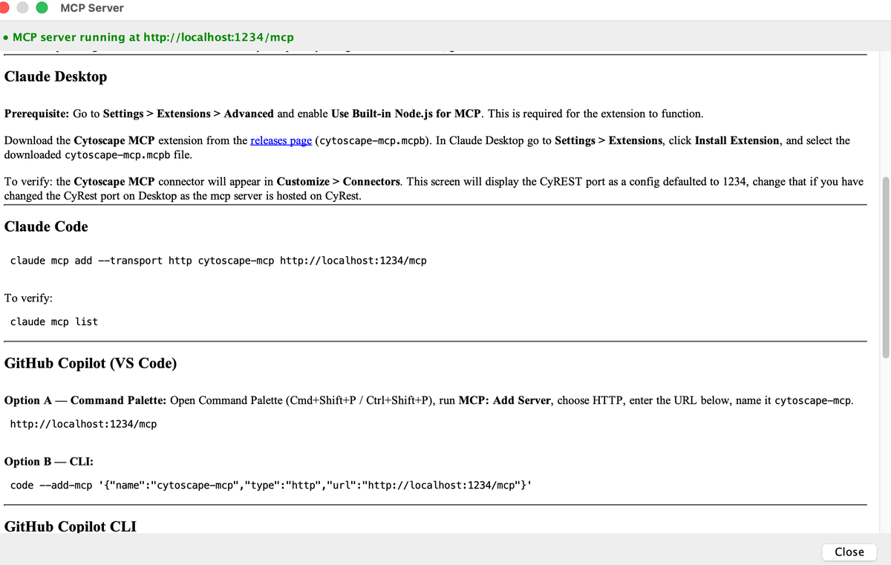
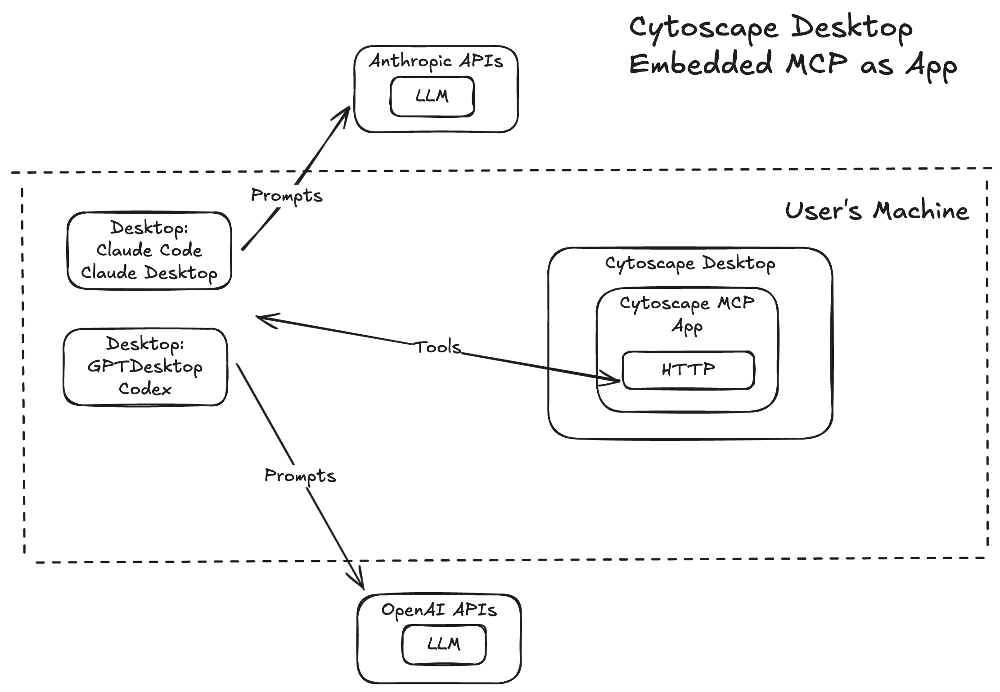
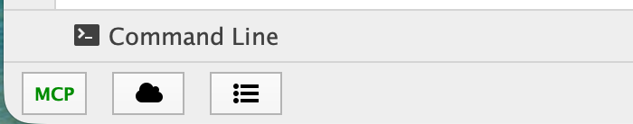
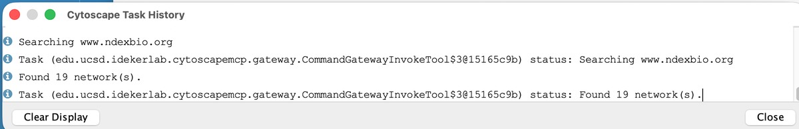
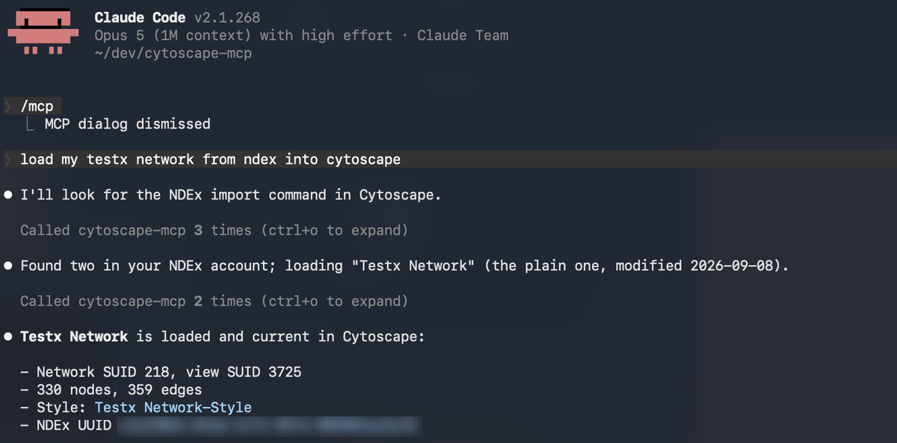

# Agentic Integration

Cytoscape has always been drivable from outside its own user interface. The
**Commands** feature, the **CyREST** interface layer, and the ***RCy3*** and
***py4cytoscape*** packages all let another program open networks, apply
layouts, change styles and export results — see
<a href="Programmatic_Access_to_Cytoscape_Features_Scripting.html#cytoscape_automation">Cytoscape Automation</a>.

An **AI agent** is a new kind of client for that same surface. Instead of a
script that names an exact command and its arguments, the caller is a large
language model (LLM) that reads a description of what Cytoscape can do, works
out which operations your request implies, and runs them in sequence. What
changes for you is the interface, not the application: you describe an
intent — *"load this network and colour the nodes by degree"* — and the agent
translates it into the operations Cytoscape already offers. Cytoscape remains
where the result is drawn, inspected and saved.

This is an active and fast-moving area, and the pieces described in this
chapter are explicitly experimental. Expect the details to change between
releases.

**Cytoscape ships agent-ready, but not agent-enabled.** Nothing in this
chapter works on a stock installation. The capability is delivered by an
optional app from the
[Cytoscape App Store (https://apps.cytoscape.org)](https://apps.cytoscape.org),
which you must install yourself. The rest of this chapter covers that app: how
to install and connect it, what it provides, and how to work with an agent once
it is running.

## Installation

The Cytoscape MCP Server is not bundled with Cytoscape, so none of this chapter
applies until you install it.

***Requirements.***

-   Cytoscape 3.10 or above.
-   An MCP-capable AI client that supports the Streamable HTTP transport —
    for example Claude Desktop, Claude Code, GitHub Copilot or OpenAI Codex
    CLI.
-   An internet connection, if you want to load networks from NDEx.

The app has one runtime property, editable at
**Edit → Preferences → Properties → cytoscapemcp**:

<table cellspacing="0" style="table-layout: fixed; width: 700px">
<caption>Cytoscape MCP Server properties</caption>
<colgroup> <col style="width:170px"> <col style="width:180px"> <col style="width:350px"> </colgroup>
<tbody>
<tr> <th>Property</th>                       <th>Default</th>                          <th>Description</th> </tr>
<tr> <th class="spec ulcase">mcp.ndexbaseurl</th> <td><code>https://www.ndexbio.org</code></td> <td>Base URL of the NDEx server that network-loading tools read from. Change it to point at a private or internal NDEx instance. Takes effect immediately — tool calls read it at invocation time, so no restart is needed.</td> </tr>
</tbody>
</table>
 

### Installing the app

Install **Cytoscape MCP Server** from its Cytoscape App Store page:

-   [apps.cytoscape.org/apps/cytoscapemcpserver (https://apps.cytoscape.org/apps/cytoscapemcpserver)](https://apps.cytoscape.org/apps/cytoscapemcpserver)

Click **Install** there and Cytoscape will pick the app up. Restart Cytoscape if
prompted. Once it has started, the app is running when the **MCP** button
appears in the status bar with a green label.

### Finding your MCP URL

Everything an agent needs is one URL:

    http://localhost:{rest.port}/mcp

where `{rest.port}` is Cytoscape's CyREST port. That is **1234** unless you
changed it under **Edit → Preferences → REST API**. Rather than assembling the
URL yourself, click the **MCP** button in the bottom-left status bar — the
**MCP Server** dialog shows the live URL for your running instance, along with
the setup commands for each supported agent.

### Configuring your agent

There are two ways to connect, and they are not equivalent.

<table cellspacing="0" style="table-layout: fixed; width: 700px">
<caption>Choosing how to connect</caption>
<colgroup> <col style="width:250px"> <col style="width:450px"> </colgroup>
<tbody>
<tr> <th>Your agent</th> <th>Use this</th> </tr>
<tr> <th class="spec ulcase">Anything supporting Streamable HTTP — Claude Code, GitHub Copilot, Codex CLI and most others</th> <td>The MCP URL above, configured directly. Nothing to install and no extra process.</td> </tr>
<tr> <th class="specalt ulcase">Claude Desktop</th> <td class="alt">The <b>Cytoscape MCP</b> extension (<code>.mcpb</code>), which bundles a small stdio-to-HTTP bridge. Desktop extensions speak stdio, so the bridge is required there.</td> </tr>
</tbody>
</table>
 

Both reach the same MCP server inside Cytoscape. **If your agent can take a
URL, give it the URL.**

***Claude Desktop.*** First go to **Settings → Extensions → Advanced** and
enable **Use Built-in Node.js for MCP** — the extension will not function
without it. Download `cytoscape-mcp.mcpb` from the project's releases page,
then in Claude Desktop go to **Settings → Extensions**, click **Install
Extension**, and select the downloaded file. To verify, look for the
**Cytoscape MCP** connector under **Customize → Connectors**; that screen
exposes the CyREST port as a setting, defaulted to 1234, which you should
change if you changed the port in Cytoscape.

***Claude Code.***

    claude mcp add --transport http cytoscape-mcp http://localhost:{rest.port}/mcp

Verify with `claude mcp list`.

***GitHub Copilot (VS Code).*** Open the Command Palette
(**Cmd+Shift+P** / **Ctrl+Shift+P**), run **MCP: Add Server**, choose **HTTP**,
enter `http://localhost:{rest.port}/mcp` and name it `cytoscape-mcp`. Or from
a terminal:

    code --add-mcp '{"name":"cytoscape-mcp","type":"http","url":"http://localhost:{rest.port}/mcp"}'

***GitHub Copilot CLI.***

    copilot mcp add --transport http cytoscape-mcp http://localhost:{rest.port}/mcp

Verify with `copilot mcp list`.

***OpenAI Codex CLI.***

    codex mcp add cytoscape-mcp --http-url http://localhost:{rest.port}/mcp

Verify with `codex mcp list`, or type `/mcp` inside the Codex TUI.

### Verifying the installation

Check Cytoscape first, then the agent.

1.  **The MCP button is present and green.** Look at the bottom-left corner of
    the Cytoscape window for a bold **MCP** button. Green means the server
    started and is ready. Red means it is not responding — confirm Cytoscape
    is running and that CyREST is active.

2.  **The MCP Server dialog opens.** Click the button. A dialog titled
    **MCP Server** should open, headed by a green line reading *MCP server
    running at* followed by the endpoint URL for your running instance, and
    listing the connection instructions for each supported agent.

    

3.  **The health endpoint answers.**

        curl http://localhost:{rest.port}/mcp/health

    You should see:

        {"status":"ok","transport":"mcp-streamable-http"}

    A "connection refused" error means Cytoscape is not running, or the port
    is not the one you used.

4.  **The agent reports a connection.** Most agents have a `/mcp` command or an
    MCP settings panel listing each configured server, whether it is
    **connected**, and which tools it publishes. `cytoscape-mcp` should appear
    there as connected.

5.  **A prompt reaches Desktop.** Ask the agent:

        > open a network using cytoscape desktop

    The network should appear in Cytoscape's **Network** panel and render in
    the main canvas, and the tool call should be listed under
    **View → Show Task History**.

**Warning:** Cytoscape is a single-user application with shared session state.
The transport supports several agents connected at once, each with its own
session, but they can issue conflicting commands — two agents changing the
current view, for instance. Running more than one agent against a single
Cytoscape instance is not recommended, and coordinating them is your
responsibility.

## MCP

The **Model Context Protocol** (MCP) is an open standard that describes how an
AI application talks to an outside system. The outside system runs an *MCP
server* that publishes a set of *tools* — named operations with typed inputs
and outputs, each carrying a description written for a language model to read.
The agent discovers those tools, decides which ones your request calls for,
and invokes them. Because the protocol is shared, any MCP-capable agent can
talk to any MCP server.

Because the Cytoscape MCP Server is not a core app, it is versioned separately
and does not update along with Cytoscape — worth remembering when the tools an
agent sees do not match what this chapter describes.

**NOTE:** This app is experimental. The tools it publishes and the way they
behave are subject to change.

Once installed, the app publishes an MCP endpoint **inside Cytoscape's
existing CyREST HTTP server**. No separate process is started and no
additional port is opened — the endpoint lives at `/mcp` on the port CyREST
already uses. Agents connect to it over the **Streamable HTTP** transport.
(The older SSE transport was deprecated in February 2025 and is not
supported.)

The app also adds two indicators to the Cytoscape Desktop interface:

-   **The MCP status button.** A bold **MCP** button appears in the
    bottom-left status bar. The label is **green** when the MCP server is
    running and ready for connections, and **red** when it is not responding.
    Clicking it opens the **MCP Server** dialog, which shows the live endpoint
    URL and connection instructions for each supported agent.

    

-   **Task History entries.** Every MCP tool invocation is recorded in the
    **Cytoscape Task History** window, opened from **View → Show Task
    History**. Each entry is a progress or status line reported by the tool as
    it runs, and identifies the tool by its internal class name rather than by
    the name the agent used. It is still the record of what an agent actually
    did to your session, and the first place to look when a result is not what
    you expected.

    

    The entries above are from an agent asked to search NDEx: the gateway
    invoked CyNDEx-2's `ndex search networks` command, which reported its
    progress and then the number of matches it found.

***What the tools cover.*** The published tools span most of what you would
otherwise do by hand:

-   Loading a network as a new collection and view — from **NDEx** by network
    ID, from a network file (SIF, GML, XGMML, CX, CX2, GraphML, SBML, BioPAX),
    or from a delimited or Excel file with column mapping.
-   Listing the loaded network views, switching the current view, and creating
    a view for a network that lacks one.
-   Analyzing a network, listing the available layout algorithms, and applying
    one.
-   Reading and setting visual style defaults, listing styles and switching
    between them.
-   Creating discrete, continuous and passthrough mappings, including
    inspecting a column's range or distinct values first to choose sensible
    mapping points.
-   Inspecting a tabular file's columns and importing it into a node, edge or
    unassigned table.

Alongside those, three **command gateway** tools give an agent access to the
*entire* catalog of Cytoscape commands registered on your machine: one
searches the catalog with a full-text query, one retrieves a command's full
argument schema, and one invokes it. The three are used in that order by
design: the gateway refuses to invoke a command whose schema has not been
retrieved first, which stops an agent from guessing at argument names.

This matters more than it might sound. Installing another Cytoscape app
registers that app's commands with Desktop, and the gateway picks them up
automatically — so an agent's reach grows with the apps you install, with no
change to the MCP app itself. The walkthrough under
<a href="#mcp_how_prompting_works">Agent Usage</a> is a worked example: the
agent reaches NDEx through a command the gateway found, not through any
built-in NDEx tool.

***The tool catalog.*** You never call a tool by name. Every tool is activated
by natural language: you describe what you want, and the model selects the
tool from the descriptions it was given. A complete, human-readable catalog of
every tool registered on the server is available for reference, listing each
tool's full
JSON input and output schema along with three or four example prompt snippets
showing the phrasing that activates it. Consult it when a request is not
producing the operation you expected — the example phrasings are the fastest
way to find wording that works.

You can obtain the catalog three ways:

-   While Cytoscape is running, from the server itself:

        curl http://localhost:{rest.port}/mcp/manifest

    or open that URL in a browser.

-   From the app's repository:
    [MCPManifest.md (https://github.com/cytoscape/cytoscape-desktop-mcp/blob/main/MCPManifest.md)](https://github.com/cytoscape/cytoscape-desktop-mcp/blob/main/MCPManifest.md)

-   From your agent, using its `/mcp` command or its MCP settings panel, which
    lists the tools currently published by each connected server.

***Further reading.*** The app maintains its own documentation — a user
manual, a tutorial, agent configuration details and an FAQ — which goes into
more detail than this chapter and is updated with each release:
[github.com/cytoscape/cytoscape-desktop-mcp (https://github.com/cytoscape/cytoscape-desktop-mcp)](https://github.com/cytoscape/cytoscape-desktop-mcp)

### Agent Usage

#### How prompting works

You do not name tools. You describe what you want, and the model chooses.

What makes the difference is naming Cytoscape and being specific about the
intent. A prompt like *"open a network using cytoscape desktop"* is enough for
the model to reason over the whole tool set and assemble a sequence: it will
ask which source you mean, load the network from it, create a view, and set
that view as current — several tool calls from one sentence, each appearing in
turn in the Task History.

Here is that pattern in practice, from Claude Code connected to Cytoscape:

One sentence — *"load my testx network from ndex into cytoscape"* — became two
rounds of tool calls. The agent first searched the command catalog for the NDEx
import command, then used the signed-in profile to look up networks by that
name, found two candidates, chose between them on their modification dates, and
loaded the result. It then reported back what Cytoscape actually holds: the
network and view identifiers, the node and edge counts, the style applied, and
the NDEx UUID now recorded against the network.

Two things in that exchange are worth drawing out. The word *"my"* is doing real
work — it resolves through the CyNDEx-2 sign-in profile configured in Cytoscape,
which is what the <a href="#working_with_ndex">NDEx section</a> below covers. And the agent
did not have a purpose-built "load from NDEx" tool: it found CyNDEx-2's command
through the gateway, which is the mechanism described earlier in this chapter.

Vague or unqualified requests are the usual reason nothing happens. *"Change
the colours"* gives the model nothing to match against; *"change the network
node color to green in cytoscape"* does. When a request is not producing the
operation you expect, consult the
<a href="#mcp_tool_catalog">tool catalog</a> — every tool carries example prompt
snippets showing phrasing known to activate it.

#### Example prompts

These are drawn from the app's App Store listing and are a reasonable starting
vocabulary.

<table cellspacing="0" style="table-layout: fixed; width: 700px">
<caption>Example prompts and what Cytoscape does in response</caption>
<colgroup> <col style="width:330px"> <col style="width:370px"> </colgroup>
<tbody>
<tr> <th>Prompt</th> <th>What happens in Cytoscape</th> </tr>
<tr> <th class="spec ulcase">open a network using cytoscape desktop</th> <td>The agent asks which source you mean — NDEx, a network file or a tabular file — loads it as a new collection, and makes its view current.</td> </tr>
<tr> <th class="specalt ulcase">analyze the network in cytoscape</th> <td class="alt">Runs network analysis on the current network and reports the resulting statistics.</td> </tr>
<tr> <th class="spec ulcase">change the network layout</th> <td>Lists the available layout algorithms, then applies the one you pick to the current view.</td> </tr>
<tr> <th class="specalt ulcase">switch network style</th> <td class="alt">Lists the styles in the session and switches the current view to the one you choose.</td> </tr>
<tr> <th class="spec ulcase">increase the network edge width by 1</th> <td>Reads the current edge width default and sets a new one.</td> </tr>
<tr> <th class="specalt ulcase">change the network node color to green</th> <td class="alt">Sets the node fill colour default on the current style.</td> </tr>
<tr> <th class="spec ulcase">change node label to courier new</th> <td>Sets the node label font default.</td> </tr>
<tr> <th class="specalt ulcase">lock node width and height on network</th> <td class="alt">Turns on the node width/height dependency so the two stay equal.</td> </tr>
<tr> <th class="spec ulcase">import new attributes into the node table of my network in cytoscape</th> <td>Inspects the file's columns, confirms the key column and the network column to match on, and imports the table.</td> </tr>
<tr> <th class="specalt ulcase">map edge shape to interaction</th> <td class="alt">Creates a discrete mapping from the <code>interaction</code> column to edge shape.</td> </tr>
<tr> <th class="spec ulcase">map weight to node size</th> <td>Creates a mapping from the <code>weight</code> column to node size, locking width and height together.</td> </tr>
<tr> <th class="specalt ulcase">generate green colors on edges based on discrete values of confidence</th> <td class="alt">Reads the distinct values of <code>confidence</code> and generates a discrete colour mapping across them.</td> </tr>
<tr> <th class="spec ulcase">set color gradient on nodes from blue to red based on eccentricity</th> <td>Reads the range of <code>eccentricity</code> and creates a continuous colour mapping over it.</td> </tr>
<tr> <th class="specalt ulcase">set node label to gene1</th> <td class="alt">Creates a passthrough mapping from the <code>gene1</code> column to the node label.</td> </tr>
</tbody>
</table>
 

#### Working with NDEx

[NDEx](https://www.ndexbio.org/), the Network Data Exchange, is where many
Cytoscape users keep their networks, and an agent can work with it directly.
Which networks it can reach is decided by the NDEx sign-in profile you have set
up in Cytoscape, not by the agent — that is what gives a phrase like *"my
networks"* something concrete to resolve against. With no profile configured,
an agent can still search and download public networks, but not save to your
account. See <a href="Export_Your_Data.html#export_ndex">Export Your Data</a>
for the interactive route to the same functionality.

***Example prompts.*** Each of these drives NDEx through the command named
in the right-hand column:

<table cellspacing="0" style="table-layout: fixed; width: 700px">
<caption>NDEx prompts and the commands they resolve to</caption>
<colgroup> <col style="width:300px"> <col style="width:400px"> </colgroup>
<tbody>
<tr> <th>Prompt</th> <th>What happens</th> </tr>
<tr> <th class="spec ulcase">load my ndex network xyz into cytoscape</th> <td>Runs <code>ndex download network</code> for that network's UUID, using your selected profile, and opens it as a new network and view.</td> </tr>
<tr> <th class="specalt ulcase">find ndex networks that start with ergosterol</th> <td class="alt">Runs <code>ndex search networks searchTerm=ergosterol</code> and reports the matches with their UUIDs, owners and sizes. Note that NDEx matches the term anywhere in a network's name, description or owner rather than only at the start, so a request phrased as "starting with" still returns every network mentioning the term.</td> </tr>
<tr> <th class="spec ulcase">upload my xyz network to ndex</th> <td>Runs <code>ndex create network</code>, saving the current network to NDEx as a <b>new</b> network and returning its UUID and URL.</td> </tr>
</tbody>
</table>
 

#### Tips and troubleshooting

-   **Name Cytoscape in the prompt.** *"apply a force-directed layout in
    cytoscape"* is unambiguous; *"apply a force-directed layout"* may not be.

-   **Say which network you mean** when the session holds several. Most tools
    act on the current view.

-   **Watch the Task History.** **View → Show Task History** is the record of
    what actually ran, which is the quickest way to tell a misunderstood
    request from a failed one.

-   **A missing capability may just be a missing app.** The command gateway
    only sees commands registered with Desktop. If an agent cannot find a way
    to do something, installing the relevant Cytoscape app registers its
    commands and the gateway picks them up — no change to the MCP app needed.

-   **If the agent reports the server as unavailable**, check the **MCP**
    button's colour and the `/mcp/health` endpoint before changing any agent
    configuration. A red button means the problem is in Cytoscape, not in the
    agent.

-   **For deeper diagnostics**, the server exposes its full tool catalog at
    `/mcp/manifest`, and the app documents its
    [diagnostic steps (https://github.com/cytoscape/cytoscape-desktop-mcp?tab=readme-ov-file#cytoscape-desktop-mcp-diagnostics)](https://github.com/cytoscape/cytoscape-desktop-mcp?tab=readme-ov-file#cytoscape-desktop-mcp-diagnostics)
    and a
    [FAQ (https://github.com/cytoscape/cytoscape-desktop-mcp/blob/main/docs/FAQ.md)](https://github.com/cytoscape/cytoscape-desktop-mcp/blob/main/docs/FAQ.md).
