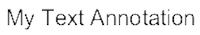
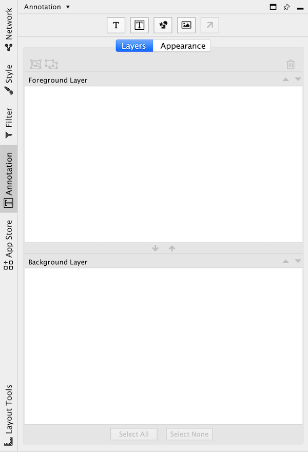
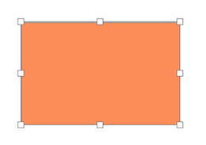
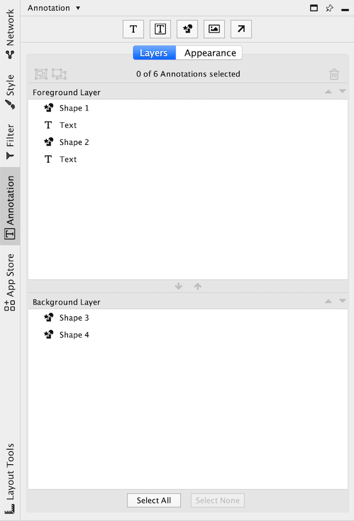
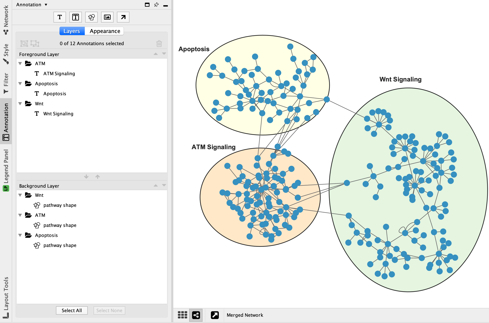

# Network Annotations

Annotations in the form of shapes, images or text can be added to the network canvas. 

The network canvas is made up of three transparent layers:

- Foreground layer

- Network layer

- Background layer

The middle Network layer contains nodes, edges and charts. The foreground and background 
layers contain annotations.

## Types of Annotations

There are five types of annotations available:

1. Images (loaded from image files)

2. Shapes (rectangles, triangles, etc...)

   

3. Text

   

4. Bounded Text (combines text with a surrounding shape)

   

5. Arrows (connects other annotations or nodes)

   

 
## The Annotation Panel

The **Annotation** panel shows the annotations that are currently present on the foreground and 
background layers. The panel allows you to create and delete annotations, select annotations, 
move annotations up and down, move annotations between layers, and group annotations.

## Creating Annotations

At the top of the **Annotation** panel there are five buttons for creating each type of annotation. 
Start by clicking the button for the type of annotation you would like to add. 

Alternatively, right click on the network canvas and select the annotation type under the **Add** menu.

### Shape, Bounded Text, Image, Text
1. Click the button for shape, bounded text or image annotation.
2. Click the general location on the network canvas where the annotation should be placed. The annotation will appear on the canvas.
3. The annotation properties can be edited in the **Appearance** tab in the **Annotations** panel. The properties can be edited 
  again after the annotation is created by selecting the annotation.
4. To resize the annotation, click on one of the resize handles and move the mouse cursor to resize the annotation. The annotation can be resized again later.
5. Click the mouse again to stop resizing.

### Arrow
Creating an arrow annotation requires there to be at least one other annotation on the network canvas.
1. Click the button for arrow annotation.
2. Click on an existing annotation on the canvas; this will be the source annotation.
4. Click on another annotation on the canvas or a node; this will be the destination.
5. An arrow annotation appears connecting the source and destination.
6. The arrow properties can be edited in the **Appearance** tab in the **Annotations** panel to select start and end arrow head, color etc.

## Selecting Annotations

One or more annotations can be selected in the **Annotations** panel by clicking on them. 

To be able to select annotations in the network canvas
**Toggle Annotation Selection** must be enabled. Toggle the 

button at the bottom of the network view to enable/disable annotation selection mode.

When an annotation is selected, 8 resize handles are visible. The annotation can be moved by clicking on it with the mouse and dragging. The annotation can be resized by clicking and dragging one of the handles.

It is possible to select multiple annotations at the same time. Hold Ctrl on Windows, 
or Command on Mac, while clicking on each of the annotations you would like to select. 
This works both in the **Annotations** panel and on the network canvas. When multiple annotations 
are selected they can be moved and resized at the same time.

## Moving Annotations Backwards and Forwards

The **Annotation** panel displays a list of annotations on the foreground layer and a list of 
annotations on the background layer.

Annotations that are towards the top of a list are drawn above annotations lower in the list. 
To move an annotation within a layer select it and click the 
 button to move it forward or the
 button
to move it backward. To move an annotation between layers select it and click the

to move it to the foreground layer or the

button to move it to the background layer. 

## Renaming Annotations

Each annotation has a name that is displayed in the **Annotation** Panel. These names are primarily 
for organizational purposes and do not affect how the annotation is displayed on the canvas. To 
rename an annotation double-click the annotation in the **Annotation** panel and enter the new name.

## Editing Annotations

To modify the properties of an annotation (eg, color, text) go to the **Annotation** panel,
right click the annotation, and select **Modify Annotation...** in the context menu. Alternatively, 
right-click on the annotation in the network and select **Modify Annotation...**. 

## Deleting Annotations

To delete annotations from the **Annotation** panel select one or more annotations and click the 
 button.

To delete annotations from the network view right click an annotation and select **Edit > Cut**.

## Grouping Annotations

Two or more annotations can be combined into a group. When grouped the annotations move and resize 
as if they were a single annotation. Groups may be nested (a group may contain other groups).

To create a group select two or more annotations and click the 
 button. The group will be given a default 
name that can be changed after the group is created. To un-group annotations select the group and click the 
 button.

A group may contain annotations from the foreground and background canvases. The group will show up in 
both the foreground and background layers in the annotations panel. 

Note: Deleting a group will delete all the annotations contained within the group.

