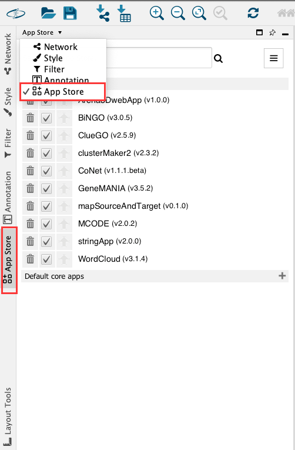
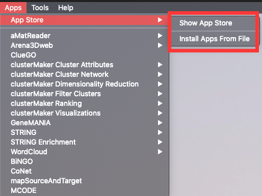
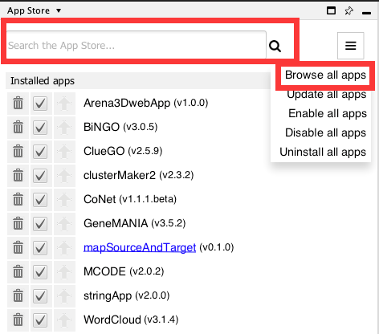
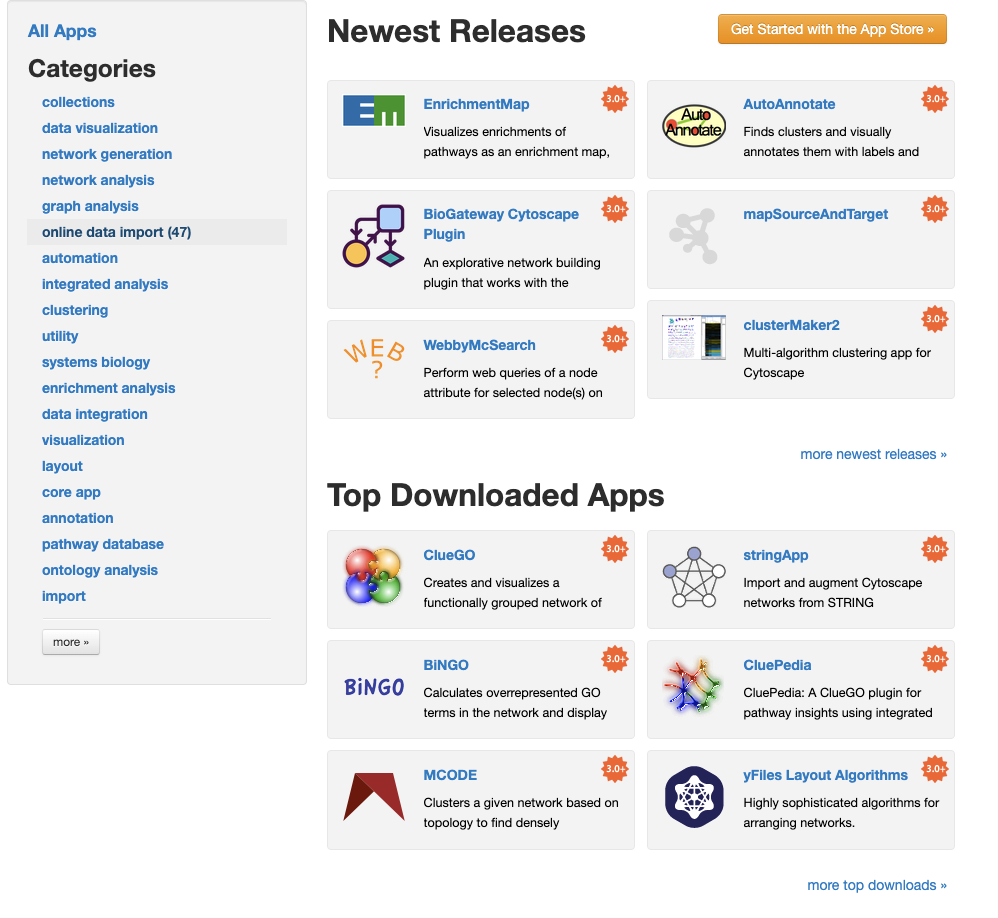
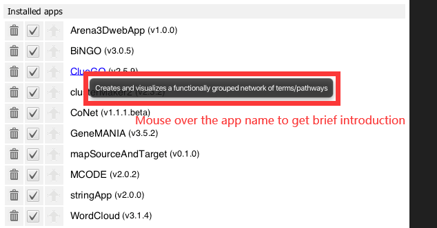
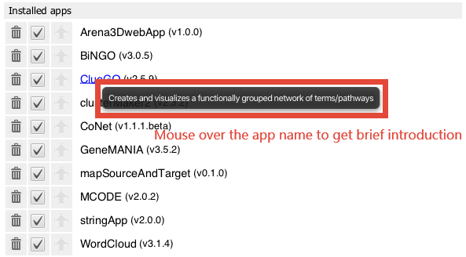
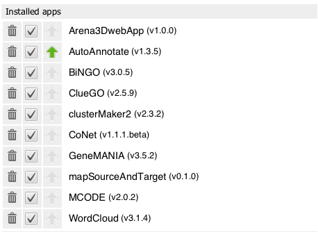

# App Store

## What are Apps?

Cytoscape's capabilities are not fixed. They can be expanded with
**apps**. They can extend Cytoscape in a variety of ways. One app can
have the ability to import data from an online database. Another app
could provide a new method for analyzing networks. You can install apps
after you have installed Cytoscape. Most apps were made by Cytoscape
users like you.

If you're familiar with Cytoscape 2.x, you probably know that Cytoscape
apps were called **plugins**. Starting in Cytoscape 3.0, we are calling
them **apps**. Cytoscape 2.x plugins cannot be used in Cytoscape 3.x.

## Accessing App Store
There are three ways you can access app store in Cytoscape:
- To access app store within Cytoscape, use the pull down menu in the **control panel**.
  
- To access app store within Cytoscape, go to the side bar and click **App Store** tab.

- To access app store within Cytoscape, go to the menu bar and choose **Apps →
  App Store → Show App Store**.

## Installing Apps

You can install apps through [the App Store](http://apps.cytoscape.org)
or within Cytoscape. In this section, we'll talk about installing apps
through Cytoscape. You can learn how to install apps through the App
Store [here](http://apps.cytoscape.org/help/getstarted_app_install).

There are three ways you can find apps:

-   If you know the name of an app you're looking for, enter it in the
    **Search** field, and click the search button. The **App Store** will list the apps whose names or
    descriptions match the **Search** field in the web page.

-   If you're not sure what sort of app you need and want to see everything,
    click the **Browse all apps** button. 
    

-   If you have a general idea of what sort of app you're looking for,
    go to [the App Store](http://apps.cytoscape.org). On the left side, click on one of the
    categories that interests you. The apps with that tag are listed in the
    web page.
    

If you've downloaded an app to your computer, you can install it by
clicking the  **Apps →
App Store → Install Apps From File**. Note that only **.jar** files can be installed.

## Managing your Installed Apps
### Get app information
You can see a list of all apps you have installed in app store tab. When you mouse over an app in the list, you'll see a brief description of the app.
If you want more information, click the app name and it will redirect you to the app page.
 

### Enable/Disable Apps
Disable an app. This temporarily disables the app. The app stays on your computer, but Cytoscape does not load it. You can enable the app by first selecting the disabled app in the list, then click Enable.

### Uninstall Apps
Uninstall an app. This deletes the app from your computer. If you want to reinstall the app, you will have to find it again in the Install Apps tab or find it in the App Store site and reinstall it from there.

 

### Core Apps
Core apps provide essential functionalities of Cytoscape. They are so important that we seperate core apps from other apps. Core apps cannot be disabled or deleted. Core apps tab is folded by default. If there is an update for core app, the tab will be expanded.

You can find the entire list of core apps [here](https://github.com/cytoscape/cytoscape#new-from-330-core-apps).

### Update Apps
If the app has a newer version, the app store will remind you to upgrade the app. By clicking the **green arrow** button, the app will get update.

 

Also, the bell button  in the right up corner of Cytoscape will be clickable if there is an newer version. By clicking the bell button, Cytoscape will redirect you to the app store tab.

