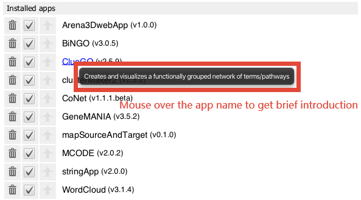
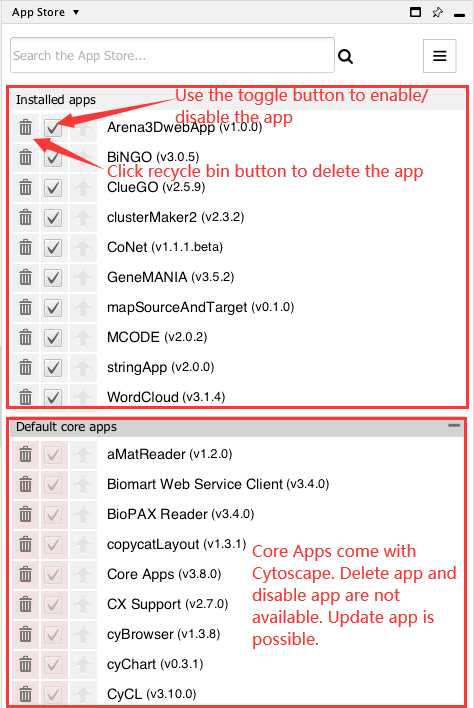

# App Store

## What are Apps?

Cytoscape's capabilities are not fixed. They can be expanded with
**apps**. They can extend Cytoscape in a variety of ways. One app can
have the ability to import data from an online database. Another app
could provide a new method for analyzing networks. You can install apps
after you have installed Cytoscape. Most apps were made by Cytoscape
users like you.

If you're familiar with Cytoscape 2.x, you probably know that Cytoscape
apps were called **plugins**. Starting in Cytoscape 3.0, we are calling
them **apps**. Cytoscape 2.x plugins cannot be used in Cytoscape 3.x.

## Accessing the App Store
There are three ways you can access the **App Store** in Cytoscape:
- Use the pull down menu at the top of the **Control Panel**.
  
- Go to the **App Store** tab of the **Control Panel**.

- Go to the menu bar and choose **Apps → App Store → Show App Store**.

## Installing Apps

You can install apps through [the App Store website](http://apps.cytoscape.org)
or within Cytoscape. In this section, we'll talk about installing apps
through Cytoscape. You can learn how to install apps through the App
Store [here](http://apps.cytoscape.org/help/getstarted_app_install).

There are three ways you can find apps:

-   If you know the name of an app you're looking for, enter it in the
    **Search** field at the top of the **App Store**, and click the search button. Search results from the online **App Store** whose names or descriptions match the search term will be displayed in your default web broowser.

-   If you're not sure what sort of app you need and want to see everything,
    select the **Browse all apps** option from button at the top right. 
    

-   If you have a general idea of what sort of app you're looking for,
    go to [the App Store](http://apps.cytoscape.org). On the left side, click on one of the
    categories that interests you. The apps with that tag are listed in the
    web page.
    

Once you have found an app you want to install, simply click the **Install** button on the corresponding page at the [the App Store website](http://apps.cytoscape.org). Once installed, the app will be listed in the **Installed Apps** section of the **App Store** in Cytoscape.

If you've downloaded an app to your computer, you can install it by clicking the  **Apps →
App Store → Install Apps From File**. Note that only **.jar** files can be installed.

## Managing your Installed Apps
### Get app information
You can see a list of all apps you have installed in the *Installed Apps** section of the **App Store**. When you mouse over an app in the list, you'll see a brief description of the app.
If you want more information, click the app name and it will redirect you to the app page.
 

The **App Store** has three buttons available for each app, corresponding to specific functionality described below;  **Uninstall app**, **Toggle enabled status** and **Update app**.

### Enable/Disable Apps
To temporarily disable an app, click the check mark **Toggle enabled status** for that app. The app stays on your computer, but Cytoscape does not load it. You can enable the app by clicking the **Toggle enabled status** check mark again.

### Uninstall Apps
To uninstall (delete) an app from your computer, click **Uninstall app** (trash can) button. If you want to reinstall the app, you will have to find it again in the **App Store** site and reinstall it from there.

 

### Core Apps
Core apps provide essential functionalities of Cytoscape. They are so important that we seperate core apps from other apps. Core apps cannot be disabled or deleted. The core apps tab is collapsed by default. If there is an update for a core app, the tab will be expanded.

You can find the entire list of core apps [here](https://github.com/cytoscape/cytoscape#new-from-330-core-apps).

### Update Apps
If the app has a newer version, the app store will remind you to upgrade the app. By clicking the **Update app** button (green arrow), the app will get updated.

 

Also, the **App Updates** button  in the upper right corner of Cytoscape will be clickable if there is a newer version of an installed app available. By clicking the button, Cytoscape will redirect you to the **App Store** tab.

