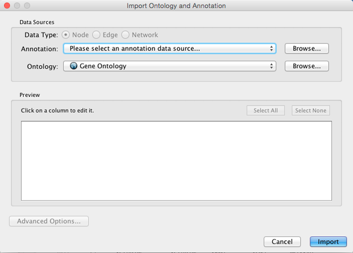

Ontology and Annotation Import
==============================

Annotations in Cytoscape are stored as a set of ontologies (e.g. the
Gene Ontology, or GO). An ontology consists of a set of controlled
vocabulary terms that annotate the objects. For example, using the Gene
Ontology, the Saccharomyces Cerevisiae CDC55 gene has a biological
process described as "protein biosynthesis", to which GO has assigned
the number 6412 (a GO ID).

GO 8150 biological\_process

-   GO 7582 physiological processes

    -   GO 8152 metabolism

        -   GO 44238 primary metabolism

            -   GO 19538 protein metabolism

                -   GO 6412 protein biosynthesis

**Graphical View of GO Term 6412: protein biosynthesis**

Cytoscape can use this ontology DAG (Directed Acyclic Graph) to annotate
objects in networks. The Ontology Server (originally called
"[BioDataServer](http://wiki.cytoscape.org/Cytoscape_3/UserManual/BioDataServer#)")
is a Cytoscape feature which allows you to load, navigate, and assign
annotation terms to nodes and edges in a network. Cytoscape 2.4 now has
an enhanced GUI for loading ontology and associated annotation, enabling
you to load both local and remote files.

Ontology and Annotation File Format
-----------------------------------

The standard file formats used in the **Cytoscape Ontology Server** are
OBO and Gene Association. The GO website details these file formats:

Ontologies and Definitions:

Current Annotations:

Default List of Ontologies
--------------------------

Cytoscape provides a list of ontologies available in OBO format. If an
Internet connection is available, Cytoscape will import ontology and
annotation files directly from the remote source. The table below lists
the included ontologies.

<table cellspacing="0" style="table-layout: fixed; width: 700px">
<caption>Default List of Ontologies</caption>
<colgroup> <col style="width:170px">                           <col style="width:530px"> </colgroup>
<tbody>
<tr> <th>Ontology Name</th>                                        <th>Description</th>                                                                      </tr>
<tr> <th class="spec ulcase">Gene Ontology Full</th>               <td class="">This data source contains a full-size GO DAG, which contains all GO terms. This OBO file is written in version 1.2 format.</td>            </tr>
<tr> <th class="specalt ulcase">Generic GO slim</th>               <td class="alt">A subset of general GO Terms, including higer-level terms only.</td>          </tr>
<tr> <th class="spec ulcase">Yeast GO slim</th>                    <td class="">A subset of GO Terms for annotating Yeast data sets maintained by SGD.</td> </tr>
<tr> <th class="specalt ulcase">Molecule role (INOH Protein name/family name ontology)</th> <td class="alt">A structured controlled vocabulary of concrete and abstract (generic) protein names. This ontology is a INOH pathway annotation ontology, one of a set of ontologies intended to be used in pathway data annotation to ease data integration. This ontology is used to annotate protein names, protein family names, and generic/concrete protein names in the INOH pathway data. INOH is part of the BioPAX working group.</td> </tr>
<tr> <th class="spec ulcase">Event (INOH pathway ontology)</th>    <td class="">A structured controlled vocabulary of pathway-centric biological processes. This ontology is a INOH pathway annotation ontology, one of a set of ontologies intended to be used in pathway data annotation to ease data integration. This ontology is used to annotate biological processes, pathways, and sub-pathways in the INOH pathway data. INOH is part of the BioPAX working group.</td> </tr>
<tr> <th class="specalt ulcase">Protein-protein interaction </th>  <td class="alt">A structured controlled vocabulary for the annotation of experiments concerned with protein-protein interactions.</td>                                  </tr>
<tr> <th class="spec ulcase">PATO</th>                             <td class="">PATO is an ontology of phenotypic qualities, intended for use in a number of applications, primarily phenotype annotation. For more information, please visit the <a href="http://www.bioontology.org/wiki/index.php/PATO:Main_Page">PATO wiki</a>.</td>    </tr>
<tr> <th class="specalt ulcase">Mouse pathology</th>               <td class="alt">The Mouse Pathology Ontology (MPATH) is an ontology for mutant mouse pathology. This is Version 1.</td>   </tr>
<tr> <th class="spec ulcase">Human disease</th>                    <td class="">This ontology is a comprehensive hierarchical controlled vocabulary for human disease representation. For more information, please visit the <a href="http://diseaseontology.sourceforge.net/">Disease Ontology website</a>.</td>    </tr>
</tbody>
</table>
 

Although Cytoscape can import all kinds of ontologies in OBO format,
annotation files are associated with specific ontologies. Therefore, you
need to provide the correct ontology-specific annotation file to
annotate nodes/edges/networks in Cytoscape. For example, while you can
annotate human network data using the GO Full ontology with human Gene
Association files, you cannot use a combination of the human Disease
Ontology file and human Gene Association files, because the Gene
Association file is only compatible with GO.

Gene Association File
---------------------

The **Gene Association** files provide annotation only for the Gene
Ontology. It is a species-specific annotation file for GO terms. Gene
Association files will only work with Gene Ontology annotation.

Sample Gene Association File (gene\_association.sgd - annotation file
for yeast):

<table cellspacing="0"  style="table-layout: fixed; dwidth: 700px">
<caption>Sample Gene Association File</caption>

<tr> <td class="small top">SGD</td> <td class="small top">S000003916</td> <td class="small top">AAD10</td> <td class="small top">GO:0006081</td> <td class="small top">SGD\_REF:S000042151| PMID:10572264</td> <td class="small top">ISS</td> <td class="small top">P</td> <td class="small top">aryl-alcohol dehydrogenase (putative)</td> <td class="small top">YJR155W gene</td> <td class="small top">taxon:4932</td>                                  </tr>
<tr> <td class="small">SGD</td> <td class="small">S000005275</td> <td class="small">AAD14</td> <td class="small">GO:0008372</td> <td class="small">SGD\_REF:S000069584</td>               <td class="small">ND</td>  <td class="small">C</td> <td class="small">aryl-alcohol dehydrogenase (putative)</td> <td class="small">YNL331C gene</td> <td class="small">taxon:4932</td>                                      </tr>
</table>
 

  ----- ------------ ------- ------------ ----------------------------------- ----- --- --------------------------------------- -------------- ------------
  SGD   S000003916   AAD10   GO:0006081   SGD\_REF:S000042151| PMID:10572264   ISS   P   aryl-alcohol dehydrogenase (putative)   YJR155W gene   taxon:4932
  SGD   S000005275   AAD14   GO:0008372   SGD\_REF:S000069584                 ND    C   aryl-alcohol dehydrogenase (putative)   YNL331C gene   taxon:4932
  ----- ------------ ------- ------------ ----------------------------------- ----- --- --------------------------------------- -------------- ------------

Import Ontology and Annotation
------------------------------

Cytoscape provides a graphical user interface to import both ontology
and annotation files at the same time.

**Note:** All data sources in the preset list are remote URLs, meaning a
network connection is required.

-   Select **File ? Import ? Ontology and Annotation...** to open the
    "Import Ontology and Annotation" interface. From the **Annotation**
    drop-down list, select a gene association file for your network. For
    example, if you want to annotate the yeast network, select "Gene
    Association file for Saccharomyces cerevisiae".

\* Select an Ontology data (OBO file) from the Ontology drop-down list.
If the file is not loaded yet, it will be shown in red. The first three
files are Gene Ontology files. You can load other ontologies, but you
need your own annotation file to annotate networks.

Once you click the **Import** button, Cytoscape will start loading OBO
and Gene Association files from the remote sources. If you choose GO
Full it may take a while since it is a large data file.

-   When Cytoscape finishes importing files, the import window will be
    automatically closed. All columns mapped by this function have the
    prefix "annotation" and look like this: annotation.\[column\_name\].

**Note:** Cytoscape supports both OBO formats: version 1.0 and 1.2.
