
# Styles

## What are Styles?

One of Cytoscape's strengths in network visualization is the ability to
allow users to encode any table data (name, type, degree, weight,
expression data, etc.) as a property (such as color, size of node,
transparency, or font type) of the network. A set of these encoded or
mapped table data sets is called a **Style** and can be created or
edited in the **Style** panel of the **Control Panel**. In this
interface, the appearance of your network is easily customized. For
example, you can:

**Specify a default color and shape for all nodes.**

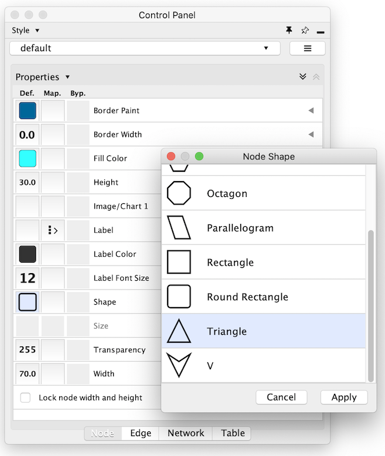

**Set node sizes based on the degree of connectivity of the nodes. You
can visually see the hub of a network...**

**...or, set the font size of the node labels instead.**

**Visualize gene expression data along a color gradient.**

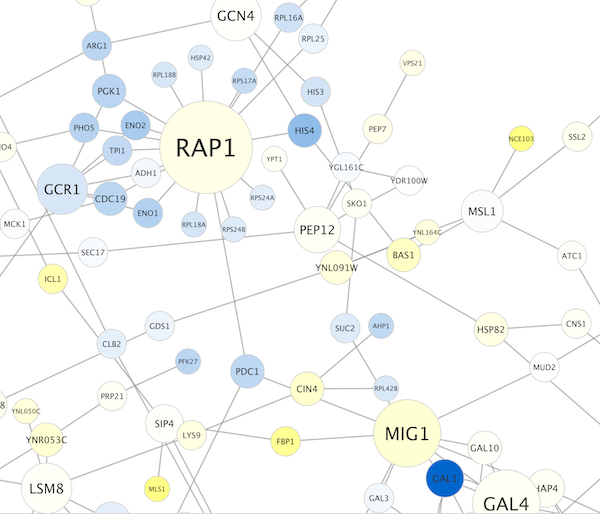

**Encode specific physical entities as different node shapes.**

**Use specific line types to indicate different types of interactions.**

**Control edge transparency (opacity) using edge weights.**

**Control multiple edge properties using edge score.**

**Browse extremely-dense networks by controlling the opacity of nodes.**

**Show highly-connected region by edge bundling and opacity.**

**Add photo/image/graphics on top of nodes.**

Cytoscape 3 has several sample styles. Below are a few examples of these
applied to the *galFiltered.sif* network :

## Introduction to the Style Interface

The **Style** interface is located under the **Style** panel of the
**Control Panel**.

This interface allows you to create/delete/view/switch between different
styles using the Current Style options. The panel displays the mapping
details for a given style and is used to edit these details as well.

-   At the top of the interface, there is a drop-down menu for selecting
    a pre-defined style. There is also an **Options** drop-down with
    options to rename, remove, create and copy a Style, and an option to
    create a legend for the selected Style.

-   The main area of the interface is composed of three tabs, for Node,
    Edge and Network.

-   Each tab contains a list of properties relevant to the
    current style. At the top of the list a **Properties** drop-down
    allows you to add additional properties to the list.

-   Each property entry in the list has 3 columns:

    -   The **Default Value** shows just that, the default value for
        the property. Clicking on the **Default Value** column for any
        property allows you to change the default value.

    -   **Mapping** displays the type of mapping currently in use for
        the property. Clicking on the **Mapping** column for any
        property expands the property entry to show the interface for
        editing the mapping. Details on the mapping types provided
        [here](http://cytoscape-working-copy.readthedocs.org/en/latest/Chapter_14_Styles.html#how-mappings-work).

    -   **Bypass** displays any style bypass for a selected node
        or edge. Note that a node/edge or subset of nodes/edges must be
        selected to activate the **Bypass** column. Clicking on the
        **Bypass** column for selected node(s)/edge(s) allows you to
        enter a bypass for that property for selected node(s)/edge(s).

The **Default Value** is used when no mapping is defined for a property,
or for nodes/edges not covered by a mapping for a particular property.
If a **Mapping** is defined for a property, this defines the style for
all or a subset of nodes/edges, depending on how the mapping is defined.
A **Bypass** on a specific set of nodes/edges will bypass and override
both the default value and defined mapping.

## Introduction to Style

The Cytoscape distribution includes several predefined styles to get you
started. To examine a few styles, try out the following example:

**Step 1. Load some sample data**

-   Load a sample session file: From the main menu, select **File
    → Open...**, and select the file *sampleData/galFiltered.cys*.

-   The session file includes a network, some annotations, and
    sample styles. By default, the style **galFiltered Style**
    is selected. Gene expression values for each node are colored along
    a color gradient between blue and yellow (where blue represents a
    low expression ratio and yellow represents a high expression ratio,
    using thresholds set for the **gal1RGexp** experiment bundled with
    Cytoscape in the *sampleData/galExpData.csv* file). Also, node size
    is mapped to the degree of the node (number of edges connected to
    the node) and you can see the hubs of the network as larger nodes.
    See the sample screenshot below:

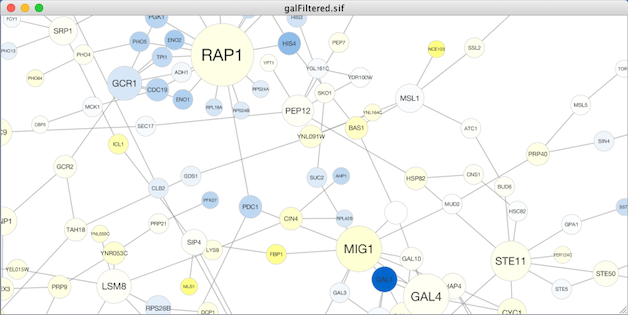

**Step 2. Switch between different styles**

You can change the style by making a selection from the **Current
Style** drop-down list, found at the top of the **Style** panel.

For example, if you select **Sample1**, a new style will be applied to
your network, and you will see a white background and round blue nodes.
If you zoom in closer, you can see that protein-DNA interactions
(specified with the label "pd") are drawn with dashed edges, whereas
protein-protein interactions (specified with the label "pp") are drawn
with solid edges (see sample screenshot below).

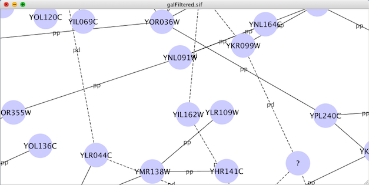

Finally, if you select **Solid**, you can see the graphics below:

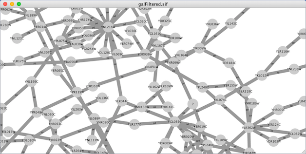

This style does not have mappings except node/edge labels, but you can
modify the network graphics by editing the *Default Value* for any
property.

Additional sample styles are available in the `sampleStyles.xml` file in
the *sampleData* directory. You can import the sample file from **File →
Import → Styles...**.

### List of Node, Edge and Network Properties

Cytoscape allows a wide variety of properties to be controlled. These
are summarized in the tables below.

<table cellspacing="0" style="table-layout: fixed; width: 700px">
<caption>Node Properties</caption>
<colgroup> <col style="width:200px">                              <col style="width:500px"> </colgroup>
<tbody>
<tr> <th>Node Properties</th>                                     <th>Description</th></tr>
<tr> <th class="spec ulcase">Border Line Type</th>                <td class="">The type of line used for the border of the node.</td> </tr>
<tr> <th class="specalt ulcase">Border Transparency</th>          <td class="alt">The opacity of the color of the border of the node. <i>Zero</i> means totally transparent, and <i>255</i> means totally opaque.</td> </tr>
<tr> <th class="spec ulcase">Border Width</th>                    <td class="">The width of the node border.</td> </tr>
<tr> <th class="specalt ulcase">Label</th>                        <td class="alt">The text used for the node label.</td> </tr>
<tr> <th class="spec ulcase">Label Font Face</th>                 <td class="">The font used for the node label.</td> </tr>
<tr> <th class="specalt ulcase">Label Font Size</th>              <td class="alt">The size of the font used for the node label.</td> </tr>
<tr> <th class="spec ulcase">Label Position</th>                  <td class="">The position of the node label relative to the node.</td> </tr>
<tr> <th class="specalt ulcase">Label Transparency</th>           <td class="alt">The opacity of the node label. <i>Zero</i> means totally transparent, and <i>255</i> means totally opaque.</td> </tr>
<tr> <th class="spec ulcase">Label Width</th>                     <td class="">The maximum width of the node label. If the node label is wider than the specified width, Cytoscape will automatically wrap the label on space characters. Cytoscape will not hyphenate words, meaning that if a single word (i.e. no spaces) is longer than maximum width, the word will be displayed beyond the maximum width.</td> </tr>
<tr> <th class="specalt ulcase">Nested Network Image Visible</th> <td class="alt">A boolean value that indicates whether a nested network should be visualized (assuming a nested network is present for the specified node).</td> </tr>
<tr> <th class="spec ulcase">Padding (Compound Node)</th>         <td class="">Internal padding of the compound node (a node that contains other nodes).</td> </tr>
<tr> <th class="specalt ulcase">Paint</th>                        <td class="alt">The color of the whole node, including its border, label and selected paint. This property can be added to the list from the drop-down menu <b>Properties → Paint → Paint</b>.</td> </tr>
<tr> <th class="spec ulcase">Border Paint</th>                    <td class="">The color of the border of the node. This property can be added to the list from the drop-down menu <b>Properties → Paint → Border Paint</b>.</td> </tr>
<tr> <th class="specalt ulcase">Image/Chart <i>1-9</i></th>       <td class="alt">A user-defined graphic (image, chart or gradient) that is displayed on the node. These properties (maximum of nine) can be added to the list from the drop-down menu <b>Properties → Paint → Custom Paint <i>n</i> → Image/Chart <i>n</i></b>.</td> </tr>
<tr> <th class="spec ulcase">Image/Chart Position <i>1-9</i></th> <td class="">The position of each graphic (image, chart or gradient). These properties (maximum of nine) can be added to the list from the drop-down menu <b>Properties → Paint → Custom Paint <i>n</i> → Image/Chart Position <i>n</i></b>.</td> </tr>
<tr> <th class="specalt ulcase">Fill Color</th>                   <td class="alt">The color of the node. This property can be added to the list from the drop-down menu <b>Properties → Paint → Fill Color</b>.</td> </tr>
<tr> <th class="spec ulcase">Label Color</th>                     <td class="">The color of the node label. This property can be added to the list from the drop-down menu <b>Properties → Paint → Label Color</b>.</td> </tr>
<tr> <th class="specalt ulcase">Selected Paint</th>               <td class="alt">The fill color of the node when selected. This property can be added to the list from the drop-down menu <b>Properties → Paint → Selected Paint</b>.</td> </tr>
<tr> <th class="spec ulcase">Shape</th>                           <td class="">The shape of the node.</td> </tr>
<tr> <th class="specalt ulcase">Shape (Compound Node)</th>        <td class="alt">The shape of the compound node (a node that contains other nodes).</td> </tr>
<tr> <th class="spec ulcase">Size</th>                            <td class="">The size of the node. Width and height will be equal. This property is mutually exclusive of <i>Node Height</i> and <i>Node Width</i>. It can be added to the list from the drop-down menu <b>Properties → Size → Size</b>.</td> </tr>
<tr> <th class="specalt ulcase">Image/Chart Size <i>1-9</i></th>  <td class="alt">The size of the related node <i>Image/Chart</i>. It can be added to the list from the drop-down menu <b>Properties → Size → Image/Chart Size <i>n</i></b>.</td> </tr>
<tr> <th class="spec ulcase">Height</th>                          <td class="">The height of the node. Height will be independent of width. This property is mutually exclusive of <i>Node Size</i>. It can be added to the list from the drop-down menu <b>Properties → Size → Height</b>.</td> </tr>
<tr> <th class="specalt ulcase">Width</th>                        <td class="alt">The width of the node. Width will be independent of height. This property is mutually exclusive of <i>Node Size</i>. It can be added to the list from the drop-down menu <b>Properties → Size → Width</b>.</td> </tr>
<tr> <th class="spec ulcase">Fit Custom Graphics to node</th>     <td class="">Toggle to fit Image/Chart size to node size. It can be added to the list from the drop-down menu <b>Properties → Size → Fit Custom Graphics to node</b>.</td> </tr>
<tr> <th class="specalt ulcase">Lock node width and height</th>   <td class="alt">Toggle to ignore <i>Width</i> and <i>Height</i>, and to use <i>Size</i> for both values. It can be added to the list from the drop-down menu <b>Properties → Size → Lock node width and height</b>.</td> </tr>
<tr> <th class="spec ulcase">Tooltip</th>                         <td class="">The text of the tooltip that appears when a mouse hovers over the node.</td> </tr>
<tr> <th class="specalt ulcase">Transparency</th>                 <td class="alt">The opacity of the color of the node. <i>Zero</i> means totally transparent, and <i>255</i> means totally opaque.</td> </tr>
<tr> <th class="spec ulcase">Visible</th>                         <td class="">Hides the node if set to <i>false</i>. By default, this value is set to <i>true</i>.</td> </tr>
<tr> <th class="specalt ulcase">X Location</th>                   <td class="alt">X location of the node. Default value of this will be ignored. The value will be used only when mapping function is defined.</td> </tr>
<tr> <th class="spec ulcase">Y Location</th>                      <td class="">Y location of the node. Default value of this will be ignored. The value will be used only when mapping function is defined.</td> </tr>
<tr> <th class="specalt ulcase">Z Location</th>                   <td class="alt">Z location of the node. Default value of this will be ignored. The value will be used only when mapping function is defined.</td> </tr>
</tbody>
</table>
 

<table cellspacing="0" style="table-layout: fixed; width: 700px">
<caption>Edge Properties</caption>
<colgroup> <col style="width:200px">                                <col style="width:500px"> </colgroup>
<tbody>
<tr> <th>Edge Properties</th>                                       <th>Description</th></tr>
<tr> <th class="spec ulcase">Bend</th>                              <td class="">The edge bend. Defines how the edge is rendered. Users can add multiple handles to define how to bend the edge line.</td> </tr>
<tr> <th class="specalt ulcase">Curved</th>                         <td class="alt">If <i>Edge Bend</i> is defined, edges will be rendered as straight or curved lines. If this value is set to <i>true</i>, edges will be drawn as curved lines.</td> </tr>
<tr> <th class="spec ulcase">Label</th>                             <td class="">The text used for the edge label.</td> </tr>
<tr> <th class="specalt ulcase">Label Font Face</th>                <td class="alt">The font used for the edge label.</td> </tr>
<tr> <th class="spec ulcase">Label Font Size</th>                   <td class="">The size of the font used for the edge label.</td> </tr>
<tr> <th class="specalt ulcase">Label Transparency</th>             <td class="alt">The opacity of the color of the edge label. <i>Zero</i> means totally transparent, and <i>255</i> means totally opaque.</td> </tr>
<tr> <th class="spec ulcase">Line Type</th>                         <td class="">The type of stoke used to render the line (solid, dashed, etc.)</td> </tr>
<tr> <th class="specalt ulcase">Paint</th>                          <td class="alt">The color of the whole edge (including the stroke and arrows) when it is selected or unselected. This property can be added to the list from the drop-down menu <b>Properties → Paint → Paint</b>.</td> </tr>
<tr> <th class="spec ulcase">Color (Selected)</th>                  <td class="">The color of the whole edge (stroke and arrows) when selected. This property can be added to the list from the drop-down menu <b>Properties → Paint → Color (Selected) → Color (Selected)</b>.</td> </tr>
<tr> <th class="specalt ulcase">Source Arrow Selected Paint</th>    <td class="alt">The selected color of the arrow on the source node end of the edge. It can be added to the list from the drop-down menu <b>Properties → Paint → Color (Selected) → Source Arrow Selected Paint</b>.</td> </tr>
<tr> <th class="spec ulcase">Stroke Color (Selected)</th>           <td class="">The color of the edge line when selected. It can be added to the list from the drop-down menu <b>Properties → Paint → Color (Selected) → Stroke Color (Selected)</b>.</td> </tr>
<tr> <th class="specalt ulcase">Target Arrow Selected Paint</th>    <td class="alt">The selected color of the arrow on the target node end of the edge. It can be found in the drop-down menu <b>Properties → Paint → Color (Selected) → Target Arrow Selected Paint</b>.</td> </tr>
<tr> <th class="spec ulcase">Color (Unselected)</th>                <td class="">The color of the whole edge (stroke and arrows) when it is not selected. It can be found in the drop-down menu <b>Properties → Paint → Color (Unselected) → Color (Unselected)</b>.</td> </tr>
<tr> <th class="specalt ulcase">Source Arrow Unselected Paint</th>  <td class="alt">The color of the arrow on the source node end of the edge. It can be found in the drop-down menu <b>Properties → Paint → Color (Unselected) → Source Arrow Unselected Paint</b>.</td> </tr>
<tr> <th class="spec ulcase">Stroke Color (Unselected)</th>         <td class="">The color of the edge line. It can be found in the drop-down menu <b>Properties → Paint → Color (Unselected) → Stroke Color (Unselected)</b>.</td> </tr>
<tr> <th class="specalt ulcase">Target Arrow Unselected Paint</th>  <td class="alt">The color of the arrow on the target node end of the edge. It can be found in the drop-down menu <b>Properties → Paint → Color (Unselected) → Target Arrow Unselected Paint</b>.</td> </tr>
<tr> <th class="spec ulcase">Label Color</th>                       <td class="">The color of the edge label. It can be found in the drop-down menu <b>Properties → Paint → Label Color</b>.</td> </tr>
<tr> <th class="specalt ulcase">Source Arrow Shape</th>             <td class="alt">The shape of the arrow on the source node end of the edge.</td> </tr>
<tr> <th class="spec ulcase">Target Arrow Shape</th>                <td class="">The shape of the arrow on the target node end of the edge.</td> </tr>
<tr> <th class="specalt ulcase">Tooltip</th>                        <td class="alt">The text of the tooltip that appears when a mouse hovers over the edge.</td> </tr>
<tr> <th class="spec ulcase">Transparency</th>                      <td class="">The opacity of the of the edge. Zero means totally transparent, and 255 means totally opaque.</td> </tr>
<tr> <th class="specalt ulcase">Visible</th>                        <td class="alt">Hides the edge if set to <i>false</i>. By default, this value is set to <i>true</i>.</td> </tr>
<tr> <th class="spec ulcase">Width</th>                             <td class="">The width of the edge line.</td> </tr>
<tr> <th class="specalt ulcase">Edge color to arrows</th>           <td class="alt">If <i>true</i> then <b>Color (Unselected)</b> is used for the whole edge, including its line and arrows. It can be found in the drop-down menu <b>Properties → Paint → Color (Unselected) → Edge color to arrows</b>.</td> </tr>
</tbody>
</table>
 

<table cellspacing="0" style="table-layout: fixed; width: 700px">
<caption>Network Properties</caption>
<colgroup> <col style="width:200px">                    <col style="width:500px"> </colgroup>
<tbody>
<tr> <th>NetworkProperties</th>                         <th>Description</th></tr>
<tr> <th class="spec ulcase">Background Paint</th>      <td class="">The background color of the network view.</td> </tr>
<tr> <th class="specalt ulcase">Center X Location</th>  <td class="alt">The X location of network view center.</td> </tr>
<tr> <th class="spec ulcase">Center Y Location</th>     <td class="">The Y location of network view center.</td> </tr>
<tr> <th class="specalt ulcase">Edge Selection</th>     <td class="alt">Edges are selectable or not. If this is <i>false</i>, users cannot select edges.</td> </tr>
<tr> <th class="spec ulcase">Node Selection</th>        <td class="">Nodes are selectable or not. If this is <i>false</i>, users cannot select nodes.</td> </tr>
<tr> <th class="specalt ulcase">Scale Factor</th>       <td class="alt">The zoom level of the network view.</td> </tr>
<tr> <th class="spec ulcase">Size</th>                  <td class="">The size (width and height) of the network view. It can be found in the drop-down menu <b>Properties → Size → Size</b>.</td> </tr>
<tr> <th class="specalt ulcase">Height</th>             <td class="alt">The height of the network view. It can be found in the drop-down menu <b>Properties → Size → Height</b>.</td> </tr>
<tr> <th class="spec ulcase">Width</th>                 <td class="">The width of the network view. It can be found in the drop-down menu <b>Properties → Size → Width</b>.</td> </tr>
<tr> <th class="specalt ulcase">Title</th>              <td class="alt">The title of the network view.</td> </tr>
</tbody>
</table>
 

### Available Shapes and Line Styles

<table cellspacing="0" style="table-layout: fixed; width: 440px">
<caption style="width: 440px">Available Shapes and Line Styles</caption>
<colgroup> <col style="width:140px">                           <col style="width:300px"> </colgroup>
<tbody>
<tr> <th class="center">Available Shapes and Line Styles</th>  <th>Sample</th></tr>
<tr> <th class="spec ulcase center"><i>Node Shapes</i></th>    <td class=""></td> </tr>
<tr> <th class="specalt ulcase center"><i>Line Types</i></th>  <td class="alt"></td> </tr>
<tr> <th class="spec ulcase center"><i>Arrow Shapes</i></th>   <td class=""></td> </tr>
</tbody>
</table>
 

### How Mappings Work

For each property, you can specify a default value or define a dynamic
mapping. Cytoscape currently supports three different types of mappings:

1.  **Passthrough Mapping**

    -   The values of network column data are passed directly through
        to properties. A passthrough mapping is typically used to
        specify node/edge labels. For example, a passthrough mapping can
        label all nodes with their common gene names.

2.  **Discrete Mapping**

    -   Discrete column data are mapped to discrete properties. For
        example, a discrete mapping can map different types of molecules
        to different node shapes, such as rectangles for gene products
        and ellipses for metabolites.

3.  **Continuous Mapping**

    -   Continuous data are mapped to properties. Depending on the
        property, there are three kinds of continuous mapping:

        i.  **Continuous-to-Continuous Mapping**: for example, you can
            map a continuous numerical value to node size.

        ii. **Color Gradient Mapping**: This is a special case of
            continuous-to-continuous mapping. Continuous numerical
            values are mapped to a color gradient.

        iii. **Continuous-to-Discrete Mapping**: for example, all values
            below 0 are mapped to square nodes, and all values above 0
            are mapped to circular nodes.

    -   However, note that there is no way to smoothly morph between
        circular nodes and square nodes.

The table below shows mapping support for each property.

**Legend**

<table cellspacing="0" style="table-layout: fixed; width: 700px">
<caption>Legend</caption>
<colgroup> <col style="width:75px">            <col style="width:625px"> </colgroup>
<tbody>
<tr> <th>Symbol</th>                           <th>Description</th></tr>
<tr> <th class="spec ulcase center">-</th>     <td class="">Mapping is not supported for the specified property.</td> </tr>
<tr> <th class="specalt ulcase center">+</th>  <td class="alt">Mapping is fully supported for the specified property.</td> </tr>
<tr> <th class="spec ulcase center">o</th>     <td class="">Mapping is partially supported for the specified property. Support for "continuous to continuous" mapping is not supported.</td> </tr>
</tbody>
</table>
 

**Node Mappings**

<table cellspacing="0" style="table-layout: fixed; width: 600px">
<caption>Node Mappings</caption>
<colgroup> <col style="width:80px">                   <col style="width:170px">                                           <col style="width:150px">                   <col style="width:150px">                <col style="width:150px">                  </colgroup>
<tbody>
<tr> <th class="center" colspan="2">Node Property</th>                                                                    <th class="center">Passthrough Mapping</th> <th class="center">Discrete Mapping</th> <th class="center">Continuous Mapping</th> </tr>
<tr> <th class="spec ulcase" rowspan="6">Color</th>   <th class="spec ulcase"><i>Fill Color</i></th>                      <td class="center">+</th>                   <td class="center">+</th>                <td class="center">+</td>                  </tr>
<tr>                                                  <th class="specalt ulcase"><i>Transparency</i></th>                 <td class="alt center">+</th>               <td class="alt center">+</th>            <td class="alt center">+</td>              </tr>
<tr>                                                  <th class="spec ulcase"><i>Border Paint</i></th>                    <td class="center">+</th>                   <td class="center">+</th>                <td class="center">+</td>                  </tr>
<tr>                                                  <th class="specalt ulcase"><i>Border Transparency</i></th>          <td class="alt center">+</th>               <td class="alt center">+</th>            <td class="alt center">+</td>              </tr>
<tr>                                                  <th class="spec ulcase"><i>Label Color</i></th>                     <td class="center">+</th>                   <td class="center">+</th>                <td class="center">+</td>                  </tr>
<tr>                                                  <th class="specalt ulcase"><i>Label Transparency</i></th>           <td class="alt center">+</th>               <td class="alt center">+</th>            <td class="alt center">+</td>              </tr>
<tr> <th class="spec ulcase" rowspan="6">Numeric</th> <th class="spec ulcase"><i>Size/Width/Height</i></th>               <td class="center">+</th>                   <td class="center">+</th>                <td class="center">+</td>                  </tr>
<tr>                                                  <th class="specalt ulcase"><i>Label Font Size</i></th>              <td class="alt center">+</th>               <td class="alt center">+</th>            <td class="alt center">+</td>              </tr>
<tr>                                                  <th class="spec ulcase"><i>Border Width</i></th>                    <td class="center">+</th>                   <td class="center">+</th>                <td class="center">+</td>                  </tr>
<tr>                                                  <th class="specalt ulcase"><i>Label Width</i></th>                  <td class="alt center">+</th>               <td class="alt center">+</th>            <td class="alt center">+</td>              </tr>
<tr>                                                  <th class="spec ulcase"><i>Padding (Compound Node)</i></th>         <td class="center">+</th>                   <td class="center">+</th>                <td class="center">+</td>                  </tr>
<tr>                                                  <th class="specalt ulcase"><i>Image/Chart Size</i></th>             <td class="alt center">+</th>               <td class="alt center">+</th>            <td class="alt center">+</td>              </tr>
<tr> <th class="spec ulcase" rowspan="10">Other</th>  <th class="spec ulcase"><i>Border Line Type</i></th>                <td class="center">+</th>                   <td class="center">+</th>                <td class="center">o</td>                  </tr>
<tr>                                                  <th class="specalt ulcase"><i>Shape</i></th>                        <td class="alt center">+</th>               <td class="alt center">+</th>            <td class="alt center">o</td>              </tr>
<tr>                                                  <th class="spec ulcase"><i>Shape (Compound Node)</i></th>           <td class="center">+</th>                   <td class="center">+</th>                <td class="center">o</td>                  </tr>
<tr>                                                  <th class="specalt ulcase"><i>Label</i></th>                        <td class="alt center">+</th>               <td class="alt center">+</th>            <td class="alt center">o</td>              </tr>
<tr>                                                  <th class="spec ulcase"><i>Tooltip</i></th>                         <td class="center">+</th>                   <td class="center">+</th>                <td class="center">o</td>                  </tr>
<tr>                                                  <th class="specalt ulcase"><i>Label Font Face</i></th>              <td class="alt center">+</th>               <td class="alt center">+</th>            <td class="alt center">o</td>              </tr>
<tr>                                                  <th class="spec ulcase"><i>Label Position</i></th>                  <td class="center">-</th>                   <td class="center">+</th>                <td class="center">o</td>                  </tr>
<tr>                                                  <th class="specalt ulcase"><i>Nested Network Image Visible</i></th> <td class="alt center">+</th>               <td class="alt center">+</th>            <td class="alt center">o</td>              </tr>
<tr>                                                  <th class="spec ulcase"><i>Image/Chart</i></th>                     <td class="center">o</th>                   <td class="center">+</th>                <td class="center">o</td>                  </tr>
<tr>                                                  <th class="specalt ulcase"><i>Image/Chart Position</i></th>         <td class="alt center">-</th>               <td class="alt center">+</th>            <td class="alt center">o</td>              </tr>
</tbody>
</table>
 

**Edge Mappings**

<table cellspacing="0" style="table-layout: fixed; width: 600px">
<caption>Edge Mappings</caption>
<colgroup> <col style="width:80px">                    <col style="width:170px">                                 <col style="width:150px">                   <col style="width:150px">                <col style="width:150px">                  </colgroup>
<tbody>
<tr> <th class="center" colspan="2">Edge Property</th>                                                           <th class="center">Passthrough Mapping</th> <th class="center">Discrete Mapping</th> <th class="center">Continuous Mapping</th> </tr>
<tr> <th class="spec ulcase" rowspan="6">Color</th>    <th class="spec ulcase"><i>Color</i></th>                 <td class="center">+</th>                   <td class="center">+</th>                <td class="center">+</td>                  </tr>
<tr>                                                   <th class="specalt ulcase"><i>Transparency</i></th>       <td class="alt center">+</th>               <td class="alt center">+</th>            <td class="alt center">+</td>              </tr>
<tr>                                                   <th class="spec ulcase"><i>Target Arrow Color</i></th>    <td class="center">+</th>                   <td class="center">+</th>                <td class="center">+</td>                  </tr>
<tr>                                                   <th class="specalt ulcase"><i>Source Arrow Color</i></th> <td class="alt center">+</th>               <td class="alt center">+</th>            <td class="alt center">+</td>              </tr>
<tr>                                                   <th class="spec ulcase"><i>Label Color</i></th>           <td class="center">+</th>                   <td class="center">+</th>                <td class="center">+</td>                  </tr>
<tr>                                                   <th class="specalt ulcase"><i>Label Transparency</i></th> <td class="alt center">+</th>               <td class="alt center">+</th>            <td class="alt center">+</td>              </tr>
<tr> <th class="spec ulcase" rowspan="3">Numeric</th>  <th class="spec ulcase"><i>Width</i></th>                 <td class="center">+</th>                   <td class="center">+</th>                <td class="center">+</td>                  </tr>
<tr>                                                   <th class="specalt ulcase"><i>Label Font Size</i></th>    <td class="alt center">+</th>               <td class="alt center">+</th>            <td class="alt center">+</td>              </tr>
<tr>                                                   <th class="spec ulcase"><i>Label Width</i></th>           <td class="center">+</th>                   <td class="center">+</th>                <td class="center">+</td>                  </tr>
<tr> <th class="specalt ulcase" rowspan="8">Other</th> <th class="specalt ulcase"><i>Line Type</i></th>          <td class="alt center">+</th>               <td class="alt center">+</th>            <td class="alt center">o</td>              </tr>
<tr>                                                   <th class="spec ulcase"><i>Bend</i></th>                  <td class="center">-</th>                   <td class="center">+</th>                <td class="center">o</td>                  </tr>
<tr>                                                   <th class="specalt ulcase"><i>Curved</i></th>             <td class="alt center">+</th>               <td class="alt center">+</th>            <td class="alt center">o</td>              </tr>
<tr>                                                   <th class="spec ulcase"><i>Source Arrow Shape</i></th>    <td class="center">+</th>                   <td class="center">+</th>                <td class="center">o</td>                  </tr>
<tr>                                                   <th class="specalt ulcase"><i>Target Arrow Shape</i></th> <td class="alt center">+</th>               <td class="alt center">+</th>            <td class="alt center">o</td>              </tr>
<tr>                                                   <th class="spec ulcase"><i>Label</i></th>                 <td class="center">+</th>                   <td class="center">+</th>                <td class="center">o</td>                  </tr>
<tr>                                                   <th class="specalt ulcase"><i>Tooltip</i></th>            <td class="alt center">+</th>               <td class="alt center">+</th>            <td class="alt center">o</td>              </tr>
<tr>                                                   <th class="spec ulcase"><i>Label Font Face</i></th>       <td class="center">-</th>                   <td class="center">+</th>                <td class="center">o</td>                  </tr>
</tbody>
</table>
 

#### Text Passthrough Mapping

In Cytoscape 2.8.0 and later versions, the Passthrough Mapping can
recognize some text representations of values. This means, if you have a
string column named *Node Size Values*, you can directly map those
values as the Node Size by setting "Node Size Values" as controlling
column with **Node Size** "Passthrough Mapping". The following value
types are supported:

-   **Colors:** [Standard color names supported by all
    browsers](http://www.w3schools.com/html/html_colornames.asp) or RGB
    representation in hex

-   **Numerical Values:** Automatically mapped to the
    specified property.

-   **Images:** URL String. If the URL is valid and an actual image data
    exists there, Cytoscape automatically downloads the image and maps
    it to the node.

##### Examples

1.  Color Passthrough Mapping

    
        

2.  Node Size Passthrough Mapping

    
        

3.  Image Passthrough Mapping

    
        

## Images, Charts and Gradients

Cytoscape allows you to set custom graphics to nodes. Using the Style
interface, you can map **Image/Chart** properties to nodes like any
other property. Cytoscape provides a set of images and you can also add
your own images in the **Image Manager**, as well as remove or modify
existing ones.

[Taxonomy
Icon (http://biosciencedbc.jp/taxonomy_icon/taxonomy_icon.cgi?lng=en)](http://biosciencedbc.jp/taxonomy_icon/taxonomy_icon.cgi?lng=en)
set used in this section is created by Database Center for Life Science
(DBCLS) and is distributed under Creative Commons License ([CC BY
2.1.](http://creativecommons.org/licenses/by/2.1/jp/deed.en))

### Managing Images

The **Image Manager** is available under the menu option **View → Open
Image Manager...**:

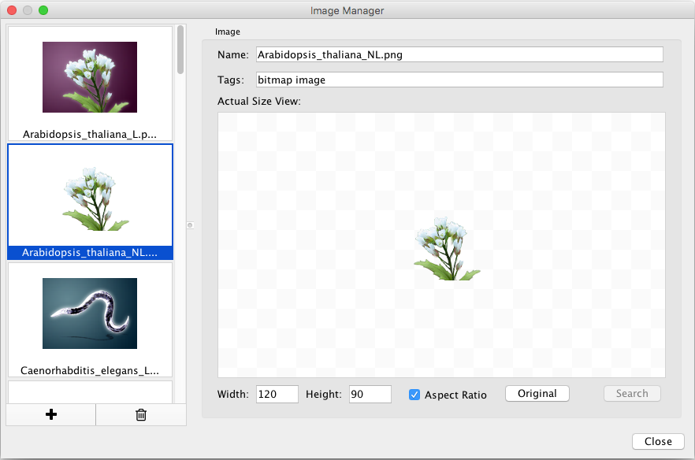

-   You can add images by drag-and-drop of image files and URLs. If you
    want to add images from a web browser or local file system, you can
    drag images from them and drop those images onto the list of images
    on the left.

    -   **Note:** When you drag and drop images from web browser, make
        sure that you are actually dragging the URL for the image. In
        some cases, images are linked to an HTML page or scripts, and in
        such cases, this drag and drop feature may not work.

-   If you want to add one or more images from a folder, press the **+**
    button on the bottom of the Image Manager window and then select the
    images you want to add.

-   To remove images from the current session's image library, simply
    select one or more images from the list and press the **Remove
    Selected Images** button (trash icon).

-   Images can be resized by defining specific **Width** and
    **Height** values. If the **Aspect Ratio** box is checked, the
    width-height ratio is always synchronized. You can resize the image
    to the original size by pressing the **Original** button.

### Using Graphics in Styles

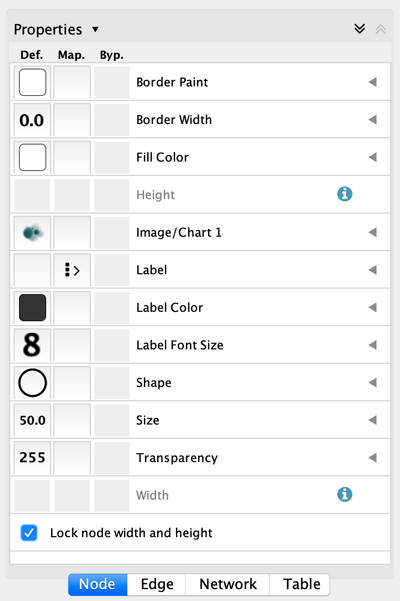
    

Node graphics are used and defined like any other property, through the
**Style** interface. There are nine **Image/Chart** properties.

-   Cytoscape provides three kinds of graphics (selectable via tabs on
    the **Graphics** dialog):

    -   **Images:** You can select one of the provided images or add
        your own (click the **Open Image Manager...** button to add more
        images to the list).

    -   **Charts:** The following chart types are available:
        
        *Bar* ,
        
        *Box*,
        
        *Heat Map*,
        
        *Line*,
        
        *Pie*,
        
        *Ring*.

    -   **Gradients:** You can also set *Linear* and *Radial* gradients
        to nodes.

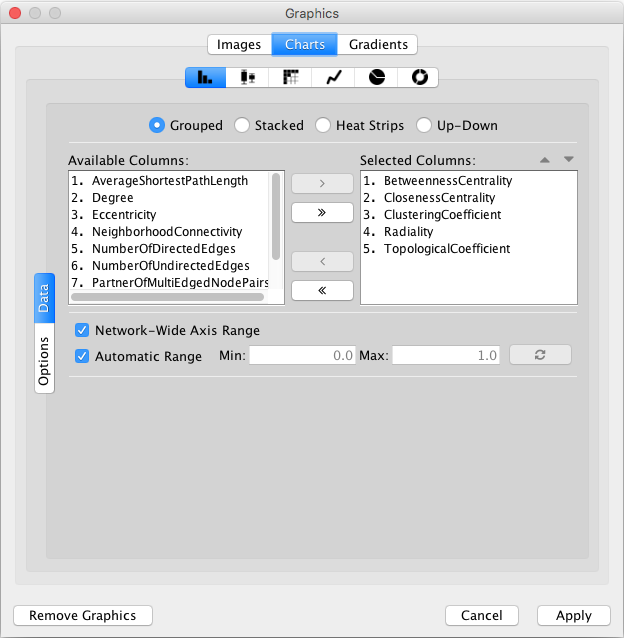
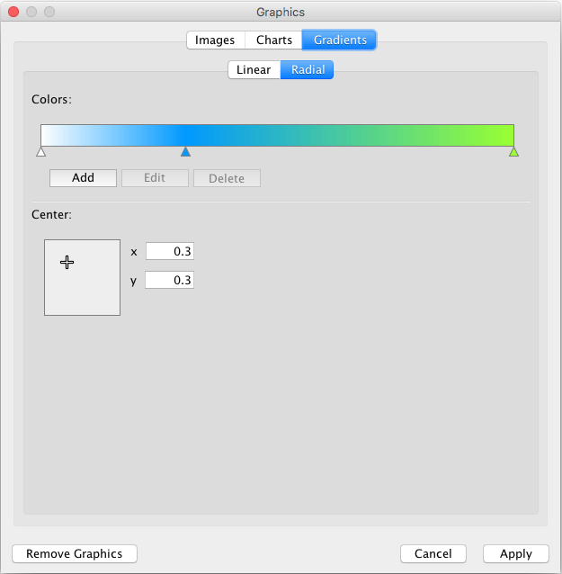

-   To add a graphic, first add one **Image/Chart** property to the
    properties list in the **Style** interface (on the **Node** tab,
    select **Properties → Paint → Custom Paint *n* → Image/Chart *n***).
    Next, click the **Default Value** column of the **Image/Chart**
    property to bring up the **Graphics** dialog. Select an image, a
    chart or a gradient and then click **Apply**.

    -   By default, graphics are automatically resized to be consistent
        with the **Node Size** property.

-   To remove an image, chart or gradient, click the **Remove Graphics**
    button on the **Graphics** dialog.

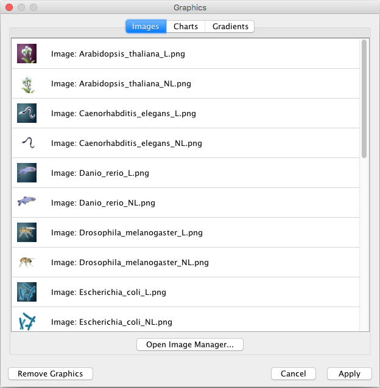

#### Graphics Positions

Each **Image/Chart** property is associated with a position. You can
edit its position by using the UI available in the **Default Value**
column for the **Image/Chart Position** property that has the same
number. For instance, the **Image/Chart Position 2** value modifies the
position of **Image/Chart 2**.

-   **Note:** Setting graphics positions for *Linear* or *Radial*
    gradients has no effect, as they are always centered on the node.

#### Z-Ordering

The number that appears with the **Image/Chart** property represents an
ordering of layers. Basic node color and shape are always rendered
first, then node Image/Chart 1, 2, ..., through 9.

### Saving and Loading Images

In general, saving and loading images is automatic. When you quit
Cytoscape, all of the images in the **Image Manager** will be saved
automatically. There are two types of saving:

1.  To a session file

    -   When you save the current session to a file, the images used in
        the current styles will be saved to that file. For example, if
        you have a style with a discrete mapping for **Image/Chart 1**,
        all images used in the style will be saved to the session file.
        Other images will **not** be saved in your session file. This is
        because your image library can be huge when you add thousands of
        images to the Image Manager and it takes a very long time to
        save and load the session file.

2.  Automatic saving to `CytoscapeConfiguration/images3` directory

    -   When you select **File → Quit** (Windows and Linux) or
        **Cytoscape → Quit Cytoscape** (Mac OS X), all of the images in
        the Image Manager will be saved automatically to your Cytoscape
        settings directory. Usually, they are saved in
        `YOUR_HOME_DIRECTORY/CytoscapeConfiguration/images3`.

In any case, images will be saved automatically to your system or
session and will be restored when you restart Cytoscape or load a
session.

## Styles Tutorials

The following tutorials demonstrate some of the basic **Style**
features. Each tutorial is independent of the others.

### Tutorial 1: Creating a Basic Style and Setting Default Values

The goal of this tutorial is to learn how to create a new Style and set
some default values.

1.  **Load a sample network:** From the main menu, select **File →
    Import → Network → File...**, and select
    `sampleData/galFiltered.sif`.

2.  **Create some node/edge statistics:** The **Network Analyzer**
    calculates some basic statistics for nodes and edges. From the main
    menu, select **Tools → Network Analyzer → Network Analysis → Analyze
    Network**, and click **OK**. Once the result is displayed, simply
    close the window. All statistics are stored as regular table data.

3.  Select the **Style** panel in the Control Panel.

    

4.  **Create a new style:** Click the **Options**
    
    drop-down, and select **Create New Style**. Enter a name for your
    new style when prompted.

    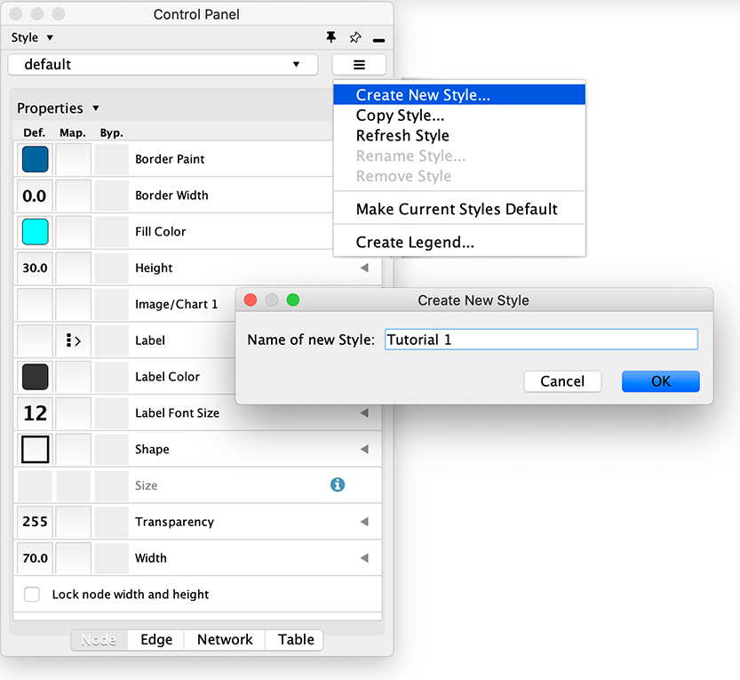

Since no mappings are set up yet, only default values are defined for
some of the properties. From this panel, you can create node/edge
mappings for all properties.

5.  **Change the default node color and shape:** To set the default node
    shape to triangles, click the **Default Value** column for the
    **Shape** property. A list of available node shapes will be shown.
    Select the **Triangle** item and click the **Apply** button. You can
    edit other default values in the same way. In the example shown
    below, the node shape is set to **Round Rectangle**, while **Fill
    Color** is set to white. The new Style is automatically applied to
    the current network, as shown below.

    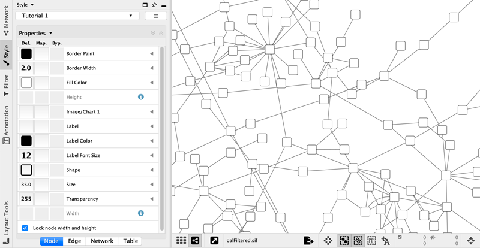

### Tutorial 2: Creating a New Style with a Discrete Mapping

Now you have a network with a new Style. The following section
demonstrates how to create a new style that has a discrete mapping. The
goal is to draw protein-DNA interactions as dashed lines, and
protein-protein interactions as solid lines.

1.  **Find the property:** In the Edge tab of the Style panel, find the
    **Stroke Color (Unselected)** property. If it is not already visible
    in the properties sheet, add it by selecting the drop-down item
    **Properties → Paint → Color (Unselected) → Stroke
    Color (Unselected)**.

2.  **Choose a data column to map to:** Expand the entry for **Stroke
    Color (Unselected)** by clicking the arrow icon on the right. Click
    the **Column** entry and select "interaction" from the drop-down
    list that appears.

3.  **Set the mapping type:** Under **Mapping Type**, select
    "Discrete Mapping". All available column values for "interaction"
    will be displayed, as shown below.

    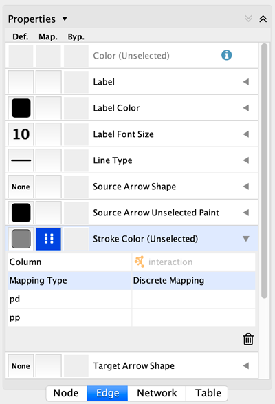

4.  **Set the mapped values:** Click the empty cell next to "pd"
    (protein-DNA interactions). On the right side of the cell, click on
    the **...** button that appears. A popup window will appear; select
    green or similar, and the change will immediately appear on the
    network window.

    

Repeat step 4 for "pp" (protein-protein interactions), but select a
darker color. Then repeat steps 3 through 4 for the *Line Type*
property, by selecting the correct line style ("Dash" or "Solid") from
the list.

Now your network should show "pd" interactions as dashed green lines and
"pp" interactions as solid lines. A sample screenshot is provided below.

### Tutorial 3: Creating a New Style with a Continuous Mapping

At this point, you have a network with some edge mappings. Next, let's
create mappings for nodes. The following section demonstrates how to
create a new style using a continuous mapping. The goal is to
superimpose node statistics (in this example, node degree) onto a
network and display it along a color gradient.

1.  **Find the property:** In the Node tab of the Style panel, find the
    **Fill Color** property. If it is not already visible in the
    properties sheet, add it by selecting the drop-down item
    **Properties → Paint → Fill Color**.

2.  **Set the node table column:** Expand the entry for **Fill Color**
    by clicking the arrow icon on the right. Click the **Column** entry
    and select "Degree" from the drop-down list that appears.

3.  **Set the mapping type:** Set the "Continuous Mapping" option as the
    **Mapping Type**. This automatically creates a default mapping.

    

4.  **Define the points where colors will change:** Double-click on the
    black-and-white gradient rectangle next to **Current Mapping** to
    open the **Continuous Mapping Editor**. Note the two smaller
    triangles at the top of the gradient.

    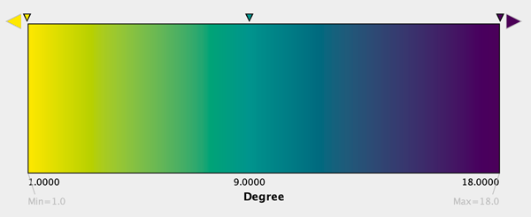

5.  **Define the colors between points:** Double-click on the larger
    leftmost triangle (facing left) and a color palette will appear. Set
    the color white and repeat for the smaller left-side triangle. For
    the triangle on the right, set the color green and then choose the
    same color for the smaller right-side triangle.

    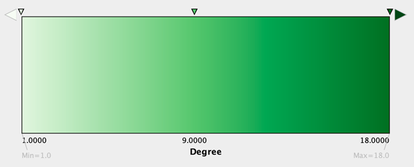

The color gradients will immediately appear on the network. All nodes
with degree *1* will be set to white, and all values between *1* and
*18* will be painted with a white/green color gradient (see the sample
screenshot below).

-   **Repeat for other properties:** You can create more continuous
    mappings for other numeric table data. For example, edge data table
    column "EdgeBetweenness" is a number, so you can use it for
    continuous mapping. The following is an example visualization which
    mapps *Edge Width* to "EdgeBetweenness".

    

### Tutorial 4: Setting Automatic Values to a Discrete Mapping

The goal of this section is to learn how to generate automatic values
for discrete mappings.

1.  Switch the Current Style to **Minimal**. Now your network looks like
    the following:

    

2.  Create a discrete mapping for **Fill Color**. Select
    "AverageShortestPathLength" (generated by the Network Analyzer) as
    the controlling property.

3.  Right-click the **Fill Color** cell, then select **Mapping Value
    Generators → Rainbow**. Cytoscape will automatically generate
    different colors for all the property values as shown below:

    

4.  Create a discrete mapping for **Label Font Size**. Select
    "AverageShortestPathLength" as controlling property
    (**Column** field).

5.  Right-click the **Label Font Size** cell, then select **Mapping
    Value Generators → Number Series**. Type **3** for the first value
    and click OK. Enter *3* for increment.

6.  Apply **Layout → yFiles Layouts → Organic**. The final view is shown
    below:

    

This mapping generator utility is useful for categorical data. The
following example shows a discrete mapping that maps the species column
to node color.

### Tutorial 5: Using Images in Styles

This tutorial is a quick introduction to the node image feature. You can
assign up to nine images per node as a part of a Style.

1.  In this first example, we will use the presets that Cytoscape 3 has.
    In general, you can use any type of bitmap graphics. User images
    should be added to the **Image Manager** before using them in
    a Style.

2.  If you are continuing from the previous tutorials, skip to the
    next step. Otherwise, load a network and run the Network Analyzer
    (**Tools → Network Analyzer → Network Analysis →
    Analyze Network...**). This creates several new table columns
    (statistics for nodes and edges).

3.  Click the **Style** panel in the **Control Panel**, and select the
    **Solid** style.

4.  If the property **Image/Chart 1** is not in the properties sheet
    yet, add it from the drop-down **Properties → Paint → Custom Paint 1
    → Image/Chart 1**.

    

5.  Click the **Default Value** cell of the **Image/Chart 1** entry in
    order to open the **Graphics** dialog.

    

6.  Select any of the images from the list and click **Apply**.

    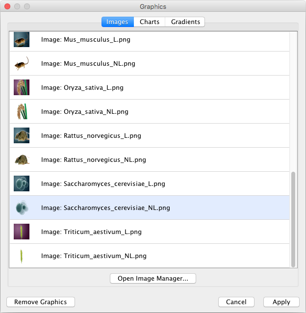

7.  Click the **Default Value** cell of node **Transparency** and set
    the value to *zero*.

8.  Set the **Default Value** of node **Size** to *80*.

9.  Set the **Default Value** of node **Label Font Size** to *10*, to
    increase readability.

10. Also change the edge **Width** to *6*. Now your network looks like
    the following:

    

11. Open the Image Manager under **View → Open Image Manager...**. Drag
    and Drop this
    
    icon to the image list which automatically adds it to the manager.

    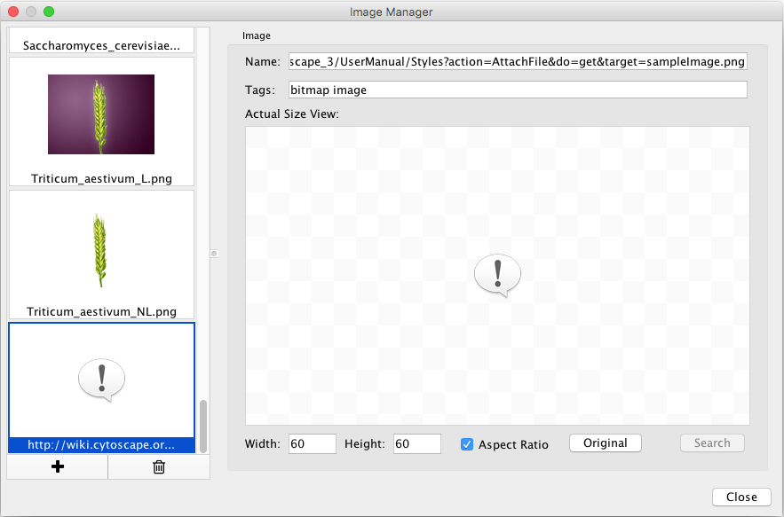

12. Create a Continuous Mapping for **Image/Chart 2** and select
    "BetweennessCentrality" as its controlling property. Double-click
    the **Current Mapping** value cell to open the Continuos
    Mapping Editor.

    

13. In the **Continuos Mapping Editor**, add a handle position by
    clicking in the **Add** button, and move the handle to *0.2*.
    Double-click the region over **0.2** and set the new icon you have
    just added in the last step.

    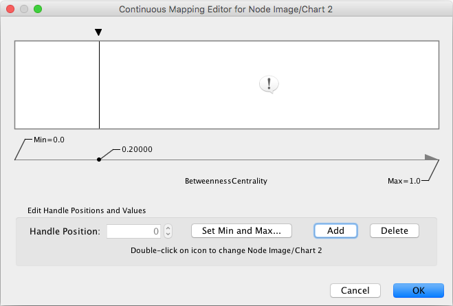

14. Add the property **Image/Chart Position 2** from the drop-down
    option **Properties → Paint → Custom Paint 2 → Image/Chart Position
    2**. Click its **Default Value** cell to move the position of the
    graphics to upper left.

    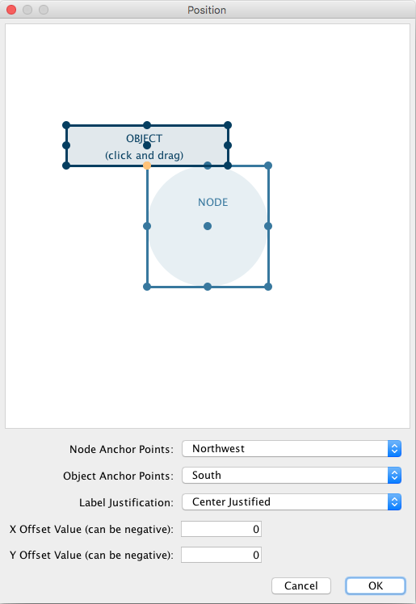

    Now the important nodes in the network (nodes with high [betweenness
    centrality](http://en.wikipedia.org/wiki/Betweenness_centrality))
    are annotated with the icon:

    

### Tutorial 6: Creating Node Charts

The goal of this tutorial is to learn how to create and customize node
charts from data stored in the Node tables.

1.  Start a new session and load a sample network. From the main menu,
    select **File → Import → Network → File...**, and select
    `sampleData/galFiltered.sif`.

2.  Create some node/edge statistics using the **Network Analyzer**.
    Network Analyzer calculates some basic statistics for nodes
    and edges. From the main menu, select **Tools → Network Analyzer →
    Network Analysis → Analyze Network...**, and click **OK**. Once the
    result is displayed, simply close the window. All statistics are
    stored as regular table data.

3.  Select the **Style** panel in the Control Panel.

4.  **Create a new style:** Click the **Options**
    
    drop-down, and select **Create New Style**. Enter a name for your
    new style when prompted.

5.  If the property **Image/Chart 1** is not in the properties sheet
    yet, add it from the drop-down **Properties → Paint → Custom Paint 1
    → Image/Chart 1**.

    

6.  Click the **Default Value** cell of the **Image/Chart 1** entry in
    order to open the **Graphics** dialog.

    

7.  Click the **Charts** tab and make sure the **Bar Chart** option
    is selected.

    

8.  **Select data columns:** Now you have to choose the columns in the
    Node table that contains the data you want to be displayed
    as charts. The **Available Columns** list displays all node columns
    that can be used as chart data (i.e. *single* or *list* columns of
    numerical types).

    -   First click the **Remove All** button to remove the current
        selected columns (by default, Cytoscape selects the first column
        in the **Available Columns** list).

        

    -   Now select all *centrality* and *coefficient* columns from
        **Available Columns** list and click the **Add
        Selected** button.

        

9.  Click the **Apply** button to create bar charts with the selected
    data columns and default options.

    
    

10. The network view doesn't look so good yet, so let's make a few
    changes to its Style before we continue. In the example shown below,
    the node **Shape** is set to *Rectangle*, while the node **Fill
    Color** is set to *white*.

    

11. Focus on one node to see the chart details. For example search for
    and then focus on node "YMR043W".

    
    

12. **Change other chart options:** Click the **Default Value** cell of
    the **Image/Chart 1** property again in order to open the
    **Graphics** dialog, and then select the **Options** tab on the
    **Bar Chart** editor.

    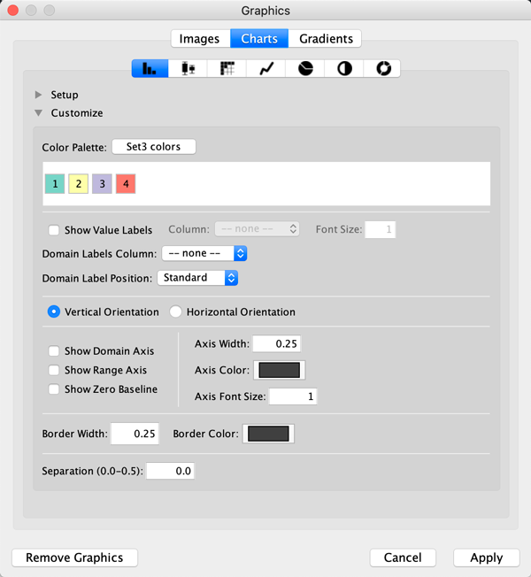

    On this panel, you can:

    -   Choose another **Color Scheme** or set all the colors
        individually (just click on each color).

    -   Show/Hide Value and Domain **Labels** and also set the **Domain
        Label Position**.

    -   Change the chart **Orientation**.

    -   Show/Hide Axes.

    -   Change the line width and color for axes and bars.

    -   Increase or reduce the separation between bars (up to 50% of the
        total chart width).

    -   **Note:** Other charts provide different options.

13. Check both **Show Domain Axis** and **Show Range Axis** and apply
    the graphics again. Now the node chart should look like this:

    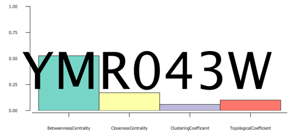

14. The default domain labels are not very useful, so let's set better
    labels:

    -   On the **Node Table** (Table Panel), create a new *List Column*
        of type *String* and name it "domain\_labels".

    -   Edit any of the cells of the created column (double-click it)
        and type
        `["Bet. Cent.","Closen. Cent","Clust. Coeff.","Topol. Coeff."]`.

    -   Right-click the same cell and select the option **Apply to
        entire column**.

    

    -   Open the chart editor again and select the **Options** panel.

    -   Select "domain\_labels" on the **Domain Labels Column**
        drop-down button.

    -   Select "Up 45^o^" on the **Domain Labels Position**
        drop-down button. The labels should look like this now:

    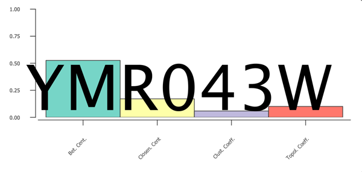

## Advanced Topics

### Discrete Mappings

Several utility functions are available for Discrete Mappings. You can
use these functions by right-clicking on any property entry (shown
below).

#### Automatic Value Generators

-   **Mapping Value Generators** - Functions in this menu category are
    value generators for discrete mappings. Users can set values for
    discrete mappings automatically by selecting these functions.

    -   **Rainbow** and **Rainbow OSC** - These functions try to assign
        as diverse a set of colors as possible for each data value.

        

    -   **Random Numbers** and **Random Colors** - Randomized numbers
        and colors.

    -   **Number Series** - Set a series of numbers to the
        specified mapping. Requires a starting number and increment.

        

    -   **Fit label width** - This function is only for node **Width**
        and **Size**. When a discrete mapping for node **Width** or
        **Size** is available, you can fit the size of each node to its
        label automatically by selecting this function. See the example
        below:

        

#### Edit Selected Values at Once

You can set multiple values at once. First, you need to select discrete
mapping rows in which you want to change values then right-click and
select **Edit → Edit Selected Discrete Mapping Values**. A dialog pops
up and you can enter the new value for the selected rows.

### Working with Continuous Mapping Editors

There are three kinds of **Continuous Mapping Editors**. Each of them
are associated with a specific property type:

<table cellspacing="0" style="table-layout: fixed; width: 700px">
<caption>Editor Type</caption>
<colgroup> <col style="width:230px">                                     <col style="width:150px">                   <col style="width:320px">                                </colgroup>
<tbody>
<tr> <th>Editor Type</th>                                                <th class="center">Supported Data Type</th> <th class="center">Properties</th>                       </tr>
<tr> <th class="spec ulcase"><b>Color Gradient Editor</b></th>           <td class="center">Color</td>               <td class="">node/edge/border/label colors</td>          </tr>
<tr> <th class="specalt ulcase"><b>Continuous-Continuous Editor</b></th> <td class="alt center">Numbers</td>         <td class="alt">size/width/transparency</td>             </tr>
<tr> <th class="spec ulcase"><b>Continuous-Discrete Editor</b></th>      <td class="center">All others</td>          <td class="">font/shape/text/graphics/position/etc.</td> </tr>
</tbody>
</table>
 

#### Range Settings Panel

Each continuous mapping editor has a range settings section (labelled
**Edit Handle Positions and Values**) with the following fields and
buttons.

1.  **Handle Position** - This box displays the current value for the
    selected slider handle. You can also directly type the value in this
    box to move the slider to an exact location.

2.  **Set Min and Max...** - Click this button to set the overall range
    of this editor. The first time you open the editor, the *Min* and
    *Max* values are set by the range of the data column you
    selected (i.e. the minimum and maximum values of the mapped column).

3.  **Add** - Adds a new handle to the editor.

4.  **Delete** - Deletes the selected handle from the slider widget.

5.  *Handle Value* (e.g. **Node Fill Color**) - Click this button to
    edit the value (e.g. a color) assigned to the selected handle.

#### Gradient Editor

The Gradient Editor is an editor for creating continuous mappings for
colors. To change the color of each region, just double-click the
handles (small triangles on the top). A Color gradient will be created
only when the editor has two or more handles (see the example below).

<table cellspacing="0" style="table-layout: fixed; width: 680px">
<caption style="width: 680px">Gradient Editor</caption>
<colgroup> <col style="width:340px">                                     <col style="width:340px"> </colgroup>
<tbody>
<tr> <th class="center">1 handle (no gradient)</th>                      <th class="center">2 handles</th></tr>
<tr> <td class=""></td> <td class=""></td> </tr>
</tbody>
</table>
 

#### Continuous-Continuous Editor

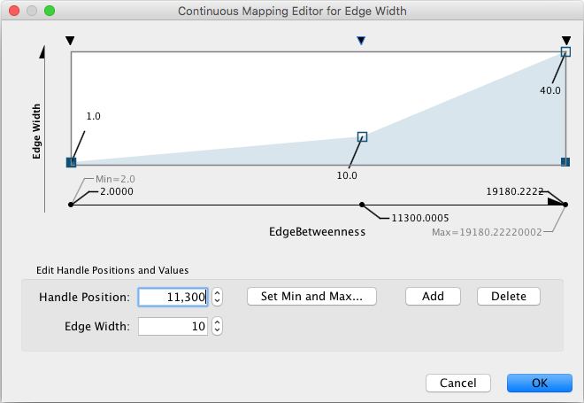

The Continuous-Continuous Editor is for creating mappings between
numerical data and numerical properties (e.g. size, transparency). To
change the value assigned on the Y-axis (the property shown in the
example above is edge **Width**), drag the small squares or double-click
them to directly type an exact value.

#### Continuous-Discrete Editor

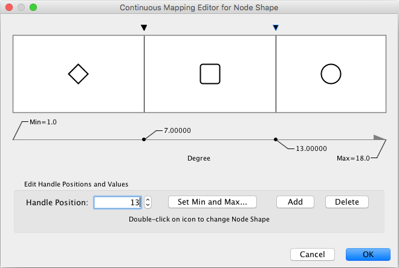

The Continuous-Discrete Editor is used to create mappings from numerical
column values to discrete properties, such as fonts, shapes, or line
styles. To edit a value for a specific region, double-click the icon on
the track.

## Managing Styles

All Cytoscape Style settings are initially loaded from a default file
that cannot be altered by users. When users make changes to the
properties, a `session_syle.xml` file is saved in the session file. This
means that if you save your session, you will not lose your properties.
No other style files are saved during normal operation.

### Saving Styles

Styles are automatically saved with the session they were created in.
Before Cytoscape exits, you will be prompted to make sure you save the
session before quitting. It is also possible to save your styles in a
file separate from the session file. To do this, navigate to the menu
option **File → Export → Styles...**, and save the selected styles to a
file. This feature can be used to share styles with other users.

You can also change the default list of styles for all future sessions
of Cytoscape. To do this, click the **Options**

drop-down in the **Style** section, and select **Make Current Styles
Default**. This will save the current styles as a `default_vizmap.xml`
file to your `CytoscapeConfiguration` directory (found in your home
directory). These styles will then be loaded each time Cytoscape is
started.

#### Style File Formats

The Cytoscape-native Style format is *Style XML*. If you want to share
Style files with other Cytoscape users, you need to export them to this
format.

From version 3.1.0 on, Cytoscape can also export
[Cytoscape.js](http://cytoscape.github.io/cytoscape.js/#style)
compatible JSON file. Since Cytoscape.js is an independent JavaScript
library, and there are some differences between Cytoscape and
Cytoscape.js, not all properties are mapped to JSON. The following
properties are not supported by the exporter:

-   Custom Graphics and their locations

-   Edge Bends

-   Nested Networks

-   Network Background (Note: This can be set manually as standard CSS
    in Cytoscape.js)

The Continuous-Discrete Editor is used to create mappings from numerical
data values to discrete properties, such as fonts, shapes, or line
styles. To edit a value for a specific region, double-click on the icon
on the track.

### Importing Styles

To import existing styles, navigate to the menu option **File → Import →
Styles...** and select a `styles.xml` (Cytoscape 3 format) file.
Imported properties will supplement existing properties or override
existing ones if the properties have the same name. You can also specify
a style file using the -V command line option. Properties loaded from
the command line will override any default properties. Note that legacy
`.props` files can only be loaded via the **File → Import → Styles...**
menu, but not by command line.
