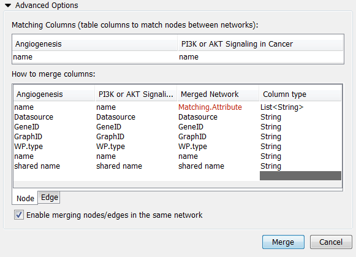

# Merge

Cytoscape allows for merging of both network and table data, through
**Tools ? Merge**.

## Merge Networks

The **Advanced Network Merge** interface is available from **Tools ?
Merge ? Networks...** and allows for merging of two or more networks.

### Basic Operations

-   With the buttons select either "union", "intersection"
    or "difference".

-   Networks available for merge are listed under **Networks to merge**.
    Select a network from the list and click the right arrow to transfer
    the network to **Selected networks**. Click **Merge** to continue.
    The merged network will be displayed as a separate network.

### Advanced Options

The **Advanced Network Merge** interface includes an expandable
**Advanced Network Merge** panel, where you can specify the details of
how to merge the networks. The options available here are:

-   **Matching columns**: This specifies the network columns that should
    be used for merging. Typically, the "name" column or some other
    column containing identifier information is used here.

-   **How to merge columns?**: A table lets the user specify for each of
    the individual network columns, what the corresponding column in the
    merged network should be named and its data type.

## Merge Tables
