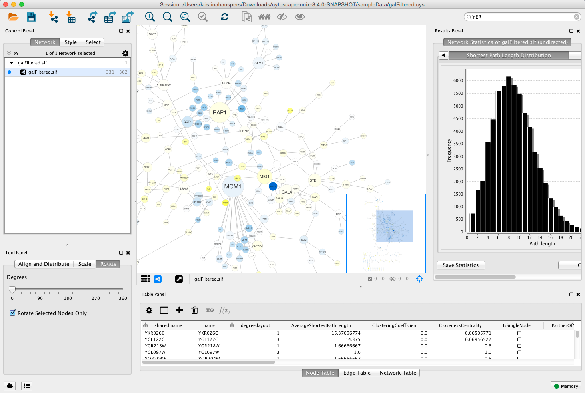
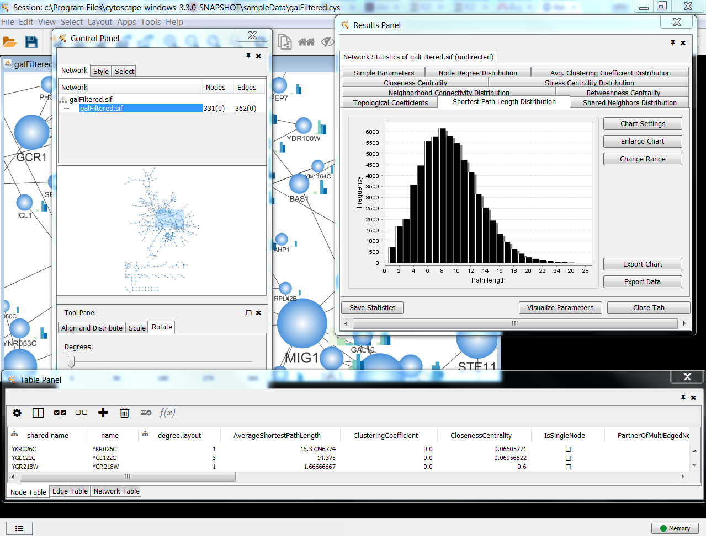
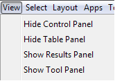

# What are Panels?

**Panels** are floatable/dockable panels designed to cut down on the number of pop-up windows within Cytoscape 
and to create a more unified user experience. They are named based on their functions -- **Control Panel**, 
**Table Panel**, **Tool Panel** and **Result Panel**. The following screenshot shows the file `galFiltered.sif` 
loaded into Cytoscape, with a force-directed layout, **Rotate** tools showing in the **Tool Panel**, and with 
results from Network Analyzer (**Tools → Network Analysis → Analyze Network**). The **Control Panel** (at the 
left-hand side of the screen) contains the Network Manager, Network Overview, Styles and Select tabs. On the 
bottom of the panel, there is another panel called **Tool Panel**. In the **Table Panel**, the **Node Table** 
is shown. In addition, analysis results from Network Analyzer are shown in **Result Panel** (at the right-hand side). 

The user can then choose to resize, hide or float Panels. For example, in the screenshot below, the Network, Table 
and Results panels are floating and the Tool Panel is hidden:

## Basic Usage

Cytoscape includes four Panels: the **Control Panel** on the left, **Tool Panel** on the bottom of 
the **Control Panel**, the **Table Panel** on the bottom right, and the **Result Panel** on the right. 
By default, only the **Control Panel** and the **Data Panel** will appear. The **Result Panel** may appear, 
depending on the mix of Cytoscape apps that you currently have installed. The **Tool Panel** will appear when 
you select the following commands under the **Layout** menu: **Rotate**, **Scale**, and **Align and Distribute**.

All panels can be shown or hidden using the **View → Show/Hide** functions.

In addition, Panels can be floated or docked using icon buttons at the top right corner of each Panel. 
The **Float Window** control 

will undock any panel which is useful when 
you want assign the network panel as much screen space as possible. To dock the window again, click the 
**Dock Window** icon 

. Clicking the **Hide Panel** 
icon 

will hide the panel; this can be shown again by choosing 
**View → Show** and selecting the relevant panel.
