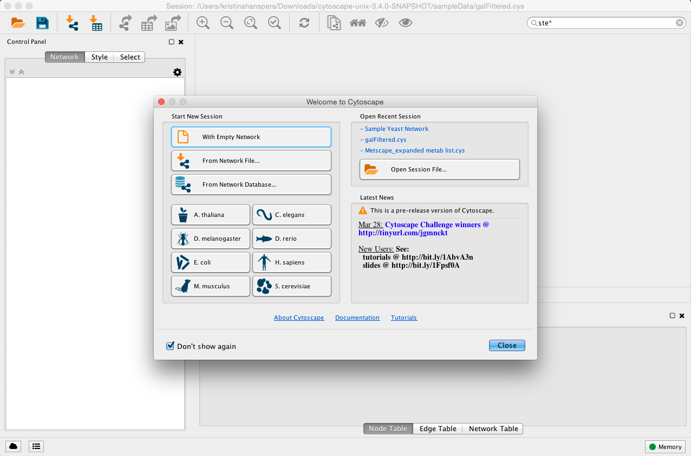

# Launching Cytoscape

Cytoscape is a Java application verified to run on the Linux, Windows,
and Mac OS X platforms. Although not officially supported, other UNIX
platforms such as Solaris or FreeBSD may run Cytoscape if Java version 8
or later is available for the platform.

## System requirements

The system requirements for Cytoscape depend on the size of the networks
you want to load, view and manipulate.

*Note that as of Cytoscape v3.2, networks are loaded faster and in less
memory than with previous versions. While this is good news, networks
created on v3.2 on a given memory configuration (e.g., 1GB) may not be
loadable by prior Cytoscape versions on the same memory configuration.*

<table cellspacing="0">
<caption>Required Resources</caption>
<tr> <th></th>                           <th>Small Network Visualization</th> <th>Large Network Analysis/Visualization</th>              </tr>
<tr> <th class="spec">Processor</th>     <td class="">1GHz</td>               <td class="">As fast as possible, with multiple cores</td> </tr>
<tr> <th class="specalt">Memory</th>     <td class="alt">512MB</td>           <td class="alt">2GB+</td>                                  </tr>
<tr> <th class="spec">Graphics Card</th> <td class="">Integrated video</td>   <td class="">High-end graphics card</td>                   </tr>
<tr> <th class="specalt">Monitor</th>    <td class="alt">XGA (1024X768)</td>  <td class="alt">Wide or Dual Monitor</td>                  </tr>
</table>
 

*Specific system requirements, limitations, and configuration options
apply to each platform, as described in the **Release Notes** available
on the  website.*

## Getting Started

### Install Java

**Cytoscape requires Java 8 or later.**

-   While Cytoscape versions prior to v3.2 run on Java 6, Oracle and
    other JVM suppliers have dropped Java 6 support. Consequently,
    Cytoscape v3.2 and later don't support Java 6 either. With v3.3, we
    have also dropped support for Java 7 for the same reason.

-   We recommend a 64 bit Java Runtime Environment (JRE). While
    Cytoscape runs with 32 bit Java versions, using a 64 bit Java allows
    the largest networks to be loaded and enables the fastest
    network processing. For Windows, the default JRE download provided
    at java.com is 32 bits regardless of the Windows version. While
    Cytoscape will run with a 32 bit JRE, it will be limited to loading
    only small networks. We recommend downloading and installing a 64
    bit JRE.

-   We currently recommend only Java 8.

For additional information, select the Release Notes button on the
Cytoscape web site ().

### Install Cytoscape

#### Downloading and installing

There are a number of options for downloading and installing Cytoscape.
See the download page at the  website for all
options.

-   Automatic installation packages exist for Windows, Mac OS X, and
    Linux platforms -- best for most users.

-   You can install Cytoscape from a compressed archive distribution.

-   You can build Cytoscape from the source code.

-   You can check out the latest and greatest software from our [Git
    repository](https://github.com/cytoscape/cytoscape).

Cytoscape installations (regardless of platform) containing the
following files and directories:

<table cellspacing="0">
<caption>Cytoscape files and directories</caption>
<tr> <th class="">Directory / File</th>                              <th class="">Description</th>                                                                       </tr>
<tr> <th class="spec">p/Cytoscape_v3.3.0</th>                        <td class="">Cytoscape program files, startup scripts, and default location for session files</td> </tr>
<tr> <th class="specalt">p/Cytoscape_v3.3.0/Cytoscape.vmoptions</th> <td class="alt">Cytoscape memory configuration settings</td>                                       </tr>
<tr> <th class="spec">p/Cytoscape_v3.3.0/sampleData</th>             <td class="">Preset networks as described in the embedded README.txt file</td>                     </tr>
<tr> <th class="specalt">p/Cytoscape_v3.3.0/framework</th>           <td class="alt">Cytoscape program files</td>                                                       </tr>
<tr> <th class="spec">p/Cytoscape_v3.3.0/apps</th>                   <td class="">Cytoscape core app program files</td>                                                 </tr>
<tr> <th class="specalt">u/CytoscapeConfiguration</th>               <td class="alt">Cytoscape properties and program cache files</td>                                  </tr>
<tr> <th class="spec">u/CytoscapeConfiguration/cytoscape3.props</th> <td class="">Cytoscape configuration settings</td>                                                 </tr>
</table>
 

  
The *`p/`* directory signifies the program directory, which varies from
platform to platform. For Cytoscape to work properly, all files should
be left in the directory in which they were unpacked. The core Cytoscape
application assumes this directory structure when looking for the
various libraries needed to run the application.

The *`u/`* directory signifies the user's home directory, which varies
from user to user and from platform to platform. To change the user home
directory from the default, one can set the Java environment variable
`user.home` to the desired directory -- this is useful when Cytoscape is
installed on a workstation, but the home directory is stored on a
central file server. `user.home` can be set by adding the following
option to the Cytoscape.vmoptions file or the \_JAVA\_OPTIONS
environment variable, substituting the desired path as appropriate:

-   ***-Duser.home=/path/to/desired/home***

Your operating system may have other mechanisms for setting environment
variables -- see your operating system documentation for further
details.

#### A quick note on upgrading your Cytoscape installation

If you have a previous Cytoscape installation you have two options:

1.  Starting with a clean slate. For this you should delete your
    previous installation directory and the `CytoscapeConfiguration`
    directory (see below for the location of this directory).

2.  Just keep what you have and simply pick a distinct, new directory
    for installation. In the unlikely event that you should encounter
    any problem, delete the `.props` files in your
    `CytoscapeConfiguration` directory. If that doesn't help try
    deleting the `CytoscapeConfiguration` directory. This latter step
    will cause you to lose all of the apps that you have installed via
    the App Store, so only do that if you are having problems or if you
    don't mind reinstalling your apps. The core apps will not be
    affected by this step.

### Launch the application

As with any application, launch Cytoscape by double-clicking on the icon
created by the installer, by running `cytoscape.sh` from the command
line (Linux or Mac OS X) or by double-clickinging `cytoscape.bat` or the
Program Launch icon (Windows).

After launching Cytoscape a window will appear that looks like this:

*If your Cytoscape window does not resemble this, further configuration
may be required. Consult the **Release Notes** available on the
 website.*

### Note on Memory Consumption

For most regular users, Cytoscape will estimate and reserve the proper
amount of memory. An incorrect estimate may result in Cytoscape hanging
at startup or Cytoscape unable to load your network. Unless Cytoscape
fails to start or open your network, it has likely estimated the
available memory correctly, and you can continue to the [Quick
Tour](#Quick_Tour).
If Cytoscape misjudges the memory size or can't allocate enough memory,
it could be that you're running with a 32 bit JRE and could get better
results by installing a 64 bit JRE -- see the Install Java section
above.

When Cytoscape starts, it displays the current memory usage in the lower
right corner of the main interface. You can click on the **Memory**
button at any time to access an option to **Free Unused Memory**. While
most users won't need to use this option, it can be useful for users who
have multiple large networks loaded.

#### Overall Memory Size for Cytoscape

By default, Cytoscape uses an estimate for initial and maximum memory
allocation based on your operating system, system architecture (32 or 64
bit), and installed memory. You can change Cytoscape's initial and/or
maximum memory size by editing the Cytoscape.vmoptions file, which
resides in the same directory as the Cytoscape executable. The file
contains one option per line, with each line terminated by a linefeed,
and an extra linefeed at the end of the file. Note that for the MacOS
platform, the situation is slightly different -- if you are launching
Cytoscape by clicking on the Cytoscape icon, you must edit the
.../Cytoscape.app/Contents/vmoptions.txt file instead. To access this in
Finder, you will need to right-click the Cytoscape app icon and select
"Show Package Contents", which will display the Contents subdirectory
that contains vmoptions.txt.

For example, if you want Cytoscape to initially allocate 2GB of memory
and use up to a maximum of 4GB, edit the Cytoscape.vmoptions file to
contain the following lines (... do not forget the linefeed at the end
of each line, and an extra linefeed at the end of the file!):

-   ***-Xms2GB***

    ***-Xmx4GB***

#### Stack Size

There is one more option related to memory allocation. Some of the
functions in Cytoscape use larger stack space (a temporary memory for
some operations, such as layout). Since this value is set independently
from the values above, sometimes layout algorithms fail due to an *out
of memory* error. To avoid this, you can set a larger heap size for
Cytoscape tasks by using the ***taskStackSize*** option in the
`cytoscape3.props` file (located in the `CytoscapeConfiguration`
directory). This can be edited within Cytoscape using the Preferences
Editor (Edit-Preferences-Properties...) - look for taskStackSize. The
value should be specified in bytes.
