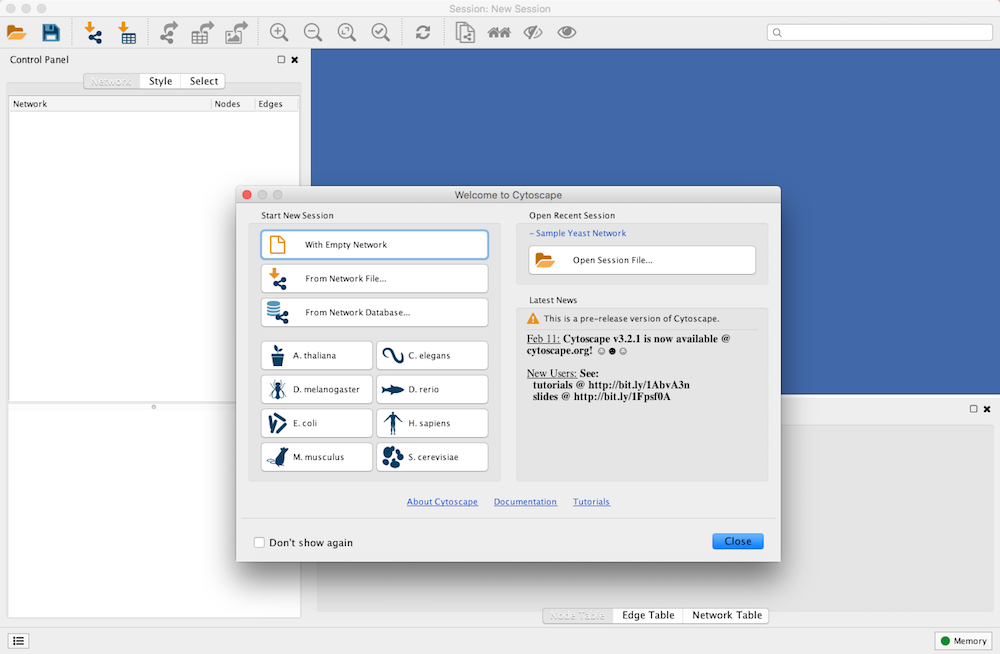
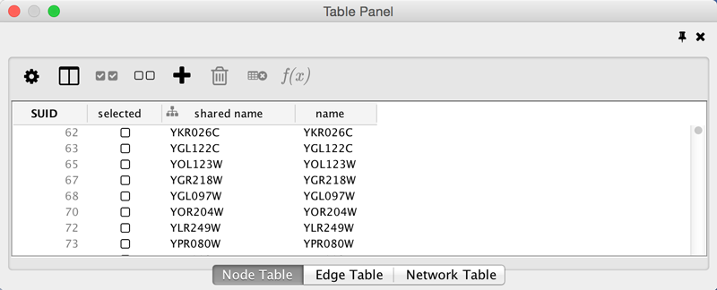
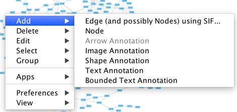
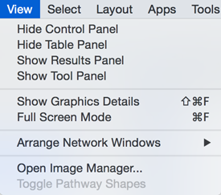
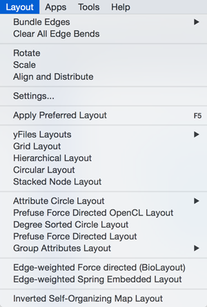
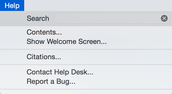
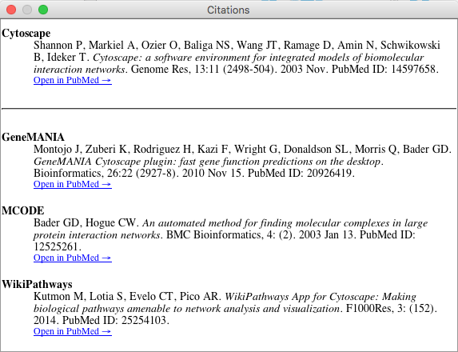
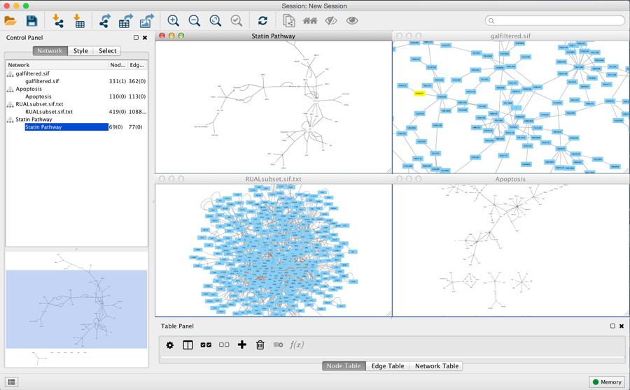
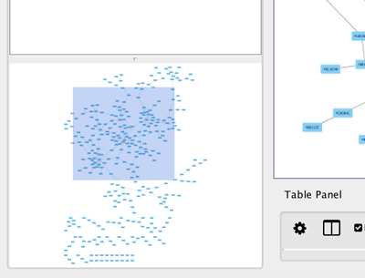

Quick Tour of Cytoscape
=======================

Welcome Screen
--------------

When you start Cytoscape, you can access basic functions from the
**Welcome Screen**:

The **Welcome Screen** is designed to access commonly used features of
Cytoscape including:

-   Create new network

-   Import network

    -   From file

    -   From public database

-   Import interactome for model organisms

-   Open recently used session file

Also, a news panel always display latest information for users. For
information on user privacy, see the **[Cytoscape Privacy
Policy](#Privacy)**.

Basic Features
--------------

When a network is loaded, Cytoscape will look similar to the image
below:

Most functionalities are self-explanatory, but we'll go through a
concise explanation for clarity. The main window here has several
components:

-   The Menu Bar at the top (see below for more information about
    each menu).

-   The Tool Bar, which contains icons for commonly used functions.
    These functions are also available via the menus. Hover the mouse
    pointer over an icon and wait momentarily for a description to
    appear as a tooltip.

-   The Network Panel (Network tab of the Control Panel, top left). This
    contains an optional network overview pane (shown at the
    bottom left).

-   The main Network View Window, which displays the network.

-   The Table Panel (bottom right panel), which displays columns of
    selected nodes and edges and enables you to modify the values of
    column data.

The Network Panel and Table Panel are dockable tabbed Panels. You can
undock any of these panels by clicking on the **Float Window** control

in the upper-right corner of the CytoPanel. This is useful when you want
assign the network panel as much screen space as possible. To dock the
window again, click the **Dock Window** icon
.
Clicking the **Hide Panel** icon

will hide the panel; this can be shown again by choosing **View ? Show**
and selecting the relevant panel.

If you click this control, for example on the Table Panel, you will now
have two Cytoscape windows, the main window, and a new window labeled
Table Panel, similar to the one shown below. A popup will be displayed
when you put the mouse pointer on a cell.

-   

Note that Table Panel now has a Dock Window control. If you click this
control, the window will dock onto the main window. For more information
on the panels in Cytoscape, see the
**[Panels](#Panels)**
section.

### Network Editing

Cytoscape also has an edit functionality that enables you to build and
modify networks interactively within the network canvas. To edit a
network, just right-click on the open space of network window, select
the menu item **Add ? Node**, a new node will be added to the canvas. To
add an edge, right click on a node, choose the menu item **Edit ? Add
Edge**. Then select the target node, a new edge will be added between
the two nodes. In a similar way annotation objects can be added;
pictures, shapes or textboxes; much like in MS PowerPoint or similar
software. Detailed information on network editing can be found in the
**[Editing Networks](#Network_Editor)**
section.

-   

The Menus
---------

### File

The File menu contains most basic file functionality: **File ? Open**
for opening a Cytoscape session file; **File ? New** for creating a new
network, either blank for editing, or from an existing network; **File ?
Save** for saving a session file; **File ? Import** for importing data
such as networks and data; and **File ? Export** for exporting data and
images. **File ? Export ? Network View as Graphics** lets you export the
network in either JPEG, PDF, PNG, Post Script or SVG format.

**File ? Recent Session** will list recently opened session files for
quick access. **File ? Run** allows you to specify a Cytoscape script
file to run, and **File ? Print Current Network...** allows printing.

-   

### Edit

The **Edit** menu contains **Cut**, **Copy** and **Paste** functions, as
well as **Undo** and **Redo** functions which undo and redo edits made
in the **Table Panel**, the **Network Editor** and to layout.

There are also options for creating and destroying views (graphical
representations of a network) and networks (the raw network data - not
yet visualized), as well as an option for deleting selected nodes and
edges from the current network. All deleted nodes and edges can be
restored to the network via **Edit ? Undo**.

There are also other editing options; **Remove Duplicated Edges** will
delete edges that are complete duplicates, keeping one edge, **Remove
Self-Loops** removes edges that have the same source and target node,
and **Delete Selected Nodes and Edges...** deletes a selected subset of
the network. **Rename Network...** allows you to rename the currently
selected network.

Editing preferences for properties and apps is found under **Edit ?
Preferences ? Properties...**. More details on how to edit preferences
can be found
[here](http://wiki.cytoscape.org/Cytoscape_3/UserManual/Cytoscape_3/UserManual/Preferences#).

-   

### View

The **View** menu allows you to display or hide the **Control Panel**,
**Table Panel**, **Tool Panel** and the **Result Panel**. It also
provides the control of other view-related functionality.

-   

### Select

The **Select** menu contains different options for selecting nodes and
edges.

-   

### Layout

The **Layout** menu has an array of features for visually organizing the
network. The features in the top portion of the network (**Bundle
Edges**, **Clear Edge Bends**, **Rotate**, **Scale**, **Align and
Distribute**) are tools for manipulating the network visualization. The
bottom section of the menu lists a variety of layout algorithms which
automatically lay a network out.

-   

### Apps

The **Apps** menu gives you access to the **App Manager** (**Apps ? App
Manager**) for managing (install/update/delete) your apps and may have
options added by apps that have been installed. Depending on which apps
are loaded, the apps that you see may be different than what appear
here. The below picture shows a Cytoscape installation without installed
apps.

-   

  ------------------------------------------------------------------------------------------------------------------
  Note: A list of available Cytoscape apps with descriptions is available online at: 
  ------------------------------------------------------------------------------------------------------------------

In previous versions of Cytoscape, apps were called plugins and served a
similar function.

### Tools

The **Tools** menu contains advanced features like the **[Command Line Dialog](#Command_Tool)**,
**[Network Analyzer](#Network_Analyzer)**,
**[Network Merge](#Merge)**
and **Workflow**.

-   

### Help

The **Help** menu allows you to launch the online help viewer and browse
the table of contents for this manual (**Contents**).

-   

The **Citations** option displays the main literature citation for
Cytoscape, as well as a list of literature citations for installed apps.
The list will be different depending on the set of apps you have
installed.

-   

The **Update Organism Preset Networks** option updates the preset
networks available on the **Welcome** screen to the latest version.

The **Help** menu also allows you to connect directly to Cytoscape Help
Desk and the Bug Report interface.

Network Management
------------------

Cytoscape allows multiple networks to be loaded at a time, either with
or without a view. A network stores all the nodes and edges that are
loaded by the user and a view displays them.

An example where a number of networks have been loaded is shown below:

The network manager (in Control Panel) shows the networks that are
loaded. Clicking on a network here will make that view active in the
main window, if the view exists. Each network has a name and size
(number of nodes and edges), which are shown in the network manager. If
a network is loaded from a file, the network name is the name of the
file.

Some networks are very large (thousands of nodes and edges) and can take
a long time to display. For this reason, a network in Cytoscape may not
contain a "view". Networks that have a view are in normal black font and
networks that don't have a view are highlighted in red. You can create
or destroy a view for a network by right-clicking the network name in
the network manager or by choosing the appropriate option in the
**Edit** menu. You can also destroy previously loaded networks this way.

Certain operations in Cytoscape will create new networks. If a new
network is created from an old network, for example by selecting a set
of nodes in one network and copying these nodes to a new network (via
the **File ? New ? Network** option), it will be shown immediately
follows the network that it was derived from.

The available network views are also arranged as multiple overlapping
windows in the network view window. You can maximize, minimize, and
destroy network views by using the normal window controls for your
operating system.

### Arrange Network Windows

When you work on multiple networks, you can arrange the network view
windows under **View ? Arrange Network Windows**.

**Vertical**

-   

**Grid**

-   

The Network Overview Window
---------------------------

The network overview window shows an overview (or "bird's eye view") of
the network. It can be used to navigate around a large network view. The
blue rectangle indicates the portion of the network currently displayed
in the network view window, and it can be dragged with the mouse to view
other portions of the network. Zooming in will cause the rectangle to
appear smaller and vice versa.

-   
