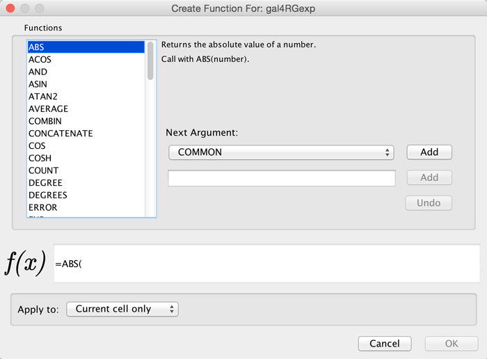

# Column Data Functions and Equations

## Column Formulas

### Introduction

Column data values may be formulas. A typical example is
**=ABS(\$otherColumn + LOG(10.2))**. Formulas are modeled after
Excel(tm) but only support references to other columns at the same node,
edge or network. Since Cytoscape column names may contain embedded
spaces, optional braces around the column name (required if the name is
not simply a letter followed by one or more letters or digits) is
allowed e.g. **\${a name with spaces}**. Backslashes, opening braces and
dollar signs in column names have to be escaped with a leading
backslash. For example the column name **ex\$am{p\\le** would have to be
written as **\${ex\\\$am\\{p\\\\le}**. Finally, column names are case
sensitive.

String constants are written with double-quotes **"**. In order to embed
a double-quote or a backslash in a string they have to be escaped with a
leading backslash, therefore the string **"\\** must be written as
**"\\"\\\\"**. Formula results must be compatible with the type of the
column that they have been assigned to. The rules are rather lax though,
for example anything can be interpreted as a string and all numeric
values will be accepted for a boolean (or logical) column data where
non-zero will be interpreted as **true** and zero as **false**. For
integer columns, floating point values will be converted using the rules
of the Excel(tm) **INT** function. Parentheses can be used for grouping
and to change evaluation order. The operator precedence rules follow
those of standard arithmetic.

### Operators

Currently supported operators are the four basic arithmetic operators
and the **\^** exponentiation operator. **+**, **-**, **\***, and
**\\** are left-associative and **\^** is right-associative. The string
concatenation operator is **&**. Supported boolean or logical operators
are the comparison operators **<**, **>**, **<=**, **>=**,
**=**, and **<>** (not equal).

### Supported Functions

Currently we support the following functions:

#### Cytoscape-specific functions

-   Degree -- the degree of a node, meaning how many edges connect to it.

-   InDegree -- the indegree of a node.

-   OutDegree -- the outdegree of a node.

-   SourceID -- the ID of the source node of an edge.

-   TargetID -- the ID of the target of an edge.

#### Numeric Functions

-   Abs -- Returns the absolute value of a number.

-   ACos -- Returns the arccosine of a number.

-   ASin -- Returns the arcsine of a number.

-   ATan2 -- Returns the arctangent of two numbers x and y.

-   Average -- Returns the average of a group of numbers.

-   Cos -- Returns the cosine of an angle given in radians.

-   Cosh -- Returns the hyperbolic sine of its argument.

-   Count -- Returns the number of numeric values in a list.

-   Degrees -- Returns its argument converted from radians to degrees.

-   Exp -- Returns e raised to a specified number.

-   Ln -- Returns the natural logarithm of a number.

-   Log -- Returns the logarithm of a number to a specified base.

-   Max -- Returns the maximum of a group of numbers.

-   Median -- Returns the median of a list of numbers.

-   Min -- Returns the minimum of a group of numbers.

-   Mod -- Calculates the modulus of a number.

-   Pi -- Returns an approximation of the value of p.

-   Radians -- Returns its argument converted from degrees to radians.

-   Round -- Rounds a number to a specified number of decimal places.

-   Sin -- Returns the sine of an angle given in radians.

-   Sinh -- Returns the hyperbolic sine of its argument.

-   Sqrt -- Calculates the square root of a number.

-   Tan -- returns the tangent of its argument in radians.

-   Tanh -- returns the hyperbolic tangent of its argument in radians.

-   Trunc -- Truncates a number.

#### String Functions

-   Concatenate -- Concatenates two or more pieces of text.

-   Left -- Returns a prefix of s string.

-   Len -- Returns the length of a string.

-   Lower -- Converts a string to lowercase.

-   Mid -- Selects a substring of some text.

-   Right -- Returns a suffix of a string.

-   Substitute -- Replaces some text with other text.

-   Text -- Format a number using the Java *DecimalFormat*
    class' conventions.

-   Upper -- Converts a string to uppercase.

-   Value -- Converts a string to a number.

#### Logical/Boolean Functions

-   And -- Returns the logical conjunction of any number of
    boolean values.

-   Not -- Returns the logical negation of a boolean value.

-   Or -- Returns the logical disjunction of any number of
    boolean values.

#### List Functions

-   First -- Returns the first entry in a list.

-   Last -- Returns the last entry in a list.

-   Nth -- Returns the n-th entry in a list.

#### Statistical Functions

-   Largest -- the kth largest value in a list.

-   GeoMean -- the geometric mean of a set of numbers.

-   HarMean -- the harmonic mean of a set of numbers.

-   Mode -- the mode of a set of numbers.

-   NormDist -- Returns the pdf or CDF of the normal distribution.

-   Permut -- Returns the number of permutations for a given number
    of objects.

-   StDev - sample standard deviation.

-   Var -- sample variance.

#### Miscellaneous Functions

-   Combin - Returns the number of combinations for a given number
    of objects.

-   If -- Returns one of two alternatives based on a boolean value.

-   ListToString -- Returns a string representation of a list.

-   Now -- Returns a string representation of the current date and time.

-   Today -- returns a string representation of the current date.

### Pitfalls

The possibly biggest problem is the referencing of other columns that
have null values. This is not allowed and leads to errors. In order to
mitigate this problem we support the following optional syntax for
column references: **\${columnName:defaultValue}**. The interpretation
is that if **columnName** is null, then the default value will be used,
otherwise the value of the referenced value will be used instead. The
referenced column must still be a defined column and not an arbitrary
name! The other potential problem is when there are circular column
reference dependencies. Circular dependencies will be detected at
formula evaluation time and lead to a run-time error.

### Useful Tips

When working with formulas it can be very helpful to open the
Developer's Log Console. Formula evaluation errors will be logged there.

## The Formula Builder

In order to ease the creation of formulas as well as to facilitate
discovery of built-in functions we provide a **Function Builder** in the
Table Panel. After selecting a non-list column cell, you can invoke it
by clicking on
.
This should bring up the Function Builder which looks like this:

Select a function on the left hand side of the dialog - here, we've
selected the ABS function. Next to the list of functions, you can
specify one or more arguments. This can either be a column (selected
from the drop-down list) or a constant specified in the box below. If
you select a column, the value of that column (in the row containing the
formula) will be used, and the function result will be updated
dynamically when that value changes. Click **Add** to add an argument -
you can add one or more depending on how many arguments the function
accepts. At the bottom of the dialog is a preview of the current
formula. Under **Apply to**, you can select whether the formula will
apply to the current cell only, the cell selection, or the entire
column. Click OK when you are satisfied with the result, or Cancel to
discard any changes.

The Function Builder is a useful tool for discovery of the list of
built-in functions, which has the return type matching the data type of
the column. Arguments can either be selected from a list of named
columns, or constant values can be entered in a text entry field. A
major shortcoming at this time is that the Formula Builder won't let you
compose functions with function calls as arguments. If you need the most
general functionality, please type the expression directly into a cell.

## A Note for App Writers

It is relatively easy to add your own built-in formula functions. A
simple function can probably be implemented in 15 to 20 minutes. It can
then be registered via the parser and becomes immediately available to
the user. It will of course also show up in the drop-down list in the
Function Builder.
