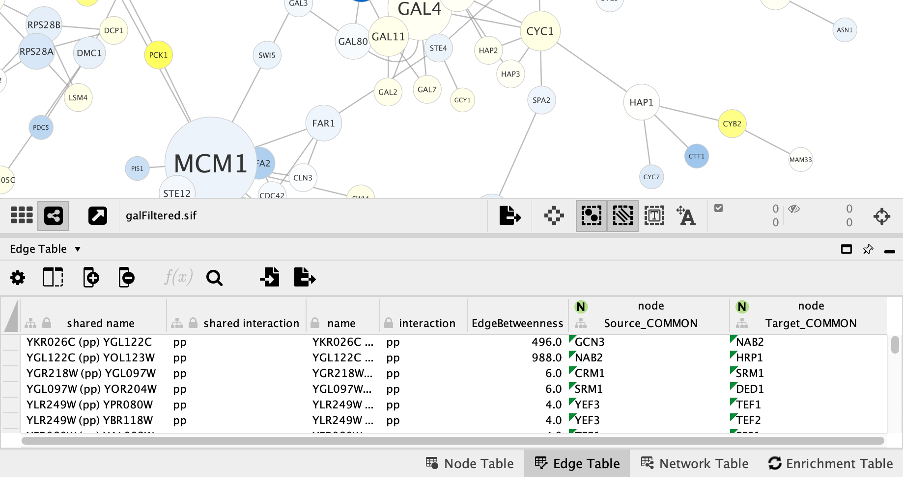

# Column Data Functions and Equations

## Column Formulas

### Introduction

Columns may contain formulas that are evaluated on-demand and result
in a value. 

### Syntax

#### Basic Syntax

A formula always starts with an equals sign '='. This signifies that the
value in the table cell is a formula.

Example:  **=ABS(\$otherColumn + LOG(10.2))**

The type of the value returned by a formula must match
the column type, or be easily converted to the column type. For example,
if a formula returns a numeric value in a string column, the numeric value 
will be converted to a string. However if a formula returns a string value in
a numeric column, the string cannot be automatically converted to a number,
so it will result in an error being shown.

All numeric values will be accepted for a boolean (or logical) column data where
non-zero will be interpreted as **true** and zero as **false**. 
Floating point values will be converted using the rules
of the Excel(tm) **INT** function. Parentheses can be used for grouping
and to change evaluation order. 

#### Functions

Cytoscape provides a set of functions that perform specific tasks and calculations.
A function is written as the name of the function, then an opening bracket '(',
then an optional comma-separated list of arguments, then a closing bracket ')'.

Example: **=MAX(10, 20)**  
Example: **=IF($otherColumn, "UP", "DOWN")**  
Example: **=NOW()**  

#### Attributes 

Attributes are named references to other columns in the same table as the formula, and
result in the value of the column cell for the same node, edge or network.

An attribute reference is written by placing the column name after a dollarsign ($).  

Example: **$columnName**

If the column name contains spaces, special characters or a namespace identifier 
then the name must be placed between curly braces.  

Example: **${column name with spaces}**  
Example: **${namespace::columnName}**

Special characters such as commas must be escaped with a leading backslash.  

Example: **${name with \\, comma}**

You may provide a default value that will be used if the column value is blank. 
Place a colon (:) and the value after the column name.  

Example: **${columnName:0.0}**

Finally, column names are case sensitive.

#### Operators

An operator is written between two operands.

Example: **=$x + 1** 

Numeric operators: **+** addition, **-** subtraction, **\*** multiplication, **\/** division, **\^** exponentiation  

Text operators: **&** string concatenation  

Logical operators (operate on boolean values true/false): **<** less than, **>** greater than, **>=** greater than or equal, 
**<=** less than or equal, **=** equal, **<>** not equal

The operator precedence rules follow those of standard arithmetic.

#### Literal Values

String (text) literals are between double quotes, example: **"abc"**

Numeric literals, example: **123** 

Floating point literals, example: **123.45** 

Boolean (logical) literals: **true, false**

In order to embed a double-quote or a backslash in a string they have to be escaped with a
leading backslash, therefore the string **"\\"** must be written as
**"\\"\\\\"**.

#### Conditional IF

A conditional is written as a function named 'IF' with three arguments: **IF(condition, a, b)**.
If the condition evaluates to true then the value of the **a** argument is returned, otherwise the **b** argument is returned.  

Example: **IF($x = $y, "equal", "different")**

### Supported Functions

Currently we support the following functions:

#### Cytoscape-specific network functions

-   Degree -- the degree of a node, meaning how many edges connect to it.

-   InDegree -- the indegree of a node.

-   IsDirected -- Returns true if this edge is directed, false otherwise.

-   OutDegree -- the outdegree of a node.

-   SourceID -- the ID of the source node of an edge.

-   TargetID -- the ID of the target of an edge.

#### Numeric Functions

-   Abs -- Returns the absolute value of a number.

-   ACos -- Returns the arccosine of a number.

-   ASin -- Returns the arcsine of a number.

-   ATan2 -- Returns the arctangent of two numbers x and y.

-   Average -- Returns the average of a group of numbers.

-   Combin -- Returns number of combinations of n objects, with k chosen at any one time.

-   Cos -- Returns the cosine of an angle given in radians.

-   Cosh -- Returns the hyperbolic sine of its argument.

-   Degrees -- Returns its argument converted from radians to degrees.

-   Exp -- Returns e raised to a specified number.

-   GeoMean -- the geometric mean of a set of numbers.

-   HarMean -- the harmonic mean of a set of numbers.

-   Ln -- Returns the natural logarithm of a number.

-   Log -- Returns the logarithm of a number to a specified base.

-   Max -- Returns the maximum of a group of numbers.

-   Median -- Returns the median of a list of numbers.

-   Min -- Returns the minimum of a group of numbers.

-   Mod -- Calculates the modulus of a number.

-   Mode -- the mode of a set of numbers.

-   NormDist -- Returns the pdf or CDF of the normal distribution.

-   Permut -- Returns the number of permutations for a given number
    of objects.

-   Pi -- Returns an approximation of the value of p.

-   Product -- Returns the product the given numbers.

-   Radians -- Returns its argument converted from degrees to radians.

-   Round -- Rounds a number to a specified number of decimal places.

-   Sign -- Implements the signum function. Returns -1,0,+1 based on the number being negative, zero, or positive.

-   Sin -- Returns the sine of an angle given in radians.

-   Sinh -- Returns the hyperbolic sine of its argument.

-   Sqrt -- Calculates the square root of a number.

-   StDev - Returns the sample standard deviation of a list of numbers.

-   Sum -- Returns the sum of all of its arguments.

-   Tan -- returns the tangent of its argument in radians.

-   Tanh -- returns the hyperbolic tangent of its argument in radians.

-   Trunc -- Truncates a number.

-   Var -- sample variance.

#### Text Functions

-   Concatenate -- Concatenates two or more pieces of text.

-   Left -- Returns a prefix of s string.

-   Len -- Returns the length of a string.

-   Listtostring --  Converts a list to a string, given a separator.

-   Lower -- Converts a string to lowercase.

-   Mid -- Selects a substring of some text.

-   Right -- Returns a suffix of a string.

-   Split -- Splits a text string into substrings around matches of a delimiter. Returns a list of strings.

-   Substitute -- Replaces some text with other text.

-   Text -- Format a number using the Java *DecimalFormat*
    class' conventions.

-   Upper -- Converts a string to uppercase.

-   Value -- Converts a string to a number.

#### List Functions

-   Blist -- Returns a list of boolean values.

-   Count -- Returns the number of numeric values in a list.

-   First -- Returns the first entry in a list.

-   Flist -- Returns a list of floating point numbers.

-   Ilist -- Returns a list of integer numbers.

-   Largest -- Returns the kth largest element of a list of numbers.

-   Last -- Returns the last entry in a list.

-   Len -- Returns the length of a string (ie number of characters in the string), or the length of a list.

-   Nth -- Returns the n-th entry in a list.

-   Slist -- Returns a list of strings.

#### Logical/Boolean Functions

-   And -- Returns the logical conjunction of any number of
    boolean values.
    
-   If -- Returns one of two alternatives based on a boolean value.

-   Not -- Returns the logical negation of a boolean value.

-   Or -- Returns the logical disjunction of any number of
    boolean values.

#### Date/Time Functions

-   Now -- Returns a string representation of the current date and time.

-   Today -- returns a string representation of the current date.

#### Other Functions

-   Booleantablecell -- Returns the value in the column for the specified SUID

-   Doubletablecell -- Returns the value in the column for the specified SUID

-   Error -- Throws an exception at runtime.

-   Integertablecell -- Returns the value in the column for the specified SUID

-   Longtablecell -- Returns the value in the column for the specified SUID

-   Stringtablecell -- Returns the value in the column for the specified SUID

### Map Source and Target Nodes

By default, Cytoscape adds columns for source and target node to the **Edge Table**, using equations. By default, this mapping happens automatically when a network is opened, and the **shared name** column is used for the mapping. However, the selection of which **Node Table** column to use is customizable. 

To update the mapping, go to **Apps → mapSourceAndTarget**. It is possible to select more than one **Node Table** column for the mapping, resulting in multiple sets of source and target node columns in the **Edge Table**.

To turn off automatic mapping, go to **Edit → Properties → Cytoscape Preferences** and then select **mapSourceAndTarget** from the drop-down. Change the valule of the **autoMap** property to **FALSE**.

The screenshot below shows the source and target node column mappings, using the node column **COMMON**. 

## The Formula Builder

In order to ease the creation of formulas as well as to facilitate
discovery of built-in functions we provide a **Formula Builder** in the
Table Panel. The Formula Builder
is opened by clicking the
 button.

This should bring up the Formula Builder which looks like this:

At the top is a text area called the **Formula Editor**. The text for a formula
may be typed directly into this area. At the top-right of the text area are buttons
for **Undo** and **Redo**.

When the formula is ready click the **Insert Formula** button to insert the formula
into the table.
Depending on what is selected in the combo box, the formula can be inserted
into the selected cell only, the entire column, or just the cells for nodes/edges
that are currently selected.
If there is a syntax error in the formula it will be reported immediately when the
**Insert Formula** button is clicked.

Normally formulas are re-evaluated on demand as needed. For example if a formula contains
an attribute reference to another column, and the value in that column changes, then
the formula is re-evaluated. This re-evaluation sometimes has disadvantages, for example re-evaluation
can sometimes be slow for very large networks. Instead of inserting the formula itself
you may click the **Evaluate and Insert Result** button. This will evaluate the formula
immediately and just insert the result into the selected cells.

Below the **Formula Editor** is an area used for documentation. 

- The **Functions** area lists all functions that are available. Click on a function name 
to view documentation on what the function does and how it can be used. Click the **insert**
link in the documentation area to insert the function into the **Formula Editor** at the location
of the cursor.

- The **Attributes** area lists all available columns in the current table that can
be referenced from the formula. Click the **insert**
link in the documentation area to insert an attribute reference into the Formula Editor 
at the location of the cursor.

- The **Syntax** area provides documentation on formula syntax.

## A Note for App Writers

It is relatively easy to add your own built-in formula functions. A
simple function can probably be implemented in 15 to 20 minutes. It can
then be registered via the parser and becomes immediately available to
the user. It will be available in the in the **Formula Builder**.
