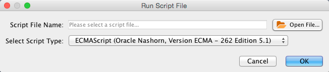

# Automation Panel

The **Automation Panel** provides a simple command-line interface to
Cytoscape using the Commands API. It allows the user to type commands into
Cytoscape and see the results in a **Reply Log**.

Any app that registers commands will
be available through the Automation Panel. Commands are part of the more general
[Cytoscape Automation](Programmatic_Access_to_Cytoscape_Features_Scripting.md#cytoscape_automation) feature, 
which includes multiple ways of scripting Cytoscape execution.

The Automation Panel can be opened from **View → Show/Hide Automation Panel**.

The Automation Panel can also be used to read and execute script files. 
Each line in the script file is a command that is sent to a app.
Script files may be entered on the Cytoscape command line using the "-S"
flag to Cytoscape, through the **Tools → Run Script File...** menu item,
or through **Tools → Execute Command File** menu item.

Cytoscape commands consist of three parts: a command class, or
namespace; a command within that namespace; and a series of arguments or
options provided as a series of **name=value** pairs. For example, to
import an XGMML format file from the **Command Line Dialog** or a
command script, you would use:

    network import file filePath="path-to-file"

where *network* is the namespace, *import file* is the command, and
there is only one argument: *filePath="path-to-file"*. If there were
more arguments they would appear on the same line separated by spaces.

The Command Tool also uses the Command API to provide help. "help" by
itself will list all of the command classes (or namespaces) and "help "
followed by a namespace will list all of the commands supported by that
namespace. Details of a specific command are available by typing "help "
followed by the namespace and command (e.g. "help layout
force-directed"). The Command Tool registers the "command" namespace and
supports a single command: run, which takes a file argument. Here is the
help for the command run command from the command namespace:

    help command run
           command run file=<File> 

Similarly, the help for the "network import file" example from above is:

    help network import file
     network import file arguments:
     dataTypeList=<String>: List of column data types ordered by column index 
	   (e.g. "string,int,long,double,boolean,intlist" or just "s,i,l,d,b,il")
     defaultInteraction=<String>: Default interaction type
     delimiters=<ListMultipleSelection [,,;, ,\t]>: Text Delimiters
     delimitersForDataList=<ListSingleSelection (\||\|/|,)>: 
	   Text Delimiters for data list type
     file=<File>: Data Table file
     firstRowAsColumnNames=true|false: First row used for column names
     indexColumnSourceInteraction=<int>: Column for source interaction
     indexColumnTargetInteraction=<int>: Column for target interaction
     indexColumnTypeInteraction=<int>: Column for interaction type
     NetworkViewRendererList=<ListSingleSelection ()>: Network View Renderer
     RootNetworkList=<ListSingleSelection (-- Create new network collection 
	   --|Network)>: Network Collection
     startLoadRow=<int>: Start Load Row
     TargetColumnList=<ListSingleSelection ()>: Node Identifier Mapping Column
