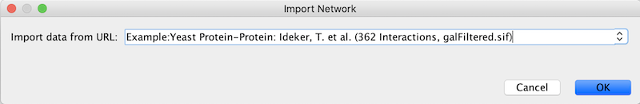
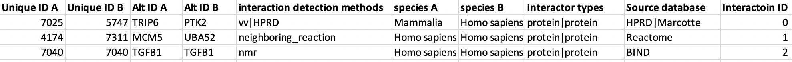
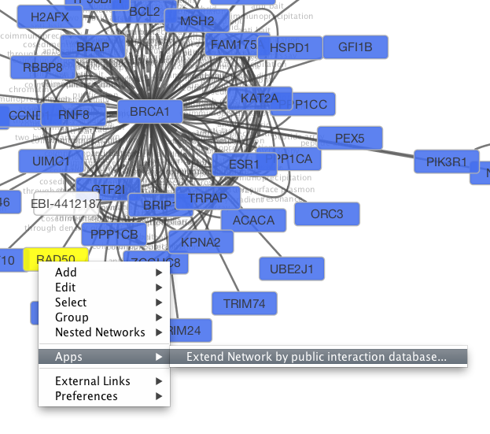
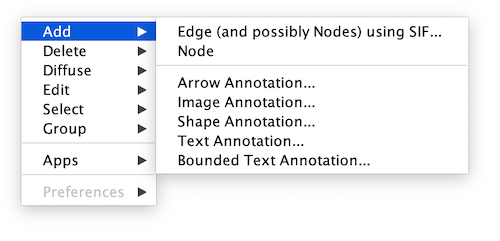
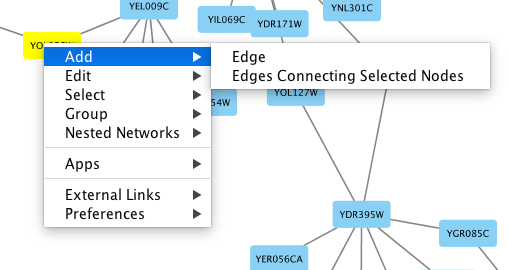
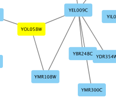
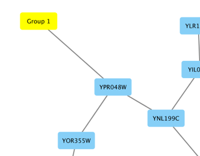

# Creating Networks

There are 4 different ways of creating networks in Cytoscape:

1.  Importing pre-existing, fixed-format network files.

2.  Importing pre-existing, unformatted text or Excel files.

3.  Importing data from from public databases.

4.  Creating an empty network and manually adding nodes and edges.

## Import Fixed-Format Network Files

Network files can be specified in any of the formats described in the
**[Supported Network
Formats](Supported_Network_File_Formats.html#supported-network-file-formats)**
section. Networks are imported into Cytoscape through the **File →
Import → Network menu**. The network file can either be located directly
on the local computer, or found on a remote computer (in which case it
will be referenced with a URL).

### Load Networks from Local Computer

In order to load a network from a local file you can select **File →
Import → Network → File...** or click on

on the tool bar. Choose the correct file in the file chooser dialog and
press Open. Some sample network files of different types have been
included in the sampleData folder in Cytoscape.

After you choose a network file, another dialog will pop up. Here, you
can choose either to create a new network collection for the new
network, or load the new network into an existing network collection.
When you choose the latter, make sure to choose the right mapping column
to map the new network to the existing network collection. 

Network files in SIF, GML, and XGMML formats may also be loaded directly
from the command line using the -N option.

### Load Networks from a Remote Computer (URL import)

To load a network from a remote file, you can select **File → Import →
Network → URL...**. In the import network dialog, insert the appropriate
URL, either manually or using URL bookmarks. Bookmarked URLs can be
accessed by clicking on the arrow to the right of the text field (see
the Bookmark Manager in
[Preferences](Cytoscape_Preferences.html#cytoscape-preferences)
for more details on bookmarks). Also, you can drag and drop links from a
web browser to the URL text box. Once a URL has been specified, click on
the OK button to load the network.

Another issue for network import is the presence of firewalls, which can
affect which files are accessible to a computer. To work around this
problem, Cytoscape supports the use of proxy servers. To configure a
proxy server, go to **Edit → Preferences → Proxy Settings...**. This is
further described in the
**[Preferences](Cytoscape_Preferences.html#cytoscape-preferences)**
section.

## Import Networks from Unformatted Table Files

Cytoscape supports the import of networks from delimited text files and
Excel workbooks using **File → Import → Network → File...**. An
interactive GUI allows users to specify parsing options for specified
files. The screen provides a preview that shows how the file will be
parsed given the current configuration. As the configuration changes,
the preview updates automatically. In addition to specifying how the
file will be parsed, the user must also choose the columns that
represent the source and target nodes as well as an optional edge
interaction type.

### Supported Files

The **Import Network from Table** function supports delimited text files
and Microsoft Excel Workbooks. For Excel Workbooks with multiple sheets,
one sheet can be selected for import at a time. The following is a
sample table file:

<table cellspacing="0"  style="table-layout: fixed; dwidth: 700px">
<caption>Sample Network in Table</caption>
<tr> <th class="">source</th>     <th class="">target</th>     <th class="center">interaction</th>  <th class="center">boolean data</th>  <th class="center">string data</th>   <th class="center">floating point data</th> </tr>
<tr> <td class="">YJR022W</td>    <td class="">YNR053C</td>    <td class="center">pp</td>           <td class="center">TRUE </td>         <td class="center">abcd12371</td>     <td class="center">1.2344543</td>           </tr>
<tr> <td class="alt">YER116C</td> <td class="alt">YDL013W</td> <td class="alt center">pp</td>       <td class="alt center">TRUE </td>     <td class="alt center">abcd12372</td> <td class="alt center">1.2344543</td>       </tr>
<tr> <td class="">YNL307C</td>    <td class="">YAL038W</td>    <td class="center">pp</td>           <td class="center">FALSE</td>         <td class="center">abcd12373</td>     <td class="center">1.2344543</td>           </tr>
<tr> <td class="alt">YNL216W</td> <td class="alt">YCR012W</td> <td class="alt center">pd</td>       <td class="alt center">TRUE </td>     <td class="alt center">abcd12374</td> <td class="alt center">1.2344543</td>       </tr>
<tr> <td class="">YNL216W</td>    <td class="">YGR254W</td>    <td class="center">pd</td>           <td class="center">TRUE </td>         <td class="center">abcd12375</td>     <td class="center">1.2344543</td>           </tr>
</table>
 

The network table files should contain at least two columns for creating
network with edges. If the file has only one column, the created network
will not contain any edges. The interaction type is optional in this
format. Therefore, a minimal network table looks like the following:

<table cellspacing="0">
<caption style="width: 240px">Minimal Network Table</caption>
<tr> <th class="">source</th>     <th class="">target</th>     </tr>
<tr> <td class="">YJR022W</td>    <td class="">YNR053C</td>    </tr>
<tr> <td class="alt">YER116C</td> <td class="alt">YDL013W</td> </tr>
<tr> <td class="">YNL307C</td>    <td class="">YAL038W</td>    </tr>
<tr> <td class="alt">YNL216W</td> <td class="alt">YCR012W</td> </tr>
<tr> <td class="">YNL216W</td>    <td class="">YGR254W</td>    </tr>
</table>
 

One row in a network table file represents an edge and its edge data
columns. This means that a network file is considered a combination of
network data and edge column data. A table may contain columns that
aren't meant to be edge data. In this case, you can choose not to import
those columns by clicking on the column header in the preview window.
This function is useful when importing a data table like the following
(1):

This data file is a tab-delimited text file and contains network data
(interactions), edge data, and node data. To import network and edge
data from this table, choose Unique ID A as source, Unique ID B as
target, and Interactor types as interaction type. Next, turn off columns
used for node data (Alternative ID A, species B, etc.). Other columns
can be imported as edge data.

The network import function cannot import node table columns - only edge
table columns. To import node table columns from this table, please see
the **[Node and Edge Column
Data](Node_and_Edge_Column_Data.html#node-and-edge-column-data)**
section of this manual.

Note (1): This data is taken from the *A merged human interactome*
datasets by Andrew Garrow, Yeyejide Adeleye and Guy Warner (Unilever,
Safety and Environmental Assurance Center, 12 October 2006). Actual data
files are available at [http://wiki.cytoscape.org/Data_Sets/](http://wiki.cytoscape.org/Data_Sets/).

### Basic Operations

To import network from text/Excel tables, please follow these steps:

1.  Select **File → Import → Network → File...** or click on
    
    on the tool bar.

2.  Select a table file in the file chooser dialog.

3.  Define the interaction parameters by specifying which columns of
    data contain the Source Interaction, Target Interaction, and
    Interaction Type. Clicking on any column header will bring up the
    interface for selecting source, interaction and target:

    

4.  (Optional) Define edge table columns, if applicable. Network table
    files can have edge table columns in addition to network data.

    -   Enable/Disable Table Columns: You can enable/disable column data
        by selecting the \[attachment:disablecolumn.png\] symbol in the
        column editor.

        

    -   Change Column Name and Data Types: You can also modify the
        column name and data type in the column editor. For more detail,
        see **Modify Column Name/Type** below.

5.  Click the OK button.

#### Import List of Nodes Without Edges

The table import feature supports lists of nodes without edges. If you
select only a source column, it creates a network without interactions.
This feature is useful with the node expansion function available from
some web service clients. Please read the section **[Importing Networks
from External
Database](Creating_Networks.html?highlight=Web%20Service#what-is-a-web-service)**
for more detail.

### Advanced Options

You can select several options by clicking the **Advanced Options**
button in the main import interface.

-   Delimiter: You can select multiple delimiters for text tables. By
    default, Tab and Space are selected as delimiters.

-   Default Interaction

-   Transfer first line as column names: Selecting this option will
    cause all edge columns to be named according to the first data entry
    in that column.

-   Start Import Row: Set which row of the table to begin importing
    data from. For example, if you want to skip the first 3 rows in the
    file, set 4 for this option.

-   Ignore lines starting with: Rows starting with this character will
    not be imported. This option can be used to skip comment lines in
    text files.

	
### Modify Column Name/Type

In the **Import Network from Table** interface, you can change the name
and data type of column by clicking on any column header:

Column names and data types can be modified here.

-   Modify Column Name - just enter a new column name.

-   Modify Column Data Type - The following column data types are
    supported:

    -   String

    -   Boolean (True/False)

    -   Integer

    -   Floating Point

    -   List of (one of) String/Boolean/Integer/Floating Point

Cytoscape has a basic data type detection function that automatically
suggests the column data type according to its entries. This can be
overridden by selecting the appropriate data type from the radio buttons
provided. For lists, a global delimiter must be specified (i.e., all
cells in the table must use the same delimiter).

## Import Networks from Public Databases

Cytoscape has a feature called **Import Network from Public Databases**.
Users can access various kinds of databases through this function,
**File → Import → Network → Public Databases...**.

### What is a Web Service?

A web service is a standardized, platform-independent mechanism for
computers to interact over the internet. These days, many major
biological databases publish their data with a web service API:

-   List of Biological Web Services:
    [http://taverna.sourceforge.net/services](http://taverna.sourceforge.net/services)

-   Web Services at the EBI: [http://www.ebi.ac.uk/Tools/webservices/](http://www.ebi.ac.uk/Tools/webservices/)

Cytoscape core developer team have developed several web service clients
using this framework. Cytoscape supports many web services including:

-   [PSICQUIC](http://code.google.com/p/psicquic/): Standard web service
    for biological interaction data sets. The full list of
    PSICQUIC-compatible databases is available
    [here](http://www.ebi.ac.uk/Tools/webservices/psicquic/registry/registry?action=STATUS).

The following sections describe how to import network from external
databases.

## Getting Started

To get started, select **File → Import → Network → Public
Databases...**.

## Example: Retrieving Protein-Protein Interaction Networks from Multiple Databases

-   Select **File → Import → Network → Public Databases...**.

-   From the pull-down menu, select the **Interaction databases
    Universal Client**.

-   Enter one or more search terms, such as BRCA1.

-   Click the **Search** button to start the search.

-   Select databases from the hits. This selection will be saved as your
    default database list.

-   Click the **Import** button to import selected network data.

After confirming the download of interaction data, the network of BRCA1
will be imported and visualized.

**Tip: Expanding the Network:** Several of the Cytoscape web services
provide additional options in the node context menu. To access these
options, right-click on a node and select **Apps → Extend Network by
public interaction database...**. For example, in the screenshot, we
have loaded the BRCA1 network from IntAct, and have chosen to merge this
node's neighbors into the existing network.

### PSICQUIC Options

PSICQUIC Web Service Client has three search modes:

-   Search by ID

-   Search by MIQL

-   Search by Species

By default, search mode is set to **Search by ID**. You can search all
databases by ID, such as gene symbol, Uniprot ID, or NCBI gene ID. If
the search mode is set to MIQL, you can use
[MIQL (https://code.google.com/p/psicquic/wiki/MiqlReference27)](https://code.google.com/p/psicquic/wiki/MiqlReference27) for
search. If you want to search interactions by keywords or specific
functions, this is the powerful query language to filter the result. The
last option is for importing all interactions for the species (i.e.,
interactome).

## Create a New Network or Edit One Manually

A new, empty network can also be created and nodes and edges manually
added. To create an empty network, go to **File → New → Network → Empty
Network**, and then manually add network components by right clicking on
the network canvas or on a node. You can edit an existing network using
the same process.

### Adding a Node

To add a new node, right-click on an empty space of the network view
panel. Select **Add → Node** item from the pop-up menu.

### Adding an Edge

To add an edge to connect nodes, right-click on the source node. Select
**Edit → Add Edge** from the pop-up menu. Next, click on the target
node. The Images below show the two steps for drawing an edge between
two nodes. You can abort the drawing of the edge by pressing Esc key.
You can also select two or more nodes to connect and in the right-click
menu select **Add → Edges Connecting Selected Nodes** to create edges
connecting all selected nodes.

You can delete nodes and edges by selecting a number of nodes and edges,
then selecting **Edit → Cut**. You can also delete selected nodes and
edges from the **Edit** menu, under **Edit → Delete Selected Nodes and
Edges...**. You can recover any nodes and edges deleted from a network
by going to **Edit → Undo**.

### Grouping Nodes

Any number of nodes can be grouped together and displayed as either one
group node or as the individual nodes. To create a group, select two or
more nodes and right-click to select **Group → Group Selected Nodes**.
You will be prompted to select a name for the group node. Once a group
is created, you can use the right-click menu to collapse or expand the
group. You can also quickly collapse/expand a group by double-clicking
on the group node or any of its children to toggle back and forth.

**Collapsed group**

**Expanded group**

The appearance and behavior of grouped nodes depends on the [group settings](Cytoscape_Preferences.html?#managing-group-view) in effect when the group is created. Settings can be managed for the entire Cytoscape session (via **Edit → Preferences → Group Preferences...**) or for a specific group (right-click **Preferences → Group Preferences...**).

There are two interacting settings involved in the group interaction and visualization:
* what happens when a node is double-clicked
* how an expanded group appears

If you set the Double-Click action to something other than Expand/Contract, the groups won't collapse on double-click, which may be appropriate for displaying group nodes that contain other nodes (i.e., the so-called Compound Node style).

The following node visualization options are available:

-   None: No specific visualization -- just do expand/contract, but don't treat the expanded group special in any way
    
-   Compound Node: Show the group node as an area surrounding the member nodes, but position it behind the member nodes to allow direct selection of each of the members.  If you move a node within this area, you may need to resize the area to encompass the newly positioned member node. Moving the group node will cause all member nodes to move with it.  There are [visual styles](Styles.html#styles) that allow you to change the color, shape and padding for the compound node. 
    
-   Show Group Node: When the group is expanded, show the group node as an additional node and add "member edges" between the group node and each of the member nodes.  This is useful for complexes where it may be important to show a group node at the same time as group member nodes.
    
-   Single Node:  Show the group node as an area surrounding the member nodes, but put it in front of the member nodes so that the member nodes can not be selected or moved individually.

### Adding Network Annotations

Annotations in the form of text, images or shapes can be added to the
network canvas by right-clicking anywhere on the canvas and selecting
one of the Annotation choices in the **Add** menu. You can add an image
of your own, choose from a shapes library or add either plain or bounded
text. Shapes and text are customizable and any added annotations can be
edited from the right-click context menu.

