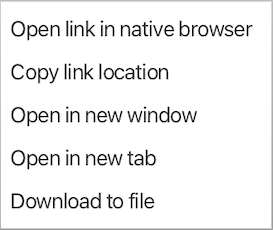

# Cytoscape Web Browser

Cytoscape includes a simple web browser that can be used for viewing 
web sites from within Cytoscape. It is also used by Cytoscape apps,
link outs, displaying the user manual, and displaying interactive
tutorials. You can bring up a browser window by selecting 
**Tools → Open web page**, which will bring up the initial **Starting Cytoscape Web Browser** dialog. 
It provides a field to type in a web site address
and a checkbox to indicate whether the browser window should be opened in
the <a href="#cybrowser_results">Cytoscape Results Panel</a>.

You can also access the web browser by clicking on the **Cytoscape Web Browser**

icon in the tool bar, which will bring up the main **Cytoscape Web Browser** with a landing page (see screenshot below)
with links to various resources like this manual, tutorials, the Cytoscape website and more.

## Cytoscape Web Browser Window

The main **Cytoscape Web Browser** window provides a rudimentary browsing interface, with
forward/back buttons, a text field to enter a new URL, and a **Go** button to 
move to the new page.  In addition, there three context menus:
1. **Selected text**: 
   The selected text menu has just one item, **Copy**, which copies the selected
   text.
2. **Link**: 
   Using the link menu, users can copy the link location, open the link in a new window or the computer's native browser,
   or open the link in a new tab.  They can also use this to download the link target to
   a file.
   

   
3. **Other**
   If the cursor is not over a link, and no text is selected, the default menu is shown.
   Using the default menu, users can close their browser or reload the page.
   

   

## Cytoscape Web Browser in Results Panel

In addition to being able to open web pages as a separate window, a web page may
also be opened in the results panel. This provides many of the same functions as the browser
window except that the interface to go forward and backwards is gone, and you can't open 
links in different tabs.

## Why Cytoscape Web Browser?

**Cytoscape Web Browser** is not a Chrome or Firefox replacement, but it provides a very quick way to view Cytoscape-specific
web pages and provides a level of integration with Cytoscape that is more difficult to provide in all of
the various browsers provided by all of the platforms Cytoscape runs on. In particular, **Cytoscape Web Browser** supports
special links that are actually just Cytoscape commands. For javascript implementers, **Cytoscape Web Browser** also provides
hooks to listen to node and edge selection in Cytoscape.
