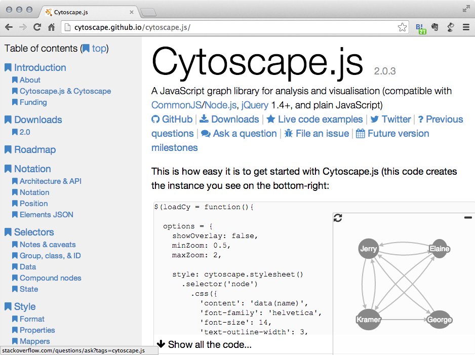
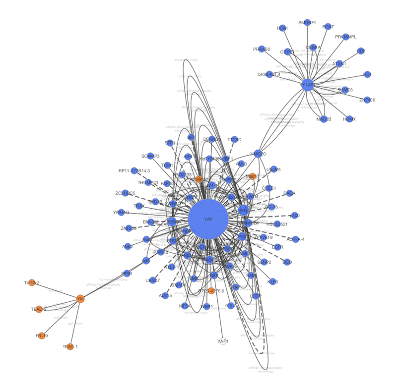
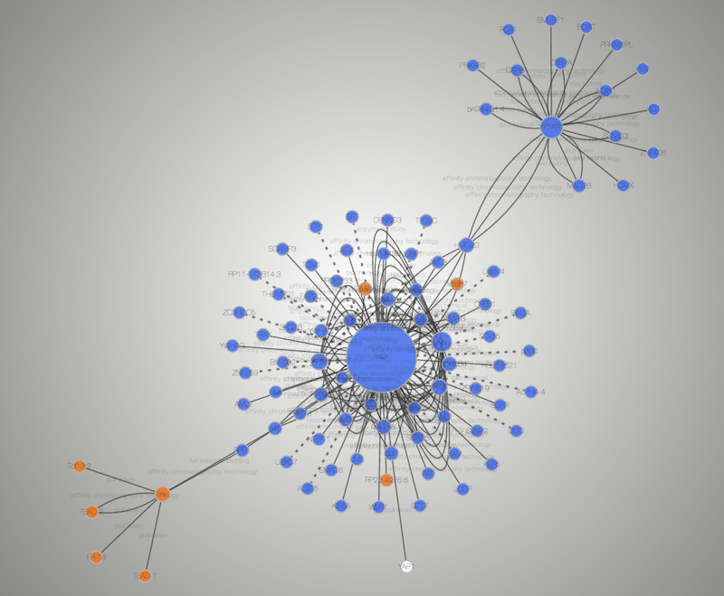

# Cytoscape.js and Cytoscape

## What is Cytoscape.js?

[Cytoscape.js](http://cytoscape.github.io/cytoscape.js/) is a
**JavaScript library** for interactive network visualization. It is a
building block for web applications and is **NOT** a complete web
application. If you have network data sets and want to share
visualizations created with Cytoscape, you can build your own website
using Cytoscape.js and this new **Export to Cytoscape.js** feature.

### Examples

-   A network visualized with Cytoscape 3.1.0

    

-   Same network exported to Cytoscape.js (Rendered with Google Chrome
    and Cytoscape.js 2.0.3)

    

-   [Interactive example (galFiltered.sif rendered with
    Cytoscape.js 2.0.3)](http://chianti.ucsd.edu/~kono/dist/)

### Differences and Shared Concepts

Although Cytoscape and Cytoscape.js are two completely independent
software packages, they are sharing higher level concepts. The following
is the list of similarities and differences between the two:

#### Cytoscape

-   **Desktop application** for network visualization written in [Java
    programming language](http://www.java.com/)

-   Needs desktop or laptop computers to run

-   Users have to install Java runtime

-   High performance application for large scale network analysis and
    visualization

-   Expandable by [Apps](http://apps.cytoscape.org/)

-   Use **Styles** to map data to network properties, such as node
    color, edge width, node shape, etc.

#### Cytoscape.js

-   A **[JavaScript library](http://en.wikipedia.org/wiki/JavaScript)**
    for network visualization, **NOT** a complete web application nor
    mobile app

-   Runs on most of modern web browsers, including tablets and smart
    phones

-   No plugins are required to run. Modern web browser is the only
    requirement

-   Need to write code to set up your web site or web application

-   Expandable by
    [Extensions](http://cytoscape.github.io/cytoscape.js/#extensions)

-   Use **CSS-based Styles** to map data to network properties

In a long term, Cytoscape and Cytoscape.js will be more integrated, and
as the first step Cytoscape now supports reading and writing
Cytoscape.js network/table JSON files. In addition, Cytoscape can
convert *Styles* to Cytoscape.js Style object.

## Data Exchange between Cytoscape and Cytoscape.js

Since Cytoscape.js is a JavaScript library, its basic data exchange
format is [JSON (JavaScript Object Notation)](http://www.json.org/). All
of these import/export functions are part of standard Cytoscape user
interface, and you can read/write Cytoscape.js JSON files just like
other standard files such as SIF.

### Export Network and Table to Cytoscape.js

Cytoscape.js stores network data (graph) and its data table in the same
object. Cytoscape writes such data complex as JSON, i.e., both network
and data tables will be exported as a single JSON file. You can select a
network and export it from **File | Export | Network**.

Cytoscape only supports one of the Cytoscape.js supported JSON formats,
which is:

    {
        elements:{
            nodes:[],
            edges:[]
        }
    }

**SUID** will be used as unique identifier for nodes and edges in the
JSON. For more information about this format, please visit [Cytoscape.js
web site](http://cytoscape.github.io/cytoscape.js/).

#### Important Note about Data Compatibility

Cytoscape creates JSON file directly from data table and tries to
extract as much data as possible from the original table. However, since
table column names will be directly converted into
[JavaScript](https://en.wikipedia.org/wiki/JavaScript)
variable names, invalid characters will be replaced by underscore (\_):

-   Original Data Table Column Names:

        Gene Name
        KEGG.pathway

-   The Names above will be replaced to:

        Gene_Name
        KEGG_pathway

You should be careful when you plan to use this feature for data
roundtrip: from Cytoscape to Cytoscape.js back to Cytoscape. For such
use cases, **we strongly recommend to use
[JavaScript](https://en.wikipedia.org/wiki/JavaScript)-safe
characters only in your table column names**. Naming your columns only
with alphanumeric characters and underscore (\_) is the best practice.
(For actual data entries, all characters are allowed. This restriction
is only for table column names.)

## Export Styles to Cytoscape.js

Cytoscape and Cytoscape.js are sharing a concept called **Style**. This
is a collection of mappings from data point to network property.
oCytoscape can export its Styles into CSS-based Cytoscape.js JSON.

You can export *all Styles into one JSON file* from **File | Export |
Styles** and select Cytoscape.js JSON as its format.

#### Limitations

Cytoscape.js does not support all of Cytoscape Network Properties. Those
properties will be ignored or simplified when you export to JSON Style
file.

Currently, the following Visual Properties will not be exported to
Cytoscape.js JSON:

-   Custom Graphics and its positions

-   Edge Bends

-   Tooltips

-   Node Label Width

-   Node Border Line Type

-   Arrow Colors (they are always same as edge color)

#### Cytoscape.js and Cytoscape Compatibility 

Cytoscape’s network rendering system is designed for desktop use, while the browser-based renderer 
incorporates web technologies (e.g., cytoscape.js and Cascaded Style Sheets). As a result, most but 
not all networks will render the same in the browser as in Cytoscape. Cytoscape visual styles not 
supported in the web browser are ignored. A complete compatibility list is available 
[here](https://docs.google.com/spreadsheets/d/1iTDKGjro1-L7HGz1ftozqDKRxjQVSPF28jQLt7XGrSg/edit#gid=0).

### Import Cytoscape.js data into Cytoscape

Cytoscape.js network JSON files can be loaded from standard Cytoscape
file menu: **File | Import | Network ...**. Both File and URL are
supported.

## Build Your Own Web Application with Cytoscape.js

Although Cytoscape can export networks, tables, and Style as
Cytoscape.js-compatible JSON, users have to write some
[JavaScript](https://en.wikipedia.org/wiki/JavaScript)
code to visualize the data files with Cytoscape.js. Details of web
application development with Cytoscape.js is beyond the scope of this
document. If you need examples and tutorials about web application
development with Cytoscape.js, please visit the following web site:

-   [https://github.com/cytoscape/cyjs-sample/wiki](https://github.com/cytoscape/cyjs-sample/wiki)

### Questions?

If you have questions and comments about web application development
with Cytoscape and Cytoscape.js, please send yours to [our mailing
list](https://groups.google.com/forum/#!forum/cytoscape-discuss).
