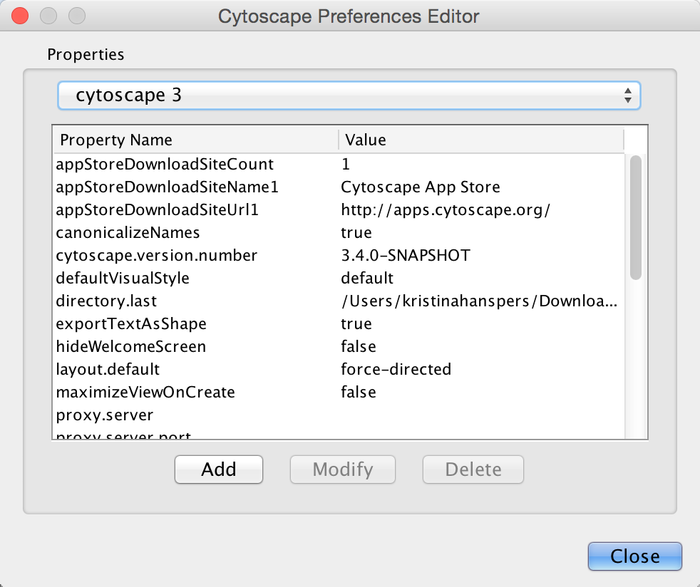
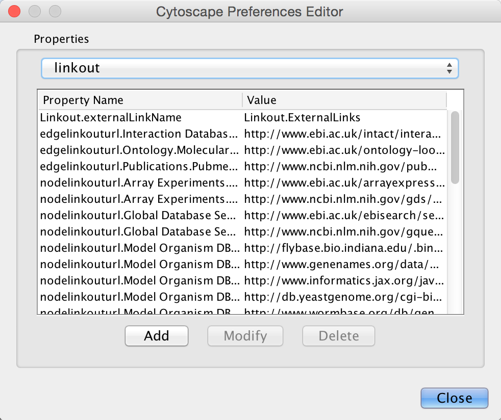
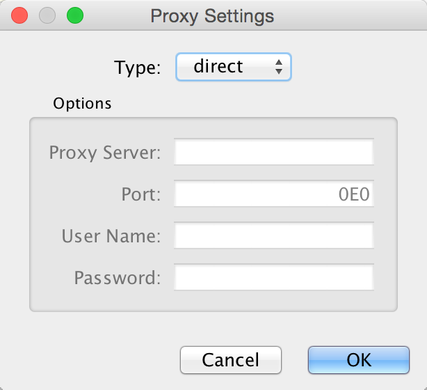
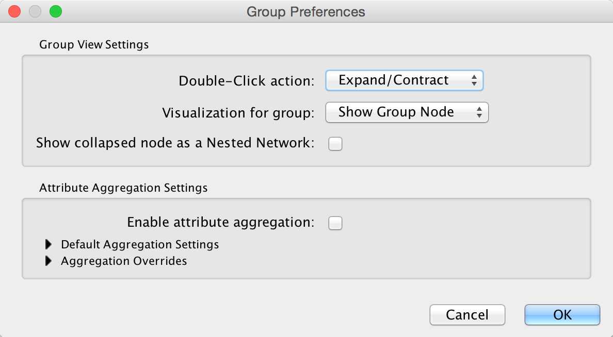
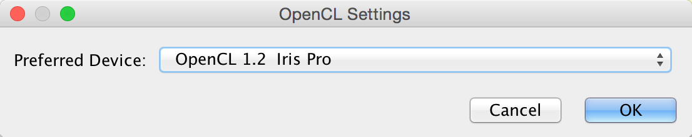

# Cytoscape Preferences

## Managing Properties

The Cytoscape properties editor, accessed via **Edit → Preferences →
Properties...**, is used to specify default properties. Any changes made
to these properties will be saved in .props files under the
`CytoscapeConfiguration` subdirectory of the user's home directory.

Cytoscape properties are configurable using the **Add**, **Modify** and **Delete**
buttons as seen below.

App properties may also be edited in the same way as editing Cytoscape
properties. For example, to edit the properties of **Linkout**, select
**linkout** from the combobox of the **Preferences Editor**. Some apps may
store properties inside session files in addition to (or instead of)
storing them in the `CytoscapeConfiguration` directory.

## Managing Bookmarks

Cytoscape contains a pre-defined list of bookmarks, which point to
sample network files located on the Cytoscape web server. Users may add,
modify, and delete bookmarks through the Bookmark manager, accessed by
going to **Edit → Preferences → Bookmarks...**.

There are currently several types of bookmarks (based on data
categories), including network and table. Network bookmarks are URLs
pointing to Cytoscape network files. These are normal networks that can
be loaded into Cytoscape. Table bookmarks are URLs pointing to data
table files.

## Managing Proxy Servers

You can define and configure a proxy server for Cytoscape by going to
**Edit → Preferences → Proxy Settings...**.

After the proxy server is set, all network traffic related to loading a
network from URL will pass through the proxy server. Cytoscape apps use
this capability as well. The proxy settings are saved in
`cytoscape3.props`. Each time you click the **OK** button after making a
change to the proxy settings, an attempt is made to connect to a well
known site on the Internet (e.g., google.com) using your settings. For
both success and failure you are notified and for failure you are given
an opportunity to change your proxy settings.

If you no longer need to use a proxy to connect to the Internet, simply
set the Proxy type to _direct_ and click the **OK** button.

## Managing Group Settings

The configuration of Cytoscape group view may also be edited through
**Edit → Preferences → Group Preferences...**.

Note that **Group Preferences** apply to [node groups](Creating_Networks.html#grouping-nodes) established after the group preferences are set. They do not apply to groups that already exist. 

The **Group Preferences** dialog provides access to three **Group View Settings** and all of the **Attribute Aggregation Settings**.
There are two interacting settings involved in the group view and group interaction:
* how an expanded group appears
* what happens when a node (group member or group node) is double-clicked
* what appears inside of a group node when it is collapsed

### Group View Settings ###
The following node visualization options are available:

-   **None**: No specific visualization -- just do expand/contract, but don't treat the expanded group special in any way
    
-   **Compound Node**: Show the group node as an area surrounding the member nodes, but position it behind the member nodes to allow direct selection of each of the members. If you move a node within this area, you may need to resize the area to encompass the newly positioned member node. Moving the group node will cause all member nodes to move with it. There are [visual styles](Styles.html#styles) that allow you to change the color, shape and padding for the compound node. 
    
-   **Show Group Node**: When the group is expanded, show the group node as an additional node and add member edges between the group node and each of the member nodes.  This is useful, for example, for complexes where it may be important to show a group node (the entire complex) at the same time as group member nodes (each individual protein).
    
-   **Single Node**:  Show the group node as an area surrounding the member nodes, but put it in front of the member nodes so that the member nodes can not be selected or moved individually.

If you set the **Double-Click** action to something other than **Expand/Contract**, the groups won't collapse on double-click, which may be appropriate for displaying group nodes that contain other nodes (i.e., the **Compound Node** visualization or **Single Node** visualization).

### Attribute Aggregation Settings ###

Attribute aggregation provides an automated way for a group to aggregate all of the attributes of its children. Since the columns in a Cytoscape network must all be of the same type, a group can't simply create a list of integers to aggregate the integer columns of its members -- the right approach to aggregating the attributes of group members will obviously depend on the application. Cytoscape allows you to set the default aggregation approach for each type of column: Integer, Long, Double, String, Boolean, String List, Integer List, Long List, or Double List in the **Default Aggregation Settings** section. In general, the user is provided with a list of some common aggregations. For example, Integer aggregations include Average, Minimum Value, Maximum Value, Median Value or Sum.  

In addition, users can indicate that a specific column should use an aggregation approach different from the default by looking at **Aggregation Overrides**.  

### Grouping Tips ###

The **Show collapsed node as a Nested Network** checkbox determines the contents of a grouping node when its member nodes are hidden. If it is checked, the group node contains a graphic of the laid out member nodes. For the Compound Node visualization, this box should remain unchecked so the grouping node can appear as a background to member nodes.

Attribute aggregation only occurs when the group is collapsed or when the group visualization is changed (e.g., from **Single Node** to **Compound Node**).

## Managing OpenCL Settings

You can choose between one or more OpenCL drivers installed on your system by going to
**Edit → Preferences → OpenCL Settings...**.

OpenCL is a library that enables Cytoscape to use your system's graphics processing unit (GPU)
to accelerate certain layouts and other calculations. If no choices are presented, consult
the support web page for your system's graphics card.

