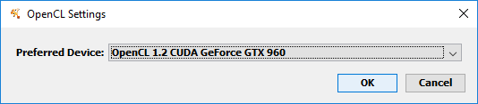

# Cytoscape and OpenCL (Computing on the GPU)

## What it is for?

Cytoscape has basic support for offloading computationally intesive tasks 
for parallel processing on a GPU, multicore CPU or a multiprocessor card 
using [OpenCL](https://en.wikipedia.org/wiki/OpenCL).
The OpenCL support in Cytoscape is mostly intended 
to provide a unifying OpenCL access for third-party Cytoscape Apps, 
but  some core functionality (Prefuse layout) also has OpenCL implementation
for increased performance. 

As OpenCL can run on almost any device, including desktop computers 
without dedicated GPUs, 
you should be able to use OpenCL functionality on any platform 
where you can run Cytoscape, although you may need to install 
additional drivers for your device.

## Setup & Configuration
The CyCL core app (should be already part of your Cytoscape distribution) 
lets you see the available OpenCL devices and configure your preferred device for OpenCL computation.
To see the device list and configure your preferred device, 
select **Edit → Preferences → OpenCL Settings...** 

In most cases, you want your preferred device to be your GPU (if you have one).
If you do not see the device you intend to use (or any device at all) 
in the configuration window, 
you may need to install OpenCL drivers. 
For GPUs from major manufacturers, OpenCL drivers are usually installed
with the graphics driver. If you have installed the latest graphics drivers and still do not see your device in the list, check the website of your GPU manfucturer.
To use OpenCL on a CPU (i.e., on any desktop computer) or a Xeon Phi, 
you need to install the drivers separately from 
the web page of the manufacturer of your CPU.

As of 2016-10-10, drivers for Intel CPUs can be downloaded at 
[http://software.intel.com/en-us/articles/opencl-drivers](http://software.intel.com/en-us/articles/opencl-drivers) - 
look for "runtime-only". AMD's drivers can be found at [http://support.amd.com/en-us/kb-articles/Pages/OpenCL2-Driver.aspx](http://software.intel.com/en-us/articles/opencl-drivers).

**Warning:** After you have just installed drivers for your OpenCL device, 
Cytoscape may require restarting to be able to "see" the device.

## OpenCL/GPU Troubleshooting

If any OpenCL app is not working, here are some of the common causes:

### CyCL core app is not installed or not initialized property

**Diagnosis:** check if you can see the **Edit → Preferences → OpenCL Settings...** menu item.
If not, this is a bad sign.

**Treatment:** Check the CytoscapeConfiguration directory, 
if it contains a file called `disable-opencl.dummy` remove it and start Cytoscape 
from the system console (using cytoscape.bat or cytoscape.sh). 
Check console output for additional information. 

### No OpenCL devices are available

**Diagnosis and treament:** See [Setup and configuartion](#cytoscape_gpu_configuration) above.

### The Cytoscape console says "Could not find OpenCL.dll"

**Treatment:** Make sure your Windows OS directory containing OpenCL.dll is listed in the 
value of the Java system property `java.library.path` 
(OpenCL.dll can usually be found in `%windir\SysWOW64%` or `%windir%\system32`).
You can modify `java.library.path` by adding a line of the form 
`-Djava.library.path=path1;path2` to the `Cytoscape.vmoptions` file.
`Cytoscape.vmoptions` can be found in the Cytoscape installation directory.

### The computer is unresponsive for a while and then resets the screen while running OpenCL on the GPU.

**Treatment:** This problem arises
if you run computations on the GPU that also handles your main display and
the computation occupies the GPU for too long, 
preventing the operating system (e.g., Windows) from updating the display. 
If the operating system detects this, it terminates the GPU computation.
You can either try to run smaller chunks of the computation or configure
the "Timeout Detection and Recovery" (TDR) to let the computation complete
even if the system becomes unresponsive.
Further info can be found at [this NVidia thread](https://devtalk.nvidia.com/default/topic/459869/-quot-display-driver-stopped-responding-and-has-recovered-quot-wddm-timeout-detection-and-recovery-/)
or [Microsoft webpage](https://msdn.microsoft.com/en-us/library/windows/hardware/ff570087(v=vs.85).aspx).
Microsoft also has [documentation for the registry keys that need to changed](https://msdn.microsoft.com/en-us/library/windows/hardware/ff569918(v=vs.85).aspx).

### My problem is not listed here
If this does not help you, ask for help in the 
[Cytoscape helpdesk mailing list](https://groups.google.com/forum/#!forum/cytoscape-helpdesk).
