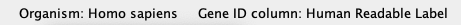
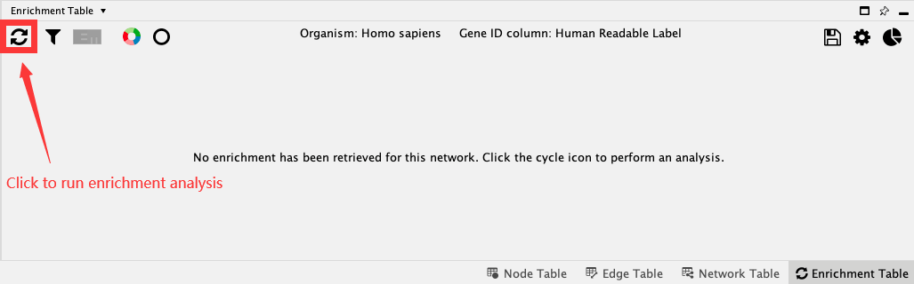
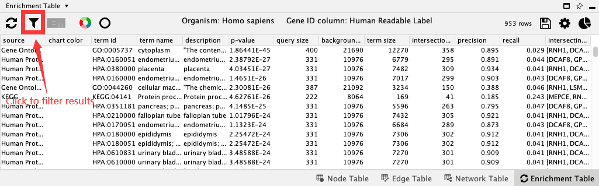
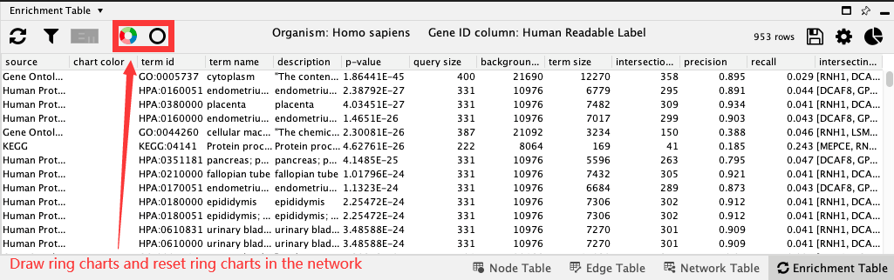
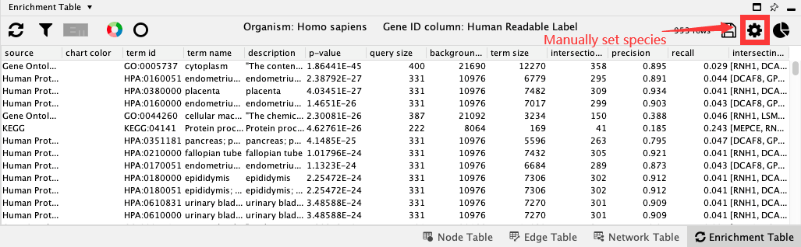
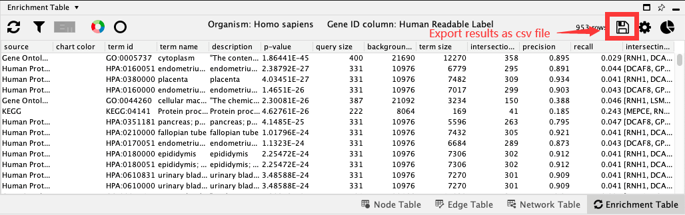

# Enrichment Table

The Enrichment Table core app provides access to functional enrichment analysis for any network loaded into Cytoscape using [g:Profiler's web service](https://biit.cs.ut.ee/gprofiler/gost). Click the reload icon in the **Enrichment Table** panel to retrieve enrichment analysis results, or use the menu option **Tools*** → Enrichment Table → Perform Gene Enrichment**.

## Organism and Gene ID

Running enrichment analysis requires two mandatory parameters:

- Organism: Organism associated with the query genes
- Gene ID: Node table column containing the gene symbols

Both these parameters are predicted by **Enrichment Table** app if enough information is available.

- The possible **organism** is predicted on startup by processing the data from the network in columns [`species`,`organism`,`IntAct::species`]
- The **gene id** column is predicted on startup in the following ways:
   1. Retrieves `NODE_LABEL` from style for any generic network
   2. Selects `display name` for `stringapp` networks
 
If you want to manully set organism and gene ID or the prediction is incorrect, you can change the options in the **Network-specific enrichment panel settings** which can be accessed by clicking the gear icon in the **Enrichment Table** panel.

## Running Enrichment Analysis
There are three ways you can perform enrichment analysis:

- Use the menu option under **Tools*** → Enrichment Table → Perform Gene Enrichment**.
- In the Cytoscape **Command Line**, enter `enrichment analysis`, and click enter.
- Click the **Perform Gene Enrichment** button (reload icon) in the **Enrichment Table** panel.

*Note: By default, the enrichment analysis is performed on all nodes of the current network using the genome as background. If a subset of nodes are selected, enrichment analysis is performed for just those nodes using the complete network as the background.*

Now you get the table containing enrichment results. The results are sorted according to the p-value in a increasing order by default.

## Filter Results
There are couple of parameters based on which you can filter the table by categories and evidence code:

- Click the **Filter Enrichment table** button with filter icon to access the filters.
- Select **Gene Ontology Biological Process** in the categories. Click ok. You will see a filtered table, and a summary of the number of filtered versus all rows at the top of the table.
- Open the filter panel again and check **Remove redundant terms**. Click ok to see terms with both filters applied.

## Charts
Charts provides the ability to visualise a set of terms for each node in the network. By default, a split donut chart is displayed, corresponding to the top 5 terms. You can change the number of terms and type of chart in **Network-specific chart settings** (right-most button).

- Click **Draw Chart** to create charts with default settings.
- To remove charts, click on **Reset Charts**.
- To change charts settings, go to **Network-specific chart settings**.

## Term Selection
Enrichment Table shows results based on the nodes selected in the network. If no nodes are selected, all terms are shown in the table. When a set of nodes are selected, terms consisting of all the selected nodes are shown. Similarly, to visualize one or more enrichment term, select the rows in the table and the corresponding nodes will be highlighted in the network.

## Optional Settings
In addition to Organism and Gene ID column, there are other parameters that can be changed to obtain a more precise enrichment results. These options are available in the **Network-specific enrichment panel settings** (gear icon). For example, you can remove redundant terms in the table by selecting the appropriate redundancy (Jaccard) cutoff, the default is 0.5.

## Enrichment Map Generation
We can generate an [Enrichment Map](https://www.baderlab.org/Software/EnrichmentMap) from the enrichment data generated by the **Enrichment Table** app. This requires the [Enrichment Map](https://apps.cytoscape.org/apps/enrichmentmap) app to be installed in Cytoscape. Once enrichment map app is present, click the **Enrichment Map** icon. Specify the output file name and connectivity cutoff and click **OK** to continue.

## Export results
**Enrichment Table** app provides functionality to export the data as a csv-formatted table:

- Select the **Export enrichment table** icon.
- Select the desired file location and file name for the table.

The default file extension is .**csv**.

## Automation
The enrichment analysis is supported in automation use cases as well. The basic command syntax is `enrichment analysis`.  You can optionally choose the organism associated with the query genes with the `organism` parameter. You can also optionally select the node table column containing the gene symbols with the `geneID` parameter. All parameters are listed
[here](http://localhost:1234/v1/swaggerUI/swagger-ui/index.html?url=http%3A%2F%2Flocalhost%3A1234%2Fv1%2Fcommands%2Fswagger.json#!/enrichment/enrichment_analysis).

