<a id="export_your_data"> </a>
# Export Your Data

## Raw Data Export


To use data from Cytoscape networks in an external application, the data has to be exported.
As a Cytoscape network consists of a number of different types of data, there are options 
in Cytoscape for each exportable data type. These options (Network, Table, Styles) can be found on the
**File → Export** submenu (shown above). 

<a id="export_ndex"> </a>
### Network Data Exchange (NDEx) Public Database

The **Network to NDEx** option is used to store a network on the public NDEx server. You can use the NDEx public server to store your networks on the cloud, for [sharing networks](Export_Your_Data.html#as_an_ndex_network) with collaborators, or to [archive networks](Export_Your_Data.html#as_an_ndex_network) for publication. To store a network, you must first create a free NDEx account, which you can easily do by visiting the [NDEx Public Server](http://ndexbio.org) website.

The **Network to NDEx** option saves only the currently selected network to your NDEx account. Such networks are suitable for processing by other applications and web services, as they contain only the nodes and edges in the selected network -- other views and the nodes and edges unique to them are not written. If you later re-import this network (using the Cytoscape [**Search bar**](Creating_Networks.html#example-retrieving-networks-from-ndex)), only the single network you saved will be loaded.

When you select the option, the CyNDEx-2 Browser dialog will appear and enable you to provide various **metadata** to annotate the network and make it findable in subsequent NDEx searches. You can set the name of your network by editing the **Network Name** attribute. The **Update Existing Network** option enables you to overwrite the existing copy of the network (if you have permission to do so). We recommend to provide as much metadata as possible, and always provide at least **Version** and **Description** attributes.

To export your network, you must first associate your NDEx account credentials with the CyNDEx-2 Browser by filling out the profile form (red oval in screenshot below).

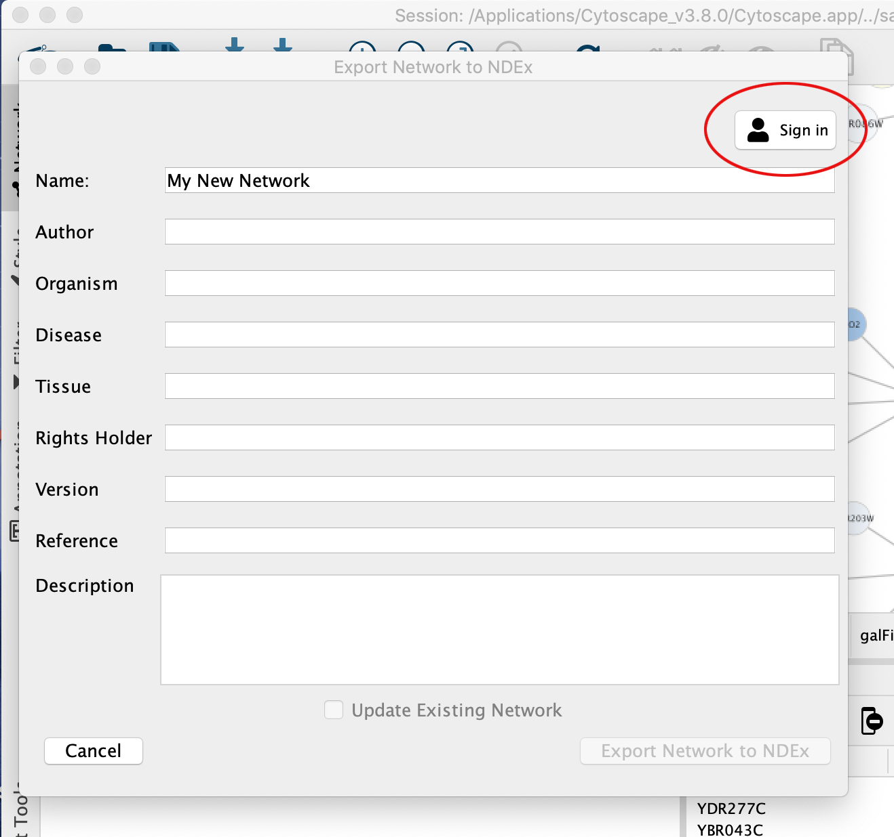

Once the profile is created, you are allowed to export your network to NDEx.


Export commands have also been added to the network and collection context menus in the Cytoscape Network panel, as another method of accessing the network save dialog.

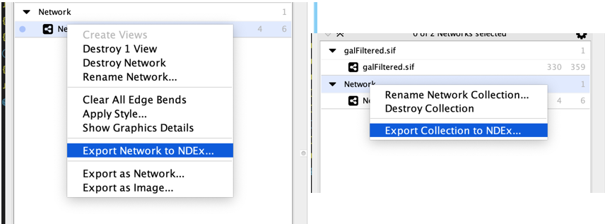

Finally, the NDEx button in the toolbar provides an additional convenient way to both Import and Export to NDEx.

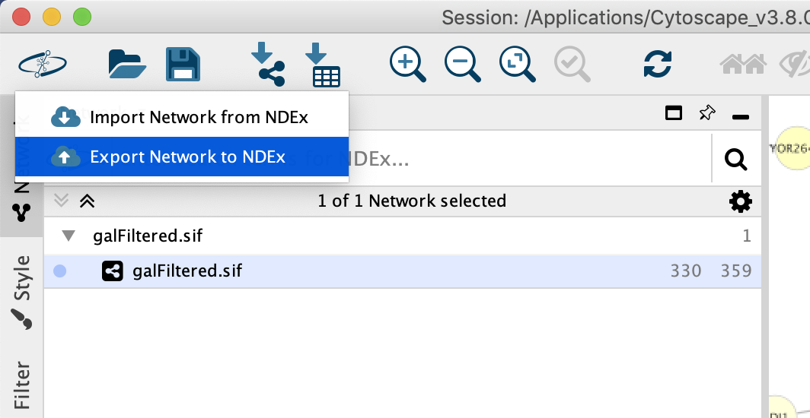

When the export operation is complete, a confirmation dialog will be displayed as shown below. If you want to share your network with external collaborators or for more sharing options, please refer to the guide for [Uploading and Sharing Networks](https://home.ndexbio.org/sharing-and-accessing-networks/) in NDEx.

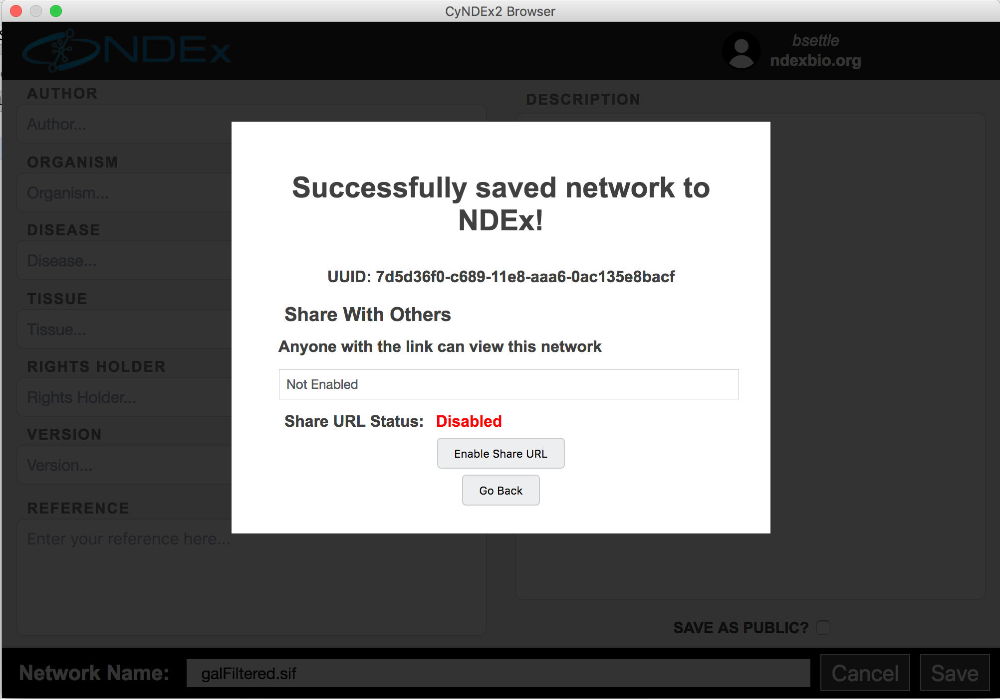

Further information on NDEx is available at the [NDEx Informational/Doc website](https://home.ndexbio.org/quick-start/).

### Network

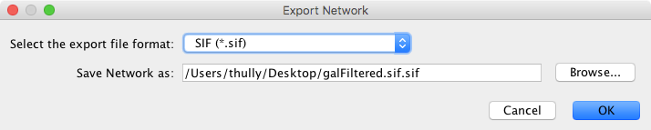

The **Network** option is used to export 
network data. Network data includes the nodes and edges in the network, and also
will include data attributes and visual information if the chosen format supports it
(like XGMML). Network data can be exported in a number of formats, including:

* SIF (Simple Interaction Format)
* XGMML, with or without style data
* GraphML
* PSI-MI Level 1 and 2.5
* Cytoscape.js JSON (can be used with Cytoscape.js, a tool described in future sections)
* CX JSON (for Cytoscape Cyberinfrastructure network exchange)
* CX2 JSON

The default format is SIF, which is a simple tab-delimited network format that provides
node names and edge interactions only. You can choose the format using the dialog drop-down box.
A file name is automatically suggested based on the network name and selected format, with the file path
defaulting to the current working directory. You can change the suggested file name/path using the
text box or Browse button. Press **OK** to export with the selected options.

### Table

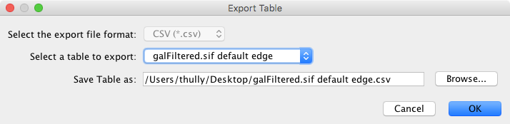

The **Table to File...** export option is used to export any of the data tables that are available
in the current Cytoscape session. This includes the node, edge, and network tables
that can be seen in the Table Panel, as well as any unassigned tables. The only
currently supported file format currently for export is CSV (comma-separated value). 

The export dialog for **Table** has only two selectable options - the table to export
and the file name (file type is always CSV). A file name is suggested based on the
name of the selected table with the path defaulting to the current working directory.
As in Network, the suggested file name can be changed using the Browse button or the
text field. Press **OK** to export the selected table with the given file name.

A shortcut button for **Export Table to File...** is also available in the **Table Panel** 
.

### Styles

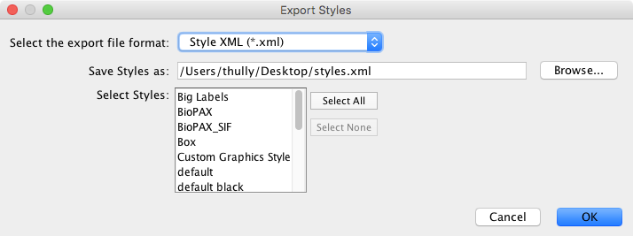

The **Styles** option is used to export one or more styles available in the current Cytoscape session. Supported formats include Style XML (which can be imported by 3.x versions of Cytoscape) or Cytoscape.js JSON (which can be used with Cytoscape.js, described in future sections).

Style export has three options - the export format (as described above), the style(s) to export, and the file name (a suggestion will be made based on the current directory and file type). As in Network → Table, the suggested file name can be changed using the Browse button or the text field. The list of styles is a multiple-selection list - one or more can be selected using Ctrl/Cmd-click (to select multiple discontiguous elements) or Shift-click (to select a contiguous element range). Press **OK** to export all selected styles with the given file path.

<a id="exporting_for_publication"> </a>
## Exporting for Publication

When you finish your data analysis and visualization, you can
publish your data to share the results. Cytoscape has several options to
do this, with most options suitable for Cytoscape users and other options
suitable for programmers wanting to create unusual or complex network
viewers. These are further explained below.

-   An NDEx network

-   A session file

-   A static image

-   An interactive web application

-   [CyNetShare](http://idekerlab.github.io/cy-net-share/)

-   Full web application

-   Simple network view (for web application developers)

<a id="as_an_ndex_network"> </a>
### As an NDEx Network

The easiest way to share your results with others is to save your network in the NDEx Public Database by using the [Network to NDEx](Export_Your_Data.html#export_ndex) or [Collection to NDEx](Export_Your_Data.html#export_ndex) options. Then, visit your NDEx account and enable the **Sharable URL** (similar to a Google Doc shared link) so that your private network can be accessed by whoever you send the link to. 

NDEx also has additional options that enable you to:

-   request a **DOI** suitable for use in publications, grant applications or progress reports
-   create working **groups** and specific sharing within NDEx.
-   run different types of **queries** on your networks
-   perform **enrichment analysis** on a variety of datasets, including curated pathways, large interactomes, drug-target association networks and many more.

For more information on NDEx publishing and sharing features, see the [Publishing in NDEx](http://home.ndexbio.org/publishing-in-ndex/) and [Sharing Networks in NDEx](http://home.ndexbio.org/obtaining-and-granting-access-to-a-network/) manuals.

<a id="as_a_session_file"> </a>
### As a Session File

Another easy way to share your results with others is simply saving
everything as a session file (which is a zipped session archive). You
can save your current session by clicking the **Save Session** icon. You
can save to a thumb drive, a shared file system, or even a cloud drive
directory such as Dropbox. If you save to a shared drive, beware not
to have two people work on the same session file with Cytoscape at the
same time, as unpredictable results may occur.

<a id="as_a_static_image"> </a>
### As a Static Image

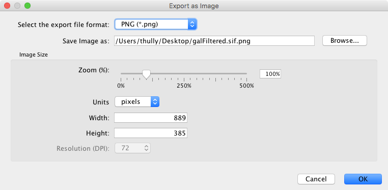

Cytoscape can generate publication-quality images from network views. By
selecting **File → Export as Image...**, you can
export the current network view into the following formats:

-   JPG

-   PNG

-   PS (Post Script)

-   SVG

-   PDF

The image export dialog has a variable number of options based on the file format selected, with file type and file name always being selectable. PNG and JPEG have options for scaling, while other formats only have a single option, **Export Text as Font**. The file name is suggested based on the name of the selected table with the path defaulting to the current working directory. As in raw data export, the suggested file name can be changed using the **Browse** button or the text field. Press **OK** to export an image with the given file name and parameters.

We recommend using **PDF** for publications because it is a standard
vector graphics format, and it is easy to edit in other applications
such as Adobe Illustrator.

<a id="known_issues"> </a>
#### Known Issues

For PDF export, there is an option to **Export text as font**.
**This option does not work for two-byte characters such as Chinese or
Japanese**. To avoid corrupted texts in the exported images, please
uncheck this option when you publish networks including those
non-English characters.

<a id="as_an_interactive_web_application"> </a>
### As an Interactive Web Application

The Web is an excellent platform for data sharing and collaboration, and
Cytoscape (as of version 3.2.0) provides a number of ways to publish your network on the web,
with each choice representing tradeoffs between ease, simplicity, and
customization options. All solutions leverage the cytoscape.js drawing
library, and so enable not only viewing but also Cytoscape-style
interactive browsing of networks and attributes.

The simplest choice is
[CyNetShare](Export_Your_Data.html#sharing-via-cynetshare),
where you save your network (and optionally a style) on a public file
system, then interactively view the network in a browser. Like Google
Maps, you can generate and publish a URL that allows collaborators to
also view your network.

Alternatively, Cytoscape can generate an entire web site showing a
single page containing the viewer with your network pre-loaded. You can
load this directly onto your own web server to become part of your web
site.

Finally, Cytoscape can generate the skeleton of a web site for further
customization by
[JavaScript](https://en.wikipedia.org/wiki/JavaScript)
programmers.

These features are available as **Export** menu items under the **File** menu,
and are described in sections below.

For example, here is a network in Cytoscape:

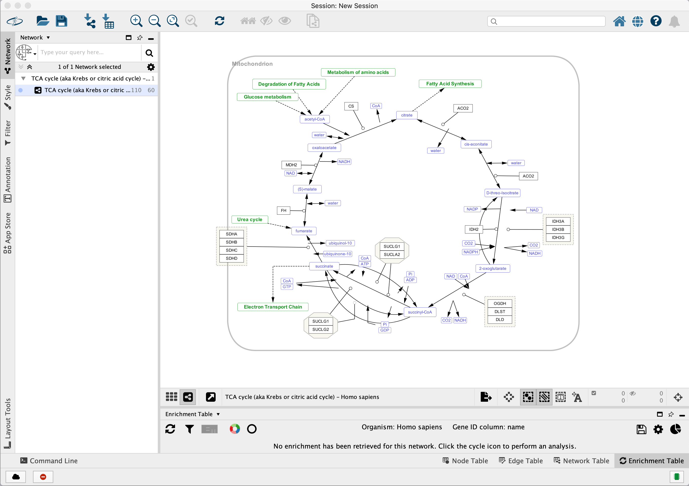

Here is the same network as an interactive web visualization:

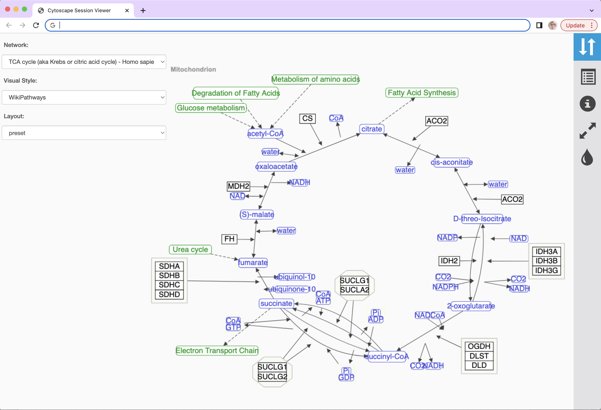

Note that web browsers can render small networks (e.g., 1000 nodes)
quickly and effectively, but attempting to render large ones (e.g., 5000
nodes) will take a very long time.

**A word about exporting styles to interactive web
applications:** Our web applications are based on the cytoscape.js
display library, which renders a subset of Cytoscape styles. For more
information, see the **Export Styles to Cytoscape.js** section below.

<a id="sharing_via_cynetshare"> </a>
#### Sharing via CyNetShare

[CyNetShare](http://idekerlab.github.io/cy-net-share/)
is a browser-based web application that renders JSON-formatted networks
and attributes saved in public directories. Optionally, you can specify
styles that the web application will use to draw your network as
it appears in Cytoscape.
[CyNetShare](http://idekerlab.github.io/cy-net-share/)
is similar to Google Maps in that once you have loaded your network and
have tweaked its appearance to suit your needs, you can have
[CyNetShare](http://idekerlab.github.io/cy-net-share/)
generate a new URL that you can e-mail or post as a link on your own web
site. That URL will bring up
[CyNetShare](http://idekerlab.github.io/cy-net-share/)
preloaded with your network for anyone to see.

To use
[CyNetShare](http://idekerlab.github.io/cy-net-share/):

1.  Select **File → Export → Network to File...** to export your
    network to a public directory. Choose the *Cytoscape.js
    JSON (\*.cyjs)* export file format.

2.  Optionally, select **File → Export → Style...** to export your
    style settings. Choose the *Style for cytoscape.js (\*.json)* export
    file format.

3.  Use your public directory system to determine direct URLs for the
    files you exported.

4.  Start [CyNetShare](http://idekerlab.github.io/cy-net-share/)

5.  Enter the network's URL as the **Graph URL**.

6.  Optionally, enter the style's URL.

7.  Click the **Visualize** button.

The CyNetShare User Guide is provided on the
[CyNetShare](http://idekerlab.github.io/cy-net-share/)
web page.

Note that if you specify a style URL, the style is added to the list of
styles available in
[CyNetShare](http://idekerlab.github.io/cy-net-share/)'s
Visual Style dropdown, and you can apply the style by selecting it in
the list. CyNetShare's initial display uses the visual style named **default** -- 
use the Visual Style dropdown to choose the style in effect when Cytoscape
generated the .cyjs and .json files. 

Note that the mechanics of generating a URL for a file in a public
directory system is a fast moving topic. Until recently, systems like
Dropbox (and others) allowed users to create a URL that resolved
directly to a file -- a direct URL would be appropriate for use with
[CyNetShare](http://idekerlab.github.io/cy-net-share/).
As of this writing, some public directory systems (e.g., Dropbox)
generate shareable URLs instead, which resolve to a web page that
allows file download -- a shareable URL doesn't work with
[CyNetShare](http://idekerlab.github.io/cy-net-share/). Systems that offer 
shareable URLs may offer direct URLs as part of their premium (or Pro) package. To tell if your public directory
system generates a direct URL, have it generate a URL for a file, then
paste the URL into the address field of a browser and observe whether
the browser displays the file itself (good!) or a download page for the
file (bad!).

**Hint:** if Dropbox generates a shareable link that looks like 
`https://www.dropbox.com/s/w5e7towcchuvdeu/cynetworm.cyjs?dl=0`, 
you may be able to create a direct link by changing the `dl=0` to `dl=1`: `https://www.dropbox.com/s/w5e7towcchuvdeu/cynetworm.cyjs?dl=1`.

A simple strategy for always getting a direct URL is to store your
file in a public directory served up by a web server, if you have access
to one -- a URL served by a web server might appear as: **http://myserver.com/~mypublicdir/netstyle.json**.

Alternately, you can use [Gist](http://gist.github.com/) to create a
shareable document having a "direct" URL. To try this:

1.  Use Cytoscape to generate your network as a .cyjs file on your local
    disk

2.  Use an editor to open the file and copy its contents to the
    clipboard

3.  Use a web browser to surf to [Gist](http://gist.github.com/)

4.  Paste the contents into a Gist document

5.  Select **Create public Gist**

6.  Select **Raw** to place the direct URL into your browser's
    address field

7.  Use that URL with
    [CyNetShare](http://idekerlab.github.io/cy-net-share/)

<a id="generating_a_full_web_application"> </a>
#### Generating a Full Web Application

The full page export option is designed for users who want to publish
their network as a complete [single-page
application](http://en.wikipedia.org/wiki/Single-page_application).
Cytoscape creates a zip archive containing a complete
[JavaScript](https://en.wikipedia.org/wiki/JavaScript)-based
web application that works as a basic viewer (like
[CyNetShare](http://idekerlab.github.io/cy-net-share/))
for Cytoscape-generated network visualizations. You can unzip the
archive onto a web server (or your PC) and view the network via a web
browser on PCs and tablets.


To generate an entire web page for all networks in the session as a zip
archive, select **File → Export → Network to Web Page...**. The following dialog
will appear:

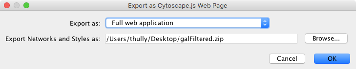

This simple dialog has only two options - the file name and the type of
web export (full, simple network view, or JSON). For full web application,
we use the default. The file name is suggested based on the name of the
selected table with the path defaulting to the current working directory.
As in raw data export, the suggested file name can be changed using the
**Browse** button or the text field. Press **OK** to export a web archive with 
the given file name.

To view the web page, unzip the archive into a folder on your PC or web
server. The folder will contain an **index.html** file, the network
data, and other files. You can open the **index.html** file in your
browser (usually from your browser's **File → Open** menu item.)

Here is an example exported file from Cytoscape:

-   [Example full export deployed to web
    server](http://chianti.ucsd.edu/~kono/webapp/cytoscape-export-full/)
    


Note that because Cytoscape uses the latest HTML5-based web
technologies, it cannot support older or non-conformant web browsers
such as Internet Explorer. We strongly recommend using the latest
version of modern web browsers such as Google Chrome, Mozilla Firefox,
or Apple Safari.

<a id="generating_a_simple_network_view_for_web_application_developers"> </a>
#### Generating a Simple Network View (For Web Application Developers)

The **Simple Network View** export option is designed for users who want to
publish their data as a complete [single-page
application](http://en.wikipedia.org/wiki/Single-page_application), but
are interested in customizing the web viewer application themselves.
Cytoscape creates a zip archive containing a partial
[JavaScript](https://en.wikipedia.org/wiki/JavaScript)-based
web application based on the cytoscape.js library and including simple
boilerplate code and the current network view. The user can create a
custom viewer by customizing this code.


To generate a web page for a single network view as a zip archive, select
**File → Export as Web Page ...** as before, but this time choose the
**Simple viewer for current network only** format as below:

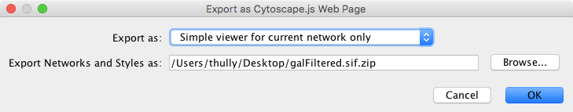

Everything else works as before, though this time the viewer will only
include the current network. Press **OK** to proceed with the export.

For instructions on testing the customized web application, see
**Generating a Full Web Application** above.

<a id="extending_the_webpage_with_Cytoscape_JS_functionality"> </a>
#### Extending the webpage with Cytoscape.JS functionality

As of version 3.6.2 of the JSON Support core app in Cytoscape, the user
may add custom [Cytoscape.JS events](http://js.cytoscape.org/#core/events)
to the exported webpage. In the web_session/scripts directory, a custom.js 
file has been added with a designated spot for custom JS code.

For example, to add linkouts to nodes in the webpage (i.e. opening a
URL specified by the **href** node attribute when the user clicks the node), 
the custom.js file should look like:

```javascript
// Notice that the `cy` object may only be referenced 
// after the document has finished loading.

$( document ).ready(function(){  
  cy.on('tap', 'node', function(){
    try { // your browser may block popups
      window.open( this.data('href') );
    } catch(e){ // fall back on url change
      window.location.href = this.data('href');
    }
  });
});
```

This change has to be made each time you export a web
page. If you want to change the default export template, refer to the next section.

<a id="customize_export_template_for_web_application_developers"> </a>
#### Customize Export Template (For Web Application Developers)

The code generated by Cytoscape for the Full Web Application and the
Simple Network View web applications is minimalistic. While you can
directly modify this code yourself to create your own page design or add
new features, the modifications will apply to a single exported network.
If you are a web application developer, you can change the application
code generated for **all** exports by editing HTML5 template code
resource files in your **\~/CytoscapeConfiguration/web** directory:


In this folder, you can find **full** and **simple** sub directories
corresponding to Full Web Application and the Simple Network View
described above.

##### Requirements

To build these project, you need the following tools installed:

-   Node.js

-   gulp

-   grunt

##### Full Export Template

This is an AngularJS based web application built with grunt (at least
for now -- we have plans to migrate to gulp). Source code and more
documentations are available here:

-   [https://github.com/idekerlab/cyjs-full-export](https://github.com/idekerlab/cyjs-full-export)

To build the project into *dist* directory, type:

    grunt

##### Simple Export Template

This template is generated by a simple [gulp](http://gulpjs.com/)
project. The source code is available here:

-   [https://github.com/idekerlab/cyjs-export-simple](https://github.com/idekerlab/cyjs-export-simple)

To build the project into *dist* directory, type:

    gulp

##### Use Your Custom Templates for Export

Once you have your own builds, you can deploy your templates by
replacing the contents of *full* and *simple* with your own builds.
