
# Finding and Filtering Nodes and Edges

## Search Bar

You can search for nodes and edges by column value directly through the search field in
the **Tool Bar**, and by clicking the **Search Table** button in the **Table Panel** for **Node** and **Edge** tables. For example, to select nodes or edges with a
column value that starts with _STE_, type `ste*` in the search bar. The
search is case-insensitive. The `*` is a wildcard character that matches
zero or more characters, while `?` matches exactly one character. So
`ste?` would match _STE2_ but would not match _STE12_. Searching for
`ste*` would match both.

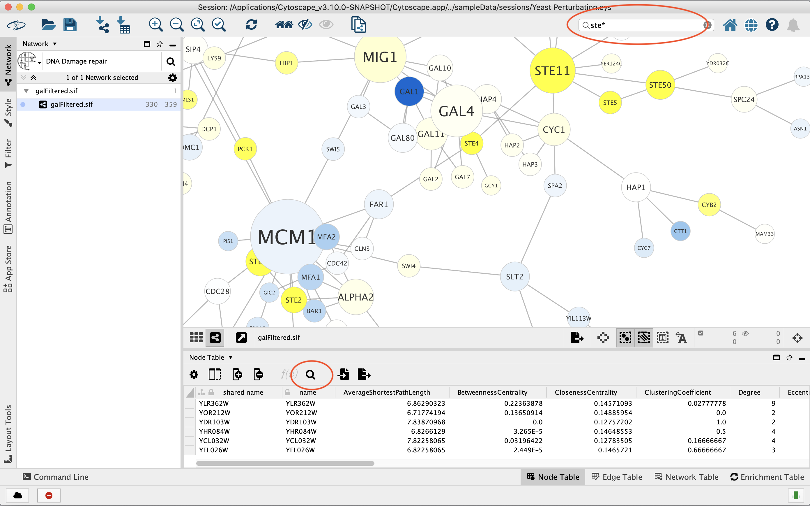

To search a specific column, you can prefix your search term with the
column name followed by a `:`. For example, to select nodes and edges
that have a **COMMON** column value that starts with _STE_, use
`common:ste*`. If you don't specify a particular column, all columns
will be searched.

### Query Syntax
The query syntax uses the <a href="https://lucene.apache.org/core/8_0_0/queryparser/org/apache/lucene/queryparser/classic/package-summary.html#package.description" target="_blank">standard Lucene QueryParser</a> with a few modifications.

<table cellspacing="0" style="table-layout: fixed; width: 700px">
<colgroup> <col style="width:100px"><col style="width:420px"> </colgroup>                                                                        <tbody>
<tr> <th td class="alt">Query type</th><th class="center">Syntax</th>                                        
<tr> <td td class="alt"><b>Multi-field query</b></td>        <td class="alt">For example <code>hello there</code>; entering any data will query all fields (columns) for that data. This only works with textual data, numeric data must be column specific.</td>             
<tr> <td td class="alt"><b>Field query</b></td>  <td class="alt"><code>name:hello</code>; searches the <b>name</b> column for "hello".</td>   
<tr> <td td class="alt"><b>Column namespaces</b></td>      <td class="alt">Using a column with a namespace in a field query requires that the namespace separator (::) be escaped: <code>EnrichmentMap\:\:pvalue:1.0</code>. However the column name without the namespace can also be used: <code>pvalue:1.0</code></td>           
<tr> <td td class="alt"><b>Wildcards</b></td>    <td class="alt">? matches any character, * matches any substring: <code>hell?</code>, <code>h*</code>.</td>  
<tr> <td td class="alt"><b>Numeric queries</b></td>      <td class="alt">Due to a limitation in Lucene the field name must be provided when performing a numeric query: <code>pvalue:1.0</code>.</td>        
<tr> <td td class="alt"><b>Numeric range queries</b></td>   <td class="alt"><code>pvalue:[0.2 TO 0.4]</code>. Also supports exclusive queries using curly braces: <code>pvalue:{0.0 TO 0.5}</code>.</td>  
<tr> <td td class="alt"><b>Boolean operators</b></td>   <td class="alt">Boolean operators are supported, with <code>OR</code> used as the default for multiple entries. Entering <code>YKR026C AND gcn3</code> would select only nodes that match both “YKR026C” and “gcn3”.</td> 
</tbody>
</table>

To search for column values that contain special characters you need to
escape those characters using a **\\**. For example, to search for
_GO:1232_, use the query `GO\:1232`. The complete list of special
characters is:

    + - & | ! ( ) { } [ ] ^ " ~ * ? : \ space

## The Select Menu

The **Select → Nodes** and **Select → Edges** menus provide several
mechanisms for selecting nodes and edges. Most options are fairly
straightforward and self-explanatory. 

A set of keyboard shortcuts for selecting nodes, edges 
and annotations are also available. Note that these keyboard shortcuts work
regardless of which **Selection Mode** for mouse click or drag-selection.

<table cellspacing="0" style="table-layout: fixed; width: 700px">
<colgroup> <col style="width:100px"><col style="width:420px"> </colgroup>                                                                        <tbody>
<tr> <th td class="alt">Keyboard shortcut</th><th class="center">Action</th>                                        
<tr> <td td class="alt"><b>Cmd-A</b></td>        <td class="alt">Select all (nodes, edges and annotations)</td>             
<tr> <td td class="alt"><b>Option-N</b></td>  <td class="alt">Select all nodes</td>   
<tr> <td td class="alt"><b>Option-E</b></td>      <td class="alt">Select all edges</td>           
<tr> <td td class="alt"><b>Cmd-Shift-A</b></td>    <td class="alt">Deselect all (nodes, edges and annotations)</td>  
<tr> <td td class="alt"><b>Option-Shift-N</b></td>      <td class="alt">Deselect all nodes</td>        
<tr> <td td class="alt"><b>Option-Shift-E</b></td>   <td class="alt">Deselect all edges</td>  
<tr> <td td class="alt"><b>Cmd-I</b></td>   <td class="alt">Invert node selection</td> 
<tr> <td td class="alt"><b>Option-I</b></td>   <td class="alt">Invert edge selection</td>
<tr> <td td class="alt"><b>Cmd-Option-E</b></td>   <td class="alt">Select Adjacent Edges</td> 
<tr> <td td class="alt"><b>Cmd-Option-N</b></td>   <td class="alt">Select Nodes by Selected Edges</td> 
<tr> <td td class="alt"><b>Cmd-Option-N</b></td>   <td class="alt">Select Nodes by Selected Edges</td> 
<tr> <td td class="alt"><b>Shift-Drag or Control-Drag (Command-Drag on Mac)</b></td>    <td class="alt">Drag Select Nodes by Rectangular Selection</td></tr>
<tr> <td td class="alt"><b>Option-Shift-Drag</b></td>    <td class="alt">Drag Select Nodes by Lasso Selection</td></tr>
</tbody>
</table>
 

**Select → Mouse Drag Selects** includes the same options for **Selection Mode** 
for mouse click- or drag-selection as the current **Selection Mode** in the [Network
    View Tools](Quick_Tour_of_Cytoscape.html#network-view-tools).

**Select → Nodes → Largest subnetwork** selects the largest connected component in the current network. This operation is useful when working with a partitioned network consisting of two or more distinctly connected graphs. After selecting the largest subnetwork, a new network can easily be created from the selection. 

**Select → Nodes → From ID List File...** selects nodes based on node
identifiers found in a specified file. The file format is simply one
node id per line:

    Node1
    Node2
    Node3
    ...

## cyChart
**CyChart** is a charting package available as a core app in Cytoscape. **CyChart** provides simple 1D and 2D plots of numerical values from node or edge tables. Selection in the chart will reciprocally select nodes or edges in the network. This provides another way to visualize and interact with your data in Cytoscape.   

### Histograms

A histogram shows the distribution of a variable in bins over a range. It shows the user where the most common values are and whether the values are distributed uniformly (flat line), normally (the bell curve) or have strong modes (hills and valleys). This can be particularly useful for finding pockets of the data that express similar ranges, such as positively and negatively expressed genes.

To create a histogram using **cyChart**, open the right-click on the header of a numeric column in the **Node** or **Edge Table**, and select the command **Plot Histogram…**. CyChart options are also available in the **Tools** menu. 

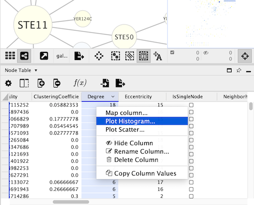

The structure of the **cyChart** window has a header with common functions and settings, the content of the chart, and a footer with the selections status and the controls to set the axes.

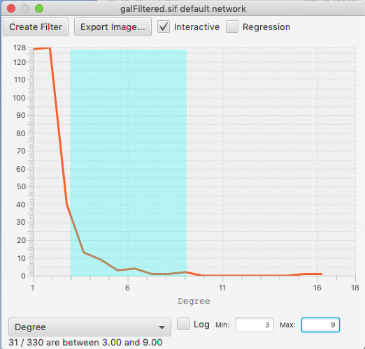

To select a range within a histogram, click and drag left or right. You should see a color change in the background of the data. To edit an existing selection, drag in the middle of the selection to move the entire selection, or on either edge of the selection to edit just the start or end of the range. To clear the selection, click outside of the range.

If the chart is in its interactive mode, you can see the main graph view changing its selection as the chart changes. However, in large networks this will over-stress the computer and become sluggish in the interface. Therefore, there is a checkbox in the header of **cyChart** to control whether selection is recomputed whenever the mouse moves, or occurs only at the end of your drag.

The footer is used to set the axes of the chart, and to show the status of the selection. Click on the popup choice box to see the list of available dimensions.  The chart will be regenerated whenever you change either dimension. The current selection is lost when either axis changes.

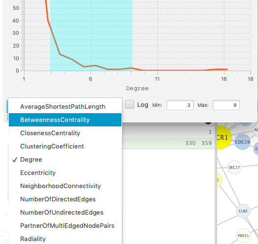

**[Note:  the first invocation of the axis popups may take several seconds to respond.  Subsequent clicks will be more responsive.]**

**[Note: Logarithmic axes will be enabled in a future release.]**

Regardless of the experiment size, the histogram is divided into 100 bins, smoothed, and plotted such that the Y value on the line is the number of nodes (edges) within that range.   The bins have equal width (as opposed to equal area).    This is a simplification of statistical rules to determine the number of bins in the sampling of the data, but is not unreasonable in the context where you are setting the ranges manually.  

### Scatter Charts

A scatter chart is a two dimensional plot with a dot drawn for each row in the table.  Per standard, the domain is the horizontal (X) axis and the range is the vertical (Y) axis.  Similar to the histograms, clicking and dragging within the chart will select a rectangle of dots, and change the current selection in your graph.  You can edit the size of the selection by dragging any of the corners, or edit the position by clicking inside the rectangle.

Create the scatter chart by right-clicking on the header of the column you want as your X axis and select the command **Plot Scatter…**

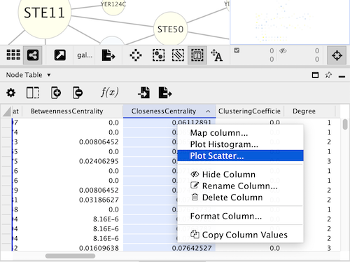

There is a **Regression** check box, which will add a regression line through the data.  The regression is calculated with the linear least squares method.  The slope, intercept and measure of the fit are shown with the line.

As with Histograms, the **Scatter Chart** has a check box to set whether the selection of nodes in your graph will update whenever the mouse moves, or only upon release.  If there is annoying flicker when dragging your selection, your should turn off the Interactive mode.

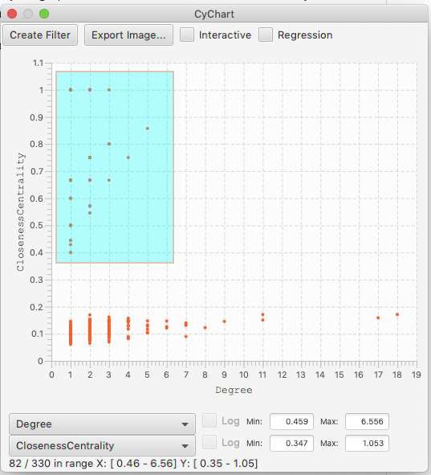

### Volcano Plots

Volcano plots are a domain-specific type of scatter chart, where the X axis is an expression level, and the range is the significance of the measurement.  These plots have the interesting characteristic that you are often interested in both positive and negative values, with a high value for the significance.  In this case,  it is useful to be able to select areas of a scatter chart symmetrically around the axis.    This is done by holding the option key, as you drag.  (This feature is only enabled when the X axis spans across 0, so if you don’t see it appear, confirm that your table column has negative and positive values.)

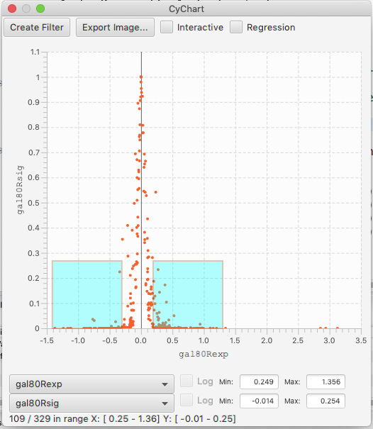

## Filters

The **Filter** tab in the **Control Panel** can be used to create selection
expressions for selecting nodes and edges.

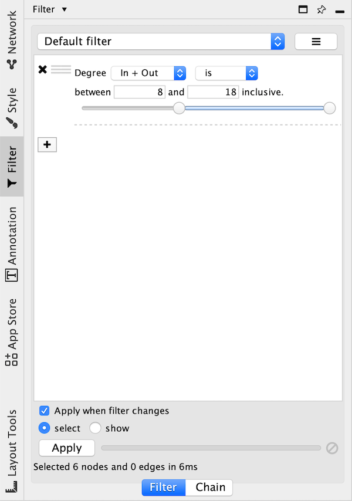

There are two tabs: 
1. On the **Filter** tab are *narrowing* filters, which can be combined into a tree. 
2. On the **Chain** tab are *chainable* transformers, which can be combined in a linear chain.

### Narrowing Filters

Narrowing filters are applied to all the nodes and edges in the network, and are used to
select a subset of the nodes and edges based on user-specified
constraints. For example, you can find edges with a weight between 0 and
5.5, or nodes with degree less than 3 (connecting to 3 or less edges). A filter can contain an arbitrary
number of sub-filters.

To add a filter click on the **+** button. To delete a filter (and all its
sub-filters) click the **x** button. To move a filter grab the handle

with the mouse and drag and drop the filter on its intended destination.
Dropping a filter on top of another filter will group the filters into a
composite filter.

#### Interactive Filter Application Mode

Due to the nature of narrowing filters, Cytoscape can apply them to a
network efficiently and interactively. Some filters even provide slider
controls to quickly explore different thresholds. This is the default
behavior on smaller networks. For larger networks, Cytoscape
automatically disables this interactivity. You can override this by
manually checking the **Apply when filter changes** box above the **Apply**
button:

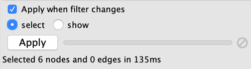

The **Apply** button will re-apply the active filter. On the opposite side of the progress
bar is the cancel button, which will let you interrupt a long-running filter.

You also have the option to use the filter to show only the selected nodes by checking 
the **show** button. The **select** button is checked by default and simply selects nodes
that pass the filter.

Cytoscape comes packaged with the following narrowing filters:

#### Column Filter

Column filters will match nodes or edges that have particular column
values. Depending on the column data type a variety of matching options are provided:

- **Numeric Columns**
  - A slider is shown that represents the minimum and maximum values in the column.
    Drag the two handles to select a range of values.
  - The range values may also be entered manually.
  - Options:
    - **is**: Selects values that are inside the range.
    - **is not**: Selects values that are outside the range.

    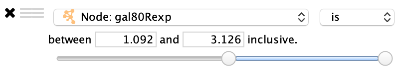
     

- **String Columns**
  - The text entered in the text box will be matched against the column values 
    depending on the following options.
  - Options:
    - **contains**: Selects values that contain the text.
    - **doesn't contain**: Selects values that do not contain the text.
    - **is**: Selects values that match the text exactly (case-insensitive).
    - **is not**: Selects values that do not match the text exactly (case-insensitive).
    - **regex**: Selects values that match a regular expression using [Java regular expression
      syntax](https://docs.oracle.com/javase/8/docs/api/java/util/regex/Pattern.html). This allows for much more
      sophisticated matching than is provided by the above options.
  - By default string matching is case insensitive. Case sensitive matching
    requires the use of a regular expression that starts with **(?-i)**. For
    example to match the text _ABC_ in a case sensitive way use the
    following regular expression: **(?-i)ABC**.

    
 

- **Boolean Columns**
  - Boolean colums can only contain three values: true, false or blank.
  - Options:
    - **true**: Selects values that are true.
    - **false**: Selects values that are false.

    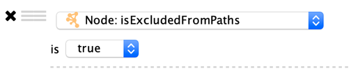
 

- **List Columns**
  - Column filters for list columns are similar to their non-list counterparts, however
    there is one additional option...
    - **any element**: Matches if any value in the list matches the filter.
    - **each element**: Matches only if all of the values in the list match the filter.

    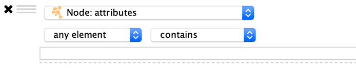

#### Degree Filter

The degree filter matches nodes with a degree that falls within the
given minimum and maximum values, inclusive. You can choose whether the
filter operates on the in-degree, out-degree or overall (in + out)
degree.

#### Topology Filter

The topology filter matches nodes having a certain number of neighbors
which are within a fixed distance away, and which match a sub-filter.
The thresholds for the neighborhood size and distance can be set
independently, and the sub-filter is applied to each such neighbor node.

The topology filter will successfully match a node if the sub-filter
matches against the required number of neighbor nodes.

#### Grouping and Organizing Filters

By default, nodes and edges need to satisfy the constraints of all your
filters. You can change this so that instead, only the constraints of at
least one filter needs to be met in order to match a node or edge. This
behavior is controlled by the **Match all/any** drop-down box. This
appears once your filter has more than one sub-filter. For example,
suppose you wanted to match nodes with column **COMMON** containing `ste`
or `cdc`, but you only want nodes with degree 5 or more, you'd first
construct a filter that looks like this:

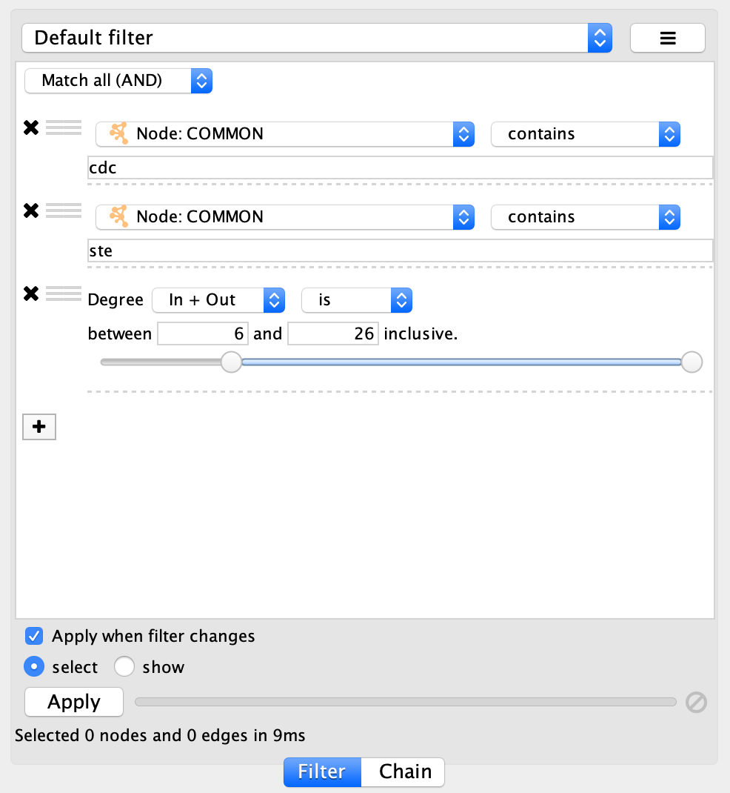

This filter will match nodes where **COMMON** contains `ste` **and**
`cdc`. To change this to a logical **or** operation, drag either of the
column filters by its handle

onto the other column filter to create a new group. Now change the
group's matching behavior to **Match any**:

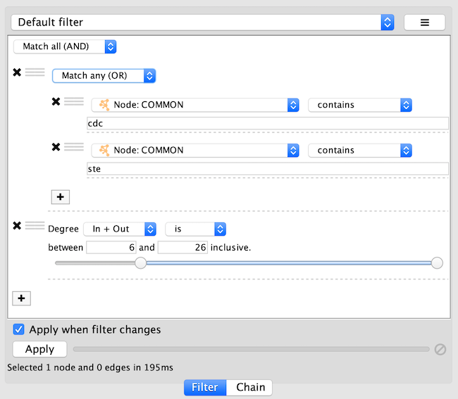

You can also reorder filters by dropping them in-between existing
filters.

### Chainable Transformers

The input to a chainable transformer is a set of nodes and edges, either the nodes and edges
that are currently selected in the network, or the output of a narrowing filter. Chainable
transformers can filter out nodes/edges, or include more nodes/edges. For example a chainable
transformer can add nodes that are neighbours of the nodes in the input. 

Chainable filters are combined in an ordered list. The nodes and edges
in the output of a transformer become the input of the next transformer in the
chain. The first transformer in the chain gets its input from the current
selection or from a filter on the **Filter** tab. The output of the last
transformer becomes the new selection.

You can specify the input to the first transformer in the chain by selecting
a **Start with**, where **Current selection** refers to the nodes and
edges currently selected. You can also choose a narrowing filter, which
produces a different set of selected nodes and edges.

Chainable transformer can be reordered by dragging one by the handle and
dropping it between existing transformer.

Cytoscape currently bundles the following chainable transformers:

#### Edge Interaction Transformer

This transformer will go through all the input edges and selectively add
their source nodes, target nodes, or both, to the output. This is useful
for adding nodes that are connected to edges that match a particular
filter.

Output options:

-   **Add** (default): Automatically includes all input nodes and edges in
    the output, and adds source or target nodes from input edges to
    the output.

-   **Replace with**: Does not automatically include input nodes and edges
    in the output. Only outputs nodes that match the filter.
    
Select options:

-   **Source and target nodes** (default): Output both target and source nodes 
    of selected edges.

-   **Source nodes**: Output only source nodes of selected edges.

-   **Target nodes**: Output only target nodes of selected edges.

A sub-filter may be added as well. When a sub-filter is present the
source/target nodes must match the filter to be included in the output.

#### Node Adjacency Transformer

This transformer is used to add nodes and edges that are adjacent to the
input nodes. A sub-filter may be specified as well.

Note that pressing the **Apply** button repeatedly may cause the
selection to continuously expand. This allows adjacent nodes that are at
greater distances to be added.

Output options:

-   **Add** (default): Automatically includes all input nodes and edges in
    the output, and adds selected adjacent nodes and edges.

-   **Replace with**: Only outputs the adjacent nodes/edges.

Select options:

-   **Adjacent nodes**: Output nodes that are adjacent to the input nodes.

-   **Adjacent edges**: Output edges that are adjacent (incident) to the
    input nodes.

-   **Adjacent nodes and edges** (default): Output both nodes and edges that
    are adjacent to the input nodes.

Edge direction options. (Hidden by default, click the small arrow icon
to reveal.):

-   **Incoming**: Only include adjacent nodes/edges when the adjacent edge
    is incoming.

-   **Outgoing**: Only include adjacent nodes/edges when the adjacent edge
    is outgoing.

-   **Incoming and Outgoing** (default): Ignore the directionality of
    adjacent edges.

Sub-filter options. (Available when a sub-filter has been added.):

-   **Adjacent nodes** (default): The sub-filter is only applied to
    adjacent nodes. (Edges to the adjacent nodes are still included in
    the output.)

-   **Adjacent edges**: The sub-filter is only applied to adjacent edges.
    (Nodes connected to the adjacent edges are still included in
    the output.)

-   **Adjacent nodes and edges**: Both the adjacent edge and its connected
    node must match the filter. Note that for a filter to match an edge
    and a node at the same time it should be a compound filter that is
    set to **Match any (OR)**.

### Working with Narrowing and Chainable Filters

The name of active filter appears in the drop-down box at the top of
**Select** panel. Beside this is the options button which will allow you
to rename, remove or export the active filter. It also lets you create a
new filter, or import filters.

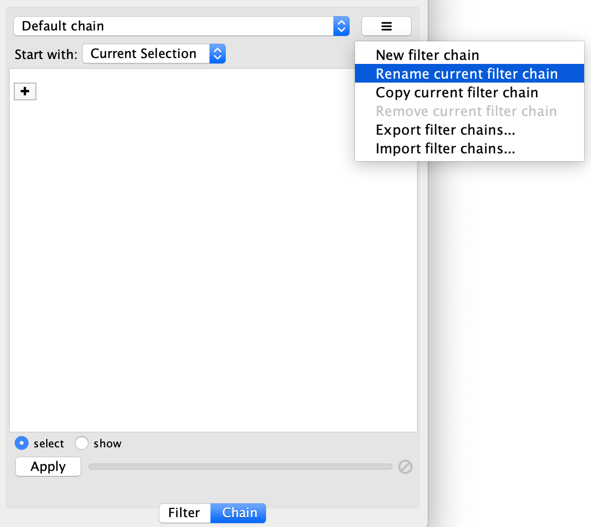

## Diffusion

Cytoscape's Diffusion algorithm attempts to use a set of nodes and an entire interaction network to find the nodes most relevant to the original set.
Conceptually, Diffusion applies heat to each node in the set, and lets the heat flow through connecting edges to adjacent nodes. 
It then produces a list of nodes ranked by the heat they accumulated. A node with many connections will tend to have a higher
ranking, and an isolated node will tend to have low rank (and thus be excluded from the resulting node set).

By default, Diffusion uses the set of selected nodes as the heat sources, with each node having the same initial heat. At the end of a Diffusion, Cytoscape leaves the top 90th percentile of hot nodes selected. It allows you to use the Results panel to select a higher or 
lower percentile dynamically. It also stores the node's initial heat as a node attribute in the _diffusion_input_ column, and returns the heat and ranking values in the _diffusion_output_heat_ and _diffusion_output_rank_ columns.

An advanced Diffusion option allows you to specify initial heat values for each node via its _diffusion_input_ attribute.

This figure shows the result of selecting the PHO4, GCR1 and ICL1 genes (via the [search bar](Finding_and_Filtering_Nodes_and_Edges.html#search_bar)) and performing a Diffusion by either selecting **Tools → Diffuse → Selected Nodes** or right-clicking to **Diffuse → Selected Nodes**. Diffusion calculated the heat ranking of all 331 nodes in the network, and then selected the top 33. 

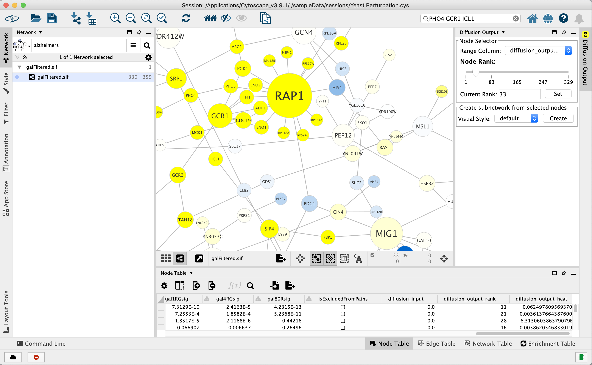

To select more than 33 nodes, move the **Node Rank** slider in the Diffusion Output Results Panel to the right or enter a number greater than 33 in the **Current Rank** field. You can also select nodes using a heat value cutoff by using the **Range Column** to select a column containing heat values. Finally, you can use the **Visual Style** chooser and **Create** button to extract the selected nodes into a new network.

You can execute Diffusion multiple times on a network, thereby creating multiple _heat_, _output_heat_ and _output_rank_ columns.
