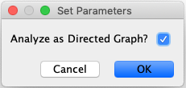
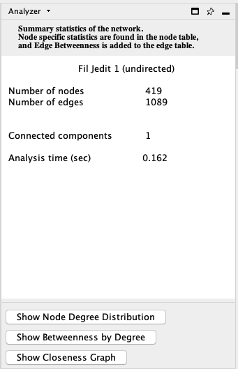

# Analyzer

Analyzer computes a comprehensive set of topological metrics
for undirected and directed networks, including:

-   Number of nodes, edges and connected components.

-   Network diameter, radius and clustering coefficient, as well as the
    characteristic path length.

-   Charts for topological coefficients, betweenness, and closeness.

-   Distributions of degrees, neighborhood connectiveness, average
    clustering coefficients, shortest path lengths, number of shared
    neighbors and stress centrality.

## Network Analysis

### Analyze Network

To run Analyzer, select **Tools → Analyze Network**.

Analyzer will run different statistics depending on whether the network is directed or undirected,
with the default being undirected. A **Set Parameters** dialog will open where you can specify if the network
should be analyzed as a directed graph.

When results are ready, they will appear in the **Results Panel**.

The results have multiple tabs, accessible via the buttons on the bottom of the panel. Details on the network metrics can be
found
**[here](http://med.bioinf.mpi-inf.mpg.de/netanalyzer/help/2.7/index.html#complex)**.

-   **Simple Metrics**

-   **Node Degree Distribution**

-   **Clustering Coefficient**

-   **Topological Coefficient**

-   **Average Shortest Path Length**

-   **Neighborhood Connectivity**

-   **Betweenness Centrality**

-   **Closeness Centrality**

-   **Stress Centrality**

### Analyze Subset of Nodes

Prior versions of this tool offered the option of analyzing all nodes or only a selected subset. This is no longer supported directly in the program. Instead, if you want to analyze a subnetwork, you can use the command **File → New Network → From Selected Nodes, All Edges** in the **Command Panel** to create the desired subnetwork.

### Plot Metrics

Once the Analyzer is run, several additional columns are added to the **Node Table** (and an EdgeBetweenness column is added to the **Edge Table**).  To plot any of these new columns, right-click on the column header and select **Plot Histogram...** for a single parameter distribution, or **Plot Scatter...** for a bivariate plot of the data.  Within either of these charts it is possible to select a section of the data, and select the nodes (edges) in the main graph window corresponding to the region selected on the chart.

## NetworkAnalyzerDemo
Comprehensive online documentation and a tutorial for **NetworkAnalyzer** are available at [http://med.bioinf.mpi-inf.mpg.de/networkanalyzer/](http://med.bioinf.mpi-inf.mpg.de/networkanalyzer/).

For additional information see **Yassen Assenov, Nadezhda Doncheva, Thomas Lengauer, and Mario Albrecht**, DOI: [10.1038/nprot.2012.004](https://doi.org/10.1038/nprot.2012.004).
