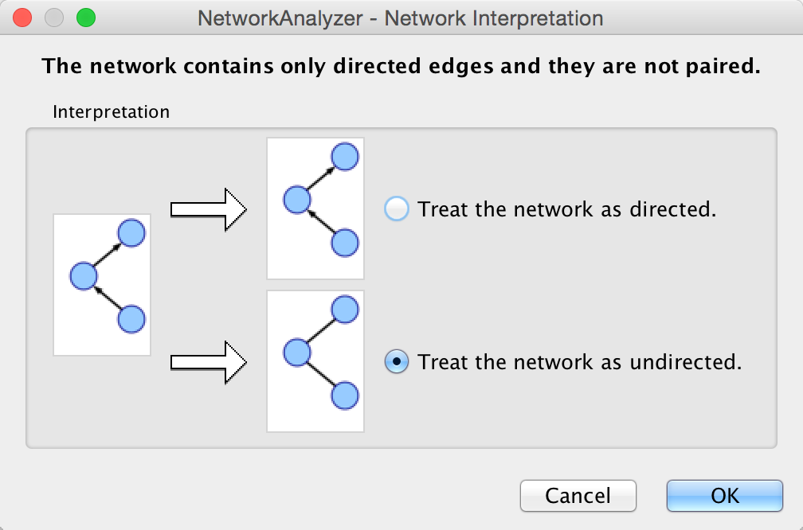
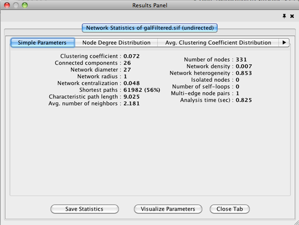
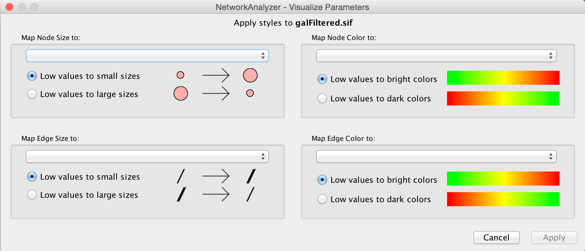
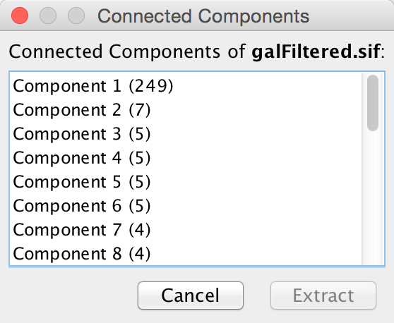

# NetworkAnalyzer

NetworkAnalyzer computes a comprehensive set of topological parameters
for undirected and directed networks, including:

-   Number of nodes, edges and connected components.

-   Network diameter, radius and clustering coefficient, as well as the
    characteristic path length.

-   Charts for topological coefficients, betweenness, and closeness.

-   Distributions of degrees, neighborhood connectiveness, average
    clustering coefficients, shortest path lengths, number of shared
    neighbors and stress centrality.

NetworkAnalyzer also constructs the intersection, union and difference
of two networks. It supports the extraction of connected components as
separate networks and the removal of self-loops.

## Network Analysis

### Analyze Network

To run NetworkAnalyzer, select **Tools → NetworkAnalyzer → Network
Analysis → Analyze Network**.

The NetworkAnalyzer will determine whether your network contains
directed or undirected edges. At this point, you can choose to ignore
edge direction information.

When results are calculated, they will appear in the **Results Panel**.

The results have multiple tabs. Details on the network parameters can be
found
**[here](http://med.bioinf.mpi-inf.mpg.de/netanalyzer/help/2.7/index.html#complex)**.

-   **Simple Parameters**

-   **Node Degree Distribution**

-   **Avg. Clustering Coefficient Distribution**

-   **Topological Coefficients**

-   **Shortest Path Distribution**

-   **Shared Neighbors Distribution**

-   **Neighborhood Connectivity Distribution**

-   **Betweenness Centrality**

-   **Closeness Centrality**

-   **Stress Centrality Distribution**

You can also save the statistics for later use by using the **Save
Statistics** button.

### Analyze Subset of Nodes

An exhaustive topological analysis of very large networks can be a time
consuming task. The computation of local parameters for the nodes is
significantly faster than the computation of global (path-related)
parameters. Examples of local parameters are node degree, neighborhood
connectivity, topological and clustering coefficients. Betweenness and
closeness centralities, as well as stress, are global parameters.

NetworkAnalyzer
provides the **Analyze Subset of Nodes** option for computing local
parameters for a subset of nodes. If one or more nodes in the network
are selected before starting an analysis, only the sub-network induced
by the selected nodes is analyzed. Moreover, only local parameters are
computed. Shared neighbors distribution and shortest path lengths
distribution, among others, are not displayed in the results.

### Batch Analysis

The **Batch Analysis** option is used to perform topological analysis on
all networks stored in specific directory, using all possible
interpretations for every network. Batch analysis consists of three
simple steps:

-   **Selecting directories**: The user selects the input and
    output directories. The input directory should contain network files
    that can be loaded into Cytoscape. Sub-directories of the input
    directory are not considered. The output directory is the one that
    will contain all analysis results after the batch analysis. In order
    to avoid file overwriting, NetworkAnalyzer requires that the output
    directory is empty (contains no files) before the batch
    analysis starts.

-   **Analysis**: NetworkAnalyzer scans the input directory and loads
    all supported networks into Cytoscape, one at a time. Each loaded
    network is inspected and then it is analyzed considering all
    possible interpretations for it. The analysis step is complete after
    all networks are analyzed. Note that depending on the number of
    networks and their sizes, this might be a very time-consuming step.

-   **Inspection of results**: After the analysis is complete, the
    button **Show Results** is enabled, and it displays the
    results dialog. The dialog contains a table of all topological
    analyses performed. Every row in the results table lists the loaded
    network, its interpretation and the resulting network statistics
    file that was saved in the output directory. By clicking on a
    network name and on statistics file name, the user can load the
    network and topology analysis results, respectively.

### Load Network Statistics

Existing network statistics can be loaded from a file saved previously
in NetworkAnalyzer.

### Plot Parameters

The **Plot Parameters** dialog offers a possibility to plot two
parameters against each other. The parameters to be plotted can be
chosen from two drop-down menus. The **Table Column 1** menu provides
the values for the domain/category axis, and the **Table Column 2** menu
specifies the values for the range/value axis. The plot is updated each
time a different parameter is selected in one of the menus.

### Generate Style from Statistics

NetworkAnalyzer computed parameters can be visualized as node/edge size
and color, if the **Store node / edge parameters in node / edge table**
option in **NetworkAnalyzer Settings** is enabled. Parameters loaded
from a .netstats file cannot be visualized because the network itself is
not stored in the network statistics file. If, after performing
topological analysis, the network is modified by introducing or removing
nodes or edges, it is recommended (and sometimes required) to run
NetworkAnalyzer again before visualizing any parameters.

The visualization is initiated by the **Generate Style from
Statistics...** menu option. There are two ways of mapping computed
parameters.

-   Map to node / edge size: The computed parameter is mapped to the
    size of the nodes or edges. Mapping can be straight or inverse, that
    is, low parameter values can be mapped to small sizes or to
    large sizes. The smallest node size is set to 10 and the largest one
    to 100. Regarding edges, size reflects the edge line width and
    varies between 1 and 8. Refer to the
    **[Styles](Styles.html#styles)**
    section for details.

-   Map to node / edge color: A computed parameter is mapped to the
    color of the nodes or edges. Two mapping styles are possible -
    mapping low parameter values to bright colors or to dark colors. By
    default, the brightest color is green and the darkest color is red.
    The mapping also uses a middle (intermediate) color, which allows
    for fine-grained perception of differing values through the
    color gradient. The default middle color is yellow.

### NetworkAnalyzer Settings

The following settings can be configured by the user:

-   **Store node / edge parameters in node / edge table**: For every
    node in a network, NetworkAnalyzer computes its degree (in- and
    out-degrees for directed networks), its clustering coefficient, the
    number of self-loops, and a variety of other parameters.
    NetworkAnalyzer also computes edge betweenness for each edge in
    the network. If the respective options are enabled, NetworkAnalyzer
    can stores the computed values as columns of the corresponding nodes
    and edges. This enables the users to use the values in Styles or to
    select nodes or edges based on the values. A complete list of the
    computed node and edge columns is available
    **[here](http://med.bioinf.mpi-inf.mpg.de/netanalyzer/help/2.7/index.html#attributes)**.

-   **Use expandable dialog interface for the display of network
    statistics**: If this option is enabled, analysis results are
    presented in a window in which all charts are placed below each
    other in expandable boxes. If this option is disabled, analysis
    results are presented in a window that contains tabs for the group
    of simple parameters and for every complex parameter (default).
    Users who wish to simultaneously view two or more complex parameters
    of one network, should enable this option.

-   NetworkAnalyzer allows the user to change the default colors of
    parameter visualization.

    -   **Background color for parameter visualization**: The color of
        the background in the network view. It is initially set to the
        default Cytoscape background color.

    -   **Bright color to map parameters**: This color defines the
        brightest color that parameters can be mapped to. By default its
        value is green.

    -   **Middle color**: This color defines the intermediate color,
        that parameters can be mapped to. By default its value
        is yellow.

    -   **Dark color**: This color defines the darkest color that
        parameters can be mapped to. By default its value is red.

-   **Location of the help documents**: URL of the original help web
    page for NetworkAnalyzer. This also enables the local download and
    storage of this help page.

## Subnetwork Creation

NetworkAnalyzer allows for the creation of sub-networks of connected
components. The user selects a number of connected components from a
list and each selected component is visualized as a sub-network. To create 
sub-networks from connected components, select **Tools → NetworkAnalyzer → Subnetwork Creation → Extract Connected Components**.

## NetworkAnalyzerDemo: Computation and Visualization of Topological Parameters and Centrality Measures for Biological Networks
**Yassen Assenov1, Nadezhda Doncheva1, Thomas Lengauer1, and Mario Albrecht1**

*1 Department of Computational Biology and Applied Algorithmics, Max Planck Institute for Informatics, Campus E1.4, 66123 Saarbrücken, Germany*

NetworkAnalyzer is a versatile and highly customizable Cytoscape plugin that requires no expert knowledge 
in graph theory from the user. It computes and displays a comprehensive set of topological parameters and 
centrality measures for undirected and directed networks, which includes the number of nodes, edges, and 
connected components, the network diameter, radius, density, centralization, heterogeneity, clustering 
coefficient, and the characteristic path length. In addition, NetworkAnalyzer shows charts of the distribution 
of node degrees, neighborhood connectivities, average clustering coefficients, and shortest path lengths. 
NetworkAnalyzer also contains extra functionality, for instance, for constructing the intersection or union of two networks.

The NetworkAnalyzer plugin and a comprehensive online documentation with a tutorial are available at [http://med.bioinf.mpi-inf.mpg.de/networkanalyzer/](http://med.bioinf.mpi-inf.mpg.de/networkanalyzer/).

**Data keywords**: network, graph, topology

**Cytoscape keywords**: Network Analysis
