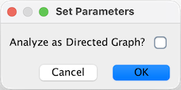
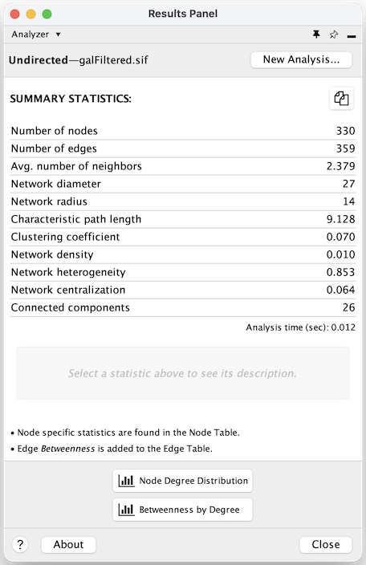

# Analyzer

Analyzer computes a comprehensive set of topological metrics
for undirected and directed networks, including:

-   Number of nodes, edges and connected components.

-   Network diameter, radius and clustering coefficient, as well as the
    characteristic path length.

-   Charts for topological coefficients, betweenness, and closeness.

-   Distributions of degrees, neighborhood connectiveness, average
    clustering coefficients, shortest path lengths, number of shared
    neighbors and stress centrality.

## Network Analysis

### Analyze Network

To run Analyzer, select **Tools → Analyze Network**.

Analyzer will run different statistics depending on whether the network is directed or undirected,
with the default being undirected. A **Set Parameters** dialog will open where you can specify if the network
should be analyzed as a directed graph.

When results are ready, they will appear in the **Results Panel**.

The header of the **Results Panel** shows the interpretation used (**Directed** or
**Undirected**) and the name of the analyzed network, next to a **New Analysis...**
button that runs the analysis again — for example, under the other interpretation.

The **Summary Statistics** table lists the network-level metrics described below.
Hover over a row for a short explanation of that metric, or select a row to see a
longer description — including its formula, where there is one — in the area below
the table. The copy button next to the table title copies all statistics to the
clipboard. Node-specific statistics are added to the **Node Table**, and edge
*Betweenness* to the **Edge Table**.

The bottom of the panel has buttons that chart the node degree distribution and
betweenness by degree; for a directed analysis, radio buttons select whether
**Indegree** or **Outdegree** is plotted.

### Summary Statistics

The metrics below appear in the **Summary Statistics** table, in this order. All of
them are computed by both interpretations unless marked otherwise.

**Number of nodes**

The total number of nodes in the network, including nodes with no connections.

**Number of edges**

The total number of edges in the network, as interpreted by the analysis (paired
edges may have been combined, depending on the chosen interpretation).

**Avg. number of neighbors**

The average number of neighbors over all nodes, indicating the average connectivity
of a node in the network. For a simple undirected network, the network density
equals this value divided by (*N* - 1), where *N* is the number of nodes. In a
directed analysis, neighbors are counted regardless of edge direction.

**Network diameter**

The distance between two nodes is the length, in edges, of the shortest path
between them. The network diameter is the largest distance between any two nodes;
node pairs with no connecting path are ignored. In a directed analysis, paths
follow edge direction.

**Network radius**

The eccentricity of a node is the largest shortest-path distance from that node to
any other node in its connected component. The network radius is the smallest
non-zero node eccentricity (the diameter is the largest). In a directed analysis,
the eccentricity of a node is the largest shortest-path distance from it to any
node reachable from it, following edge direction.

**Characteristic path length**

Also known as the average shortest path length: the average shortest-path distance
over all node pairs for which a path exists. It gives the expected distance between
two randomly chosen connected nodes. In a directed analysis, paths follow edge
direction and the pairs are ordered: the distance from one node to another may
differ from the distance in the opposite direction.

**Clustering coefficient**

The clustering coefficient of a node *n* measures how connected its neighbors are
to one another: *C*{sub}`n` = 2*e*{sub}`n` / (*k*{sub}`n`(*k*{sub}`n` - 1)), where
*k*{sub}`n` is the number of neighbors of *n* and *e*{sub}`n` is the number of
edges between those neighbors. The network clustering coefficient is the average of
*C*{sub}`n` over all nodes, with nodes having fewer than two neighbors counted as
0. It ranges from 0 (no neighbor of any node connects to another neighbor) to 1
(every neighborhood is fully connected).

In a directed analysis, *C*{sub}`n` = *e*{sub}`n` / (*k*{sub}`n`(*k*{sub}`n` - 1)),
where *k*{sub}`n` is the number of neighbors of *n*, counted regardless of edge
direction, and *e*{sub}`n` is the number of directed edges between those neighbors,
counted individually.

**Network density**

The fraction of possible edges that actually exist: *D* = 2*E* / (*N*(*N* - 1)) for
a network with *N* nodes and *E* edges. It ranges from 0 (no edges) to 1 (every
possible edge is present); self-loops and duplicated edges are not considered.

In a directed analysis, *D* = *E* / (*N*(*N* - 1)), since each pair of nodes may be
connected by an edge in each direction.

**Network heterogeneity**

*Undirected analysis only.*

The coefficient of variation of the node degrees: the standard deviation of the
degrees divided by their mean. A high value indicates greater variation in
connectivity and a stronger tendency for some nodes to act as hubs.

**Network centralization**

*Undirected analysis only.*

An index of how strongly degree is concentrated in a few nodes:
*C* = (*N* / (*N* - 2)) · (*k*{sub}`max` / (*N* - 1) - *D*), where *k*{sub}`max` is
the maximum node degree and *D* is the network density. Star-like networks have
centralization close to 1, whereas networks where every node has the same number of
neighbors have centralization close to 0.

**Connected components**

A connected component is a maximal set of nodes such that every pair of nodes is
connected by a path within the component. The number of connected components
indicates how fragmented the network is: a fully connected network has a single
component. Components are always computed ignoring edge direction; for a directed
network these are, in graph-theory terms, the weakly connected components.

**Multi-edge node pairs**

The number of unordered pairs of nodes that are connected by more than one edge
(duplicated or parallel edges). Edge direction is ignored, so two edges in opposite
directions between the same two nodes also form a multi-edge pair.

**Number of self-loops**

The number of edges whose source and target are the same node.

### Analyze Subset of Nodes

Prior versions of this tool offered the option of analyzing all nodes or only a selected subset. This is no longer supported directly in the program. Instead, if you want to analyze a subnetwork, you can use the command **File → New Network → From Selected Nodes, All Edges** in the **Command Panel** to create the desired subnetwork.

### Plot Metrics

Once the Analyzer is run, several additional columns are added to the **Node Table** (and an EdgeBetweenness column is added to the **Edge Table**).  To plot any of these new columns, right-click on the column header and select **Plot Histogram...** for a single parameter distribution, or **Plot Scatter...** for a bivariate plot of the data.  Within either of these charts it is possible to select a section of the data, and select the nodes (edges) in the main graph window corresponding to the region selected on the chart.

For additional information about **NetworkAnalyzer** see **Yassen Assenov, Nadezhda Doncheva, Thomas Lengauer, and Mario Albrecht**, DOI: [10.1038/nprot.2012.004](https://doi.org/10.1038/nprot.2012.004).
