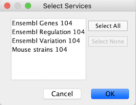

# Node and Edge Column Data

Interaction networks are useful as stand-alone models. However, they are
most powerful for answering scientific questions when integrated with
additional information. Cytoscape allows the user to add arbitrary node,
edge and network information to Cytoscape as node/edge/network data
columns. This could include, for example, annotation data on a gene or
confidence values in a protein-protein interaction. These column data
can then be visualized in a user-defined way by setting up a mapping
from columns to network properties (colors, shapes, and so on). The
section on
**[Styles](Styles.md#styles#)**
discusses this in greater detail.

## Import Data Table Files

Cytoscape offers support for importing data from delimited text and MS
Excel data tables.

***Sample Data Table 1***

<table cellspacing="0" style="table-layout: fixed; dwidth: 500px">
<caption style="width: 500px">Sample Data</caption>
<tr> <th class="">Object Key</th>  <th class="center">Alias</th>        <th class="center">SGD ID</th>  </tr>
<tr> <th class="spec">AAC3</th>    <td class="">YBR085W|ANC3</td>       <td class="">S000000289</td>    </tr> 
<tr> <th class="specalt">AAT2</th> <td class="alt">YLR027C|ASP5</td>    <td class="alt">S000004017</td> </tr>
<tr> <th class="spec">BIK1</th>    <td class="">YCL029C|ARM5|PAC14</td> <td class="">S000000534</td>    </tr>
</table>
 

The data table file should contain a primary key column and at least one
data column. The maximum number of data columns is unlimited. The
**Alias** column is an optional feature, as is using the first row of
data as column names. Alternatively, you can specify each column name
from the **File → Import → Table → File...** user interface.

### Basic Operation

1.  Select **File → Import → Table from File...**.

2.  Select a data file. The file can be either a text or
    Excel (.xls/.xlsx) file.
    Alternatively, you can simply drag and drop the file from the desktop into the **Table Panel**.

3.  In the **Target Table Data** section, choose where to import the
    data to. You can choose an existing network collection, a specific
    network only, or you can choose to import the data to an
    **Unassigned Table** (described below).

4.  Depending on what you choose in the **Where to import Table Data**
    drop-down, you will need to select a network collection or
    specific network. You will also need to select **Importing Type**,
    that is whether the data is node, edge or network table columns.

5.  If the table is not properly delimited in the preview panel, change
    the delimiter in the **Advanced Options** panel. The default
    delimiter is tab. This step is not necessary for Excel Workbooks.

6.  By default, the first column is designated as the primary key, as 
    designated by the key 
    icon. To set another column as the key instead, click the arrow at 
    next to the column title and select the key symbol. Make sure the 
    column designated as key matches the key in the network.
    
7.  Similarly, to change the data type of a column, for example from 
    integer to string, click the arrow next to the column title, and 
    select the correct data type.
    

8.  Click **OK** to import.

#### Unassigned Table

As of Cytoscape 3.1. it is possible to import data tables without
assigning them to existing networks, meaning the data doesn't have to
correspond to any nodes/edges currently loaded. If a data table is
imported as unassigned and a network is later imported that maps to the
data in terms of nodes or edges, the data will link automatically. This
is useful when loading a large dataset (for example expression data),
defining a **Style** for visualizing the data on networks and later
loading individual networks to view the data, for example from an online
database. This feature allows the data to be automatically linked to any
network that is applicable, without having to load the data for each
network.

## Legacy Cytoscape Attributes Format

In addition to tabular data, the simple attribute file format used in
previous versions of Cytoscape is still supported. Node and edge data
files are simply formatted: a node data file begins with the name of the
column on the first line (note that it cannot contain spaces). Each
following line contains the name of the node, followed by an equals sign
and the data value. Numbers and text strings are the most common data
types. All values for a given column must have the same type. For
example:

    FunctionalCategory
    YAL001C = metabolism
    YAR002W = apoptosis
    YBL007C = ribosome

An edge data file has much the same structure, except that the name of
the edge is the source node name, followed by the interaction type in
parentheses, followed by the target node name. Directionality counts, so
switching the source and target will refer to a different (or perhaps
non-existent) edge. The following is an example edge data file:

    InteractionStrength
    YAL001C (pp) YBR043W = 0.82
    YMR022W (pd) YDL112C = 0.441
    YDL112C (pd) YMR022W = 0.9013

Since Cytoscape treats edge data as directional, the second and third
edge data values refer to two different edges (source and target are
reversed, though the nodes involved are the same).

Each data column is stored in a separate file. Node and edge data files
use the same format, and have the suffix ".attrs".

Node and edge data may be loaded via the **File → Import → Table** menu,
just as data table files are.

When expression data is loaded using an expression matrix, it is
automatically loaded as node data unless explicitly specified otherwise.

Node and edge data columns are attached to nodes and edges, and so are
independent of networks. Data values for a given node or edge will be
applied to all copies of that node or edge in all loaded network files,
regardless of whether the data file or network file is imported first.

### Detailed file format (Advanced users)

Every data file has one header line that gives the name of the data
column, and optionally some additional meta-information about that data
column. The format is as follows:

    columnName (class=JavaClassName)

The first field is always the column name: it cannot contain spaces. If
present, the class field defines the name of the class of the data
values. For example, java.lang.String or String for Strings,
java.lang.Double or Double for floating point values, java.lang.Integer
or Integer for integer values, etc. If the value is actually a list of
values, the class should be the type of the objects in the list. If no
class is specified in the header line, Cytoscape will attempt to guess
the type from the first value. If the first value contains numbers in a
floating point format, Cytoscape will assume java.lang.Double; if the
first value contains only numbers with no decimal point, Cytoscape will
assume java.lang.Integer; otherwise Cytoscape will assume
java.lang.String. Note that the first value can lead Cytoscape astray:
for example,

    floatingPointDataColumn
    firstName = 1
    secondName = 2.5

In this case, the first value will make Cytoscape think the values
should be integers, when in fact they should be floating point numbers.
It's safest to explicitly specify the value type to prevent confusion. A
better format would be:

    floatingPointDataColumn (class=Double)
    firstName = 1
    secondName = 2.5

or

    floatingPointDataColumn 
    firstName = 1.0
    secondName = 2.5

Every line past the first line identifies the name of an object (a node
in a node data file or an edge in a edge data file) along with the
String representation of the data value. The delimiter is always an
equals sign; whitespace (spaces and/or tabs) before and after the equals
sign is ignored. This means that your names and values can contain
whitespace, but object names cannot contain an equals sign and no
guarantees are made concerning leading or trailing whitespace. Object
names must be the Node ID or Edge ID as seen in the left-most column of
the Table Panel if the data column is to map to anything. These names
must be reproduced exactly, including case, or they will not match.

Edge names are all of the form:

    sourceName (edgeType) targetName

Specifically, that is

`sourceName space openParen edgeType closeParen space targetName`

Note that tabs are not allowed in edge names. Tabs can be used to
separate the edge name from the "=" delimiter, but not within the edge
name itself. Also note that this format is different from the
specification of interactions in the SIF file format. To be explicit: a
SIF entry for the previous interaction would look like

    sourceName edgeType targetName

or

`sourceName whiteSpace edgeType whiteSpace targetName`

To specify lists of values, use the following syntax:

    listDataColumnName (class=java.lang.String)
    firstObjectName = (firstValue::secondValue::thirdValue)
    secondObjectName = (onlyOneValue)

This example shows a data column whose value is defined as a list of
text strings. The first object has three strings, and thus three
elements in its list, while the second object has a list with only one
element. In the case of a list every data value uses list syntax (i.e.
parentheses), and each element is of the same class. Again, the class
will be inferred if it is not specified in the header line. Lists are
not supported by Styles and so can't be mapped to network properties.

### Newline Feature

Sometimes it is desirable to for data values to include linebreaks, such
as node labels that extend over two lines. You can accomplish by
inserting into the data value. For example:

    newlineDataColumn
    YJL157C = This is a long\nline for a label.

### Table Panel

When Cytoscape is started, the **Table Panel** appears in the bottom
right of the main Cytoscape window. This browser can be hidden and
restored using the F5 key or the **View → Show/Hide Table Panel** menu
option. Like other Panels, the browser can be undocked by pressing the
little icon in the top right corner.

To swap between displaying node, edge, and network Data Tables use the
tabs on the bottom of the Table Panel. By default, the Table Panel
displays columns for all nodes and edges in the selected network. To
display columns for only selected nodes/edges, click the **Change Table
Mode** button

at the top left. To change the columns that are displayed, click the
**Show Column**

button and choose the columns that are to be displayed (select various
columns by clicking on them, and then click elsewhere on the screen to
close the column list).

Most column values can be edited by double-clicking the cell (only the
ID cannot be edited). Newline characters can be inserted into String
columns either by pressing **Enter** or by typing "\\n". Once finished
editing, click outside of the editing cell in the Table Panel or press
**Shift-Enter** to save your edits. Pressing **Esc** while editing will
undo any changes.

Rows in the panel can be sorted alphabetically by specific column by
clicking on a column heading. A new column can be created using the
**Create New column**

button, and must be one of four types - integer, string, real number
(floating point), or boolean. Columns can be deleted using the **Delete
Columns...**

button. **NOTE: Deleting columns removes them from Cytoscape, not just
the Table Panel!** To remove columns from the panel without deleting
them, simply unselect the column using the **Select Columns**

button.

Columns in the Table Panel can be renamed by right-clicking on the column
header and selecting **Rename Column...**. The Table Panel supports name spaces,
so if you have several columns with related information, you can create a namespace.
Namespace and column name are separated by a double colon (::). For example, if the data
includes multiple columns with cellular compartment information, you can edit the 
column titles in the format **compartment::cytosol**, **compartment::endosome** etc, 
which will create a namespace **compartment** with several associated columns. 
It is then possible to perform operations such as **Show/Hide** on all columns 
in a namespace.

## Import Data Table from Public Databases

It is also possible to import node data columns from public databases
via web services, for example from
[BioMart (http://www.biomart.org)](http://www.biomart.org/#).

### Basic Operation

1.  Load a network, for example galFiltered.sif.

2.  Select **File → Import → Table from Public Databases...**.

3.  You will first be asked to select from a set of web services. For
    this example, we will choose **ENSEMBL GENES 73 (SANGER UK)**.

1.  In the **Import Data Table from Web Services** dialog, select a
    **Data Source**. Since galFiltered.sif is a yeast network, select
    **ENSEMBL GENES - SACCHAROMYCES CEREVISIAE**.

2.  For **Key Column in Cytoscape**, select *shared name* for **Column**
    and *Ensembl Gene ID* for **Data Type**.

The type of identifier selected under **Data Type** must match what is
used in the selected **Column** in the network.

1.  Select the data columns you want to import.

2.  Select **Import**.

When import is complete, you can see the newly imported data columns in
the Table Panel.

## Mapping Identifiers

A common problem in integrating multiple data sources is differences in terminology.  Standardized identifiers have many dialects. Some databases are specific to a particular organism or genome.  Others span those boundaries.  [**BridgeDB**](http://www.bridgedb.org) is a web service devoted to solving the id mapping problem. Cytoscape contains simple access to BridgeDB.  If you need more esoteric species or data sources, there is an [installable BridgeDB app](http://apps.cytoscape.org/apps/bridgedb) to access a fuller feature set.  

[**Ensembl**](http://www.ensembl.org/) is used as the canonical taxonomy.  A translation between two arbitrary data sources is generally achieved by mapping each through Ensembl.

To map an identifier from one source to another, right click on the column header of your identifier.  Select the option to **Map Column…**

A. The mapping is always constrained by species to prevent senseless matches across species.  You must choose a species (once) for this feature to function properly.   The choices for the Data Source and Target are determined by the species.
 
B. Based on the items in the column you chose we can make a reasonable assumption as to the database as to use as the source for your mapping.  If this is not the source, you can override it in the Map from field.
 
C. The target database of the identifier mapping.  This list is filtered by species and curated down to the most common options.  A full list of supported targets is [here](http://webservice.bridgedb.org/Human/targetDataSources).
 
D. In some cases where there are multiple answers, the **Force Single** option limits the result to the first answer returned by the service.  If the option is off, a list of results will appear in the column.

