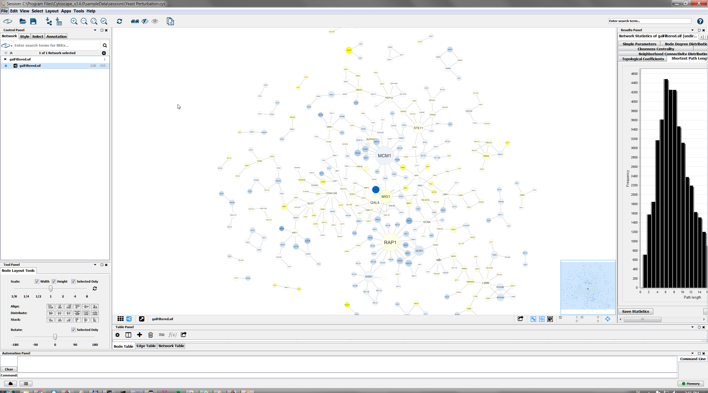
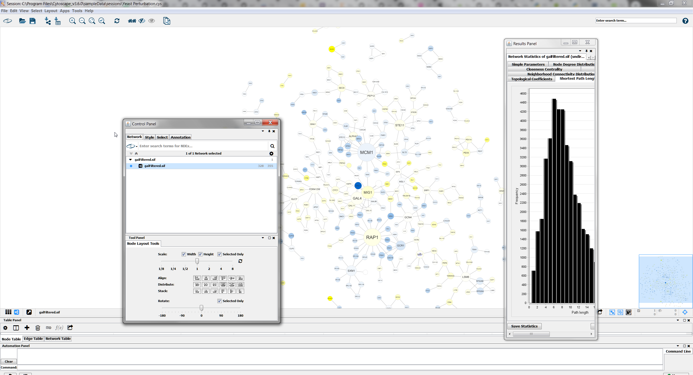

# Panels

**Panels** are floatable/dockable panels designed to cut down on the number of pop-up windows within Cytoscape 
and to create a more unified user experience. 

There are five panels that can be visible or hidden.
- Control Panel (left)
- Tool Panel (bottlom left)
- Table Panel (bottom right)
- Results Panel (right)
- Automation Panel (bottom)

Each panel typically contains multiple tabs. For example the **Control Panel** contains at a minumum the **Network**,
**Style**, **Select** and **Annotation** tabs. The **Table Panel** contains the **Node Table**, **Edge Table** and
**Network Table** tabs. Analysis results from Network Analyzer (**Tools → Network Analysis → Analyze Network**) 
are shown in **Results Panel**. Installed Apps may add additional tabs.

The user can then choose to resize, hide or float Panels. For example, in the screenshot below, the Control, Table 
and Results panels are floating:

## Basic Usage

All panels can be shown or hidden using the **View → Show/Hide** functions.

By default, only the **Control Panel** and the **Data Panel** will be shown. The **Results Panel** may appear, 
depending on the mix of Cytoscape apps that you currently have installed. The **Tool Panel** will appear when 
you select the following commands under the **Layout** menu: **Rotate**, **Scale**, and **Align and Distribute**.

In addition, Panels can be floated or docked using icon buttons at the top right corner of each Panel. 
The **Float Window** control 

will undock any panel which is useful when 
you want assign the network as much screen space as possible. To dock the window again, click the 
**Dock Window** icon 

. Clicking the **Hide Panel** 
icon 

will hide the panel; this can be shown again by choosing 
**View → Show** and selecting the relevant panel.
