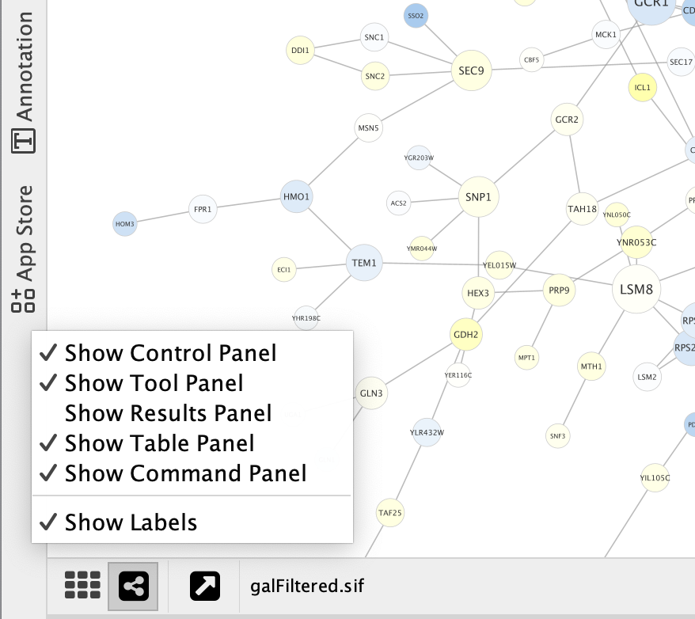
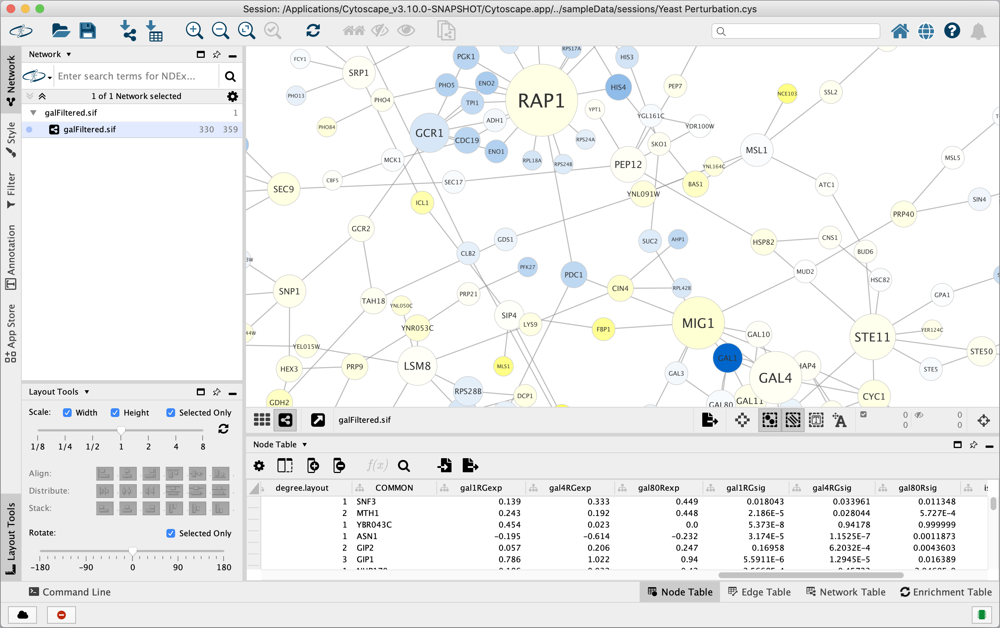
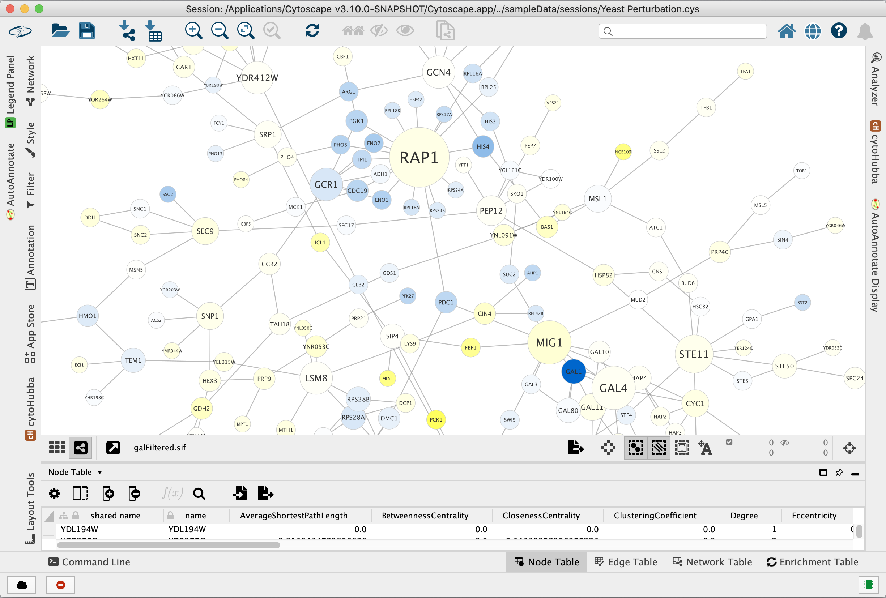

# Panels

There are five panels that can be visible or hidden:
- Control Panel (left)
- Tool Panel (bottlom left)
- Table Panel (bottom right)
- Results Panel (right)
- Command Panel (bottom)

Each panel contains multiple tabs. For example the **Control Panel** contains at a minimum the **Network**,
**Style**, **Filter** and **Annotation** tabs. The **Table Panel** contains the **Node Table**, **Edge Table** and
**Network Table** tabs. Analysis results from _Analyzer_ (**Tools → Analyze Network**) 
are shown in **Results Panel**. Installed Apps may add additional tabs.

## Managing Panels

These panels can compete for valuable screen real-estate (e.g. by making the network view too small), so it is important to manage each panel's state and size properly and acconding to the user's needs.
You can take advantage of these 5 panel states in order to manage the available screen real-estate:

- **Hidden:** A panel can be totally removed from the screen if you find it unnecessary. To do that, uncheck the corresponding option under the **View** menu (e.g. uncheck **View → Show Results Panel** to hide the _Results Panel_). When a panel is hidden its tabs no long appear in the sidebar. In order to show the panel again select the same menu option.

  Alternatively, you can right-click an empty space on any sidebar to hide/show a panel:
  
  
  

- **Minimized:** Use the **Minimize** icon  at the top-right corner of a panel to quickly hide it. The tabs from a minimized panel still appear on the sidebar, and by clicking a tab the panel will be shown again as undocked. Some panels (e.g. _Tool Panel_) may be minimized by default.

  In the example below, the _Control_ and _Tool_ panels are minimized (_Results_ and _Command_ are hidden):
  
  
  

- **Docked:** The most used panels (e.g. _Control_, _Table_) are initially docked by default. When docked, a panel takes the space that could be used by its adjacent panels and by resizing it, those adjacent panels are resized as well (e.g. by resizing the "Control" panel horizontally, the "View" panel is also resized). If a panel is undocked or floating, use the **Dock** icon  to make it docked.

  In the screenshot below, all panels are docked, except _Results_ and _Command_, which are hidden:
  
  
  

- **Undocked:** A panel is undocked when the **Undock** icon  is clicked or a minimized panel is shown again by clicking one of its tabs on the sidebar. In this state, the panel is displayed over other panels but is still anchored to one of Cytoscape corners. That allows it to be resized more freely (vertically and horizontally) whithout affecting the size of other panels. You can also double-click the undocked panel's title bar to quickly maximize it. And double-clicking the title bar of a maximized panel again will restore it to its previous size. To temporarily hide an undocked panel click the **Minimize** icon . An undocked panel will be automatically minimized when other panels or components outside the undocked panel are clicked.

  In the example below, the _Control_ panel is undocked:

  

- **Floating:** Use the **Float** icon  to completely detach a panel from the Cytoscape desktop. A floating panel has its own window that can be resized, maximized and minimized like any other application window. It can also be moved to another monitor in a multi-monitor setup.

  When a panel is floating, its tabs are not removed from the corresponding sidebar in the main desktop window, but you can also use the drop-down in the floating panel's title bar to show another tab's content:
  
   

  In the image below, the _Control_, _Table_ and _Tool_ panels are floating:
  
  

## Other Features

- **Hide Sidebar Labels:**

  When you install and use Cytoscape apps, those apps may add their own tabs, which can sometimes lead to very busy sidebars. In order to make the sidebars cleaner and easier to use, Cytoscape allows you to hide the tab labels and show only their icons. Righ-click anywhere on a sidebar and uncheck the context-menu option **Show Labels**.

  In the example below, notice how the left sidebar is crowded with many tabs:
  
  
  
  In the next example, the tab labels have been hidden:
  
  
