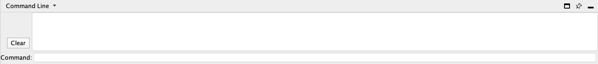
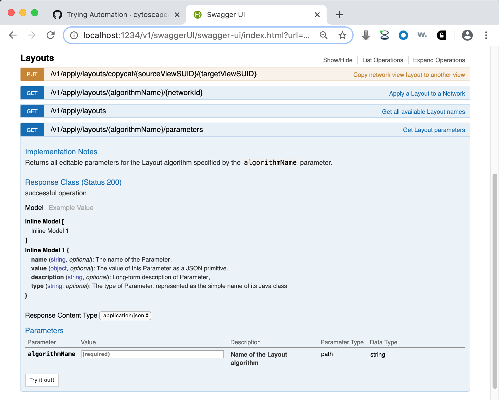
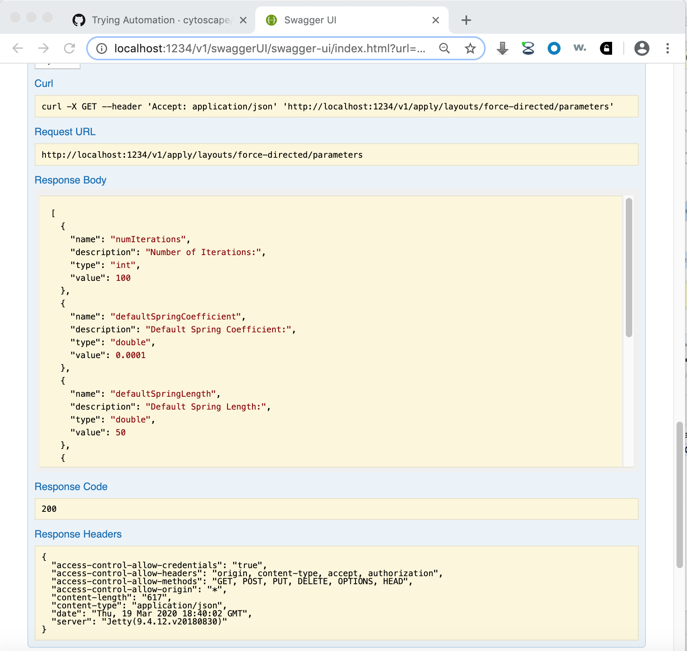

<a id="programmatic_access_to_cytoscape_features_scripting"> </a>
<a id="programmatic_access_to_cytoscape_features"> </a>
<a id="cytoscape_automation"> </a>
# Cytoscape Automation

Cytoscape's intuitive graphical user interface is useful for
*interactive* network data integration, analysis, and visualization. It
provides great features for exploratory data analysis, but what happens
if you have hundreds of data files or need to ask someone to execute
your data analysis workflows? It is virtually impossible to apply the
same operations to hundreds of networks manually using a GUI. More
importantly, although you can save your ***results*** as session files,
you cannot save your ***workflows*** if you perform your data analysis
with point-and-click GUI operations. Cytoscape has several options that
support automating your workflows, all under the umbrella of Cytoscape Automation. More tutorials and examples are available at the [Cytoscape Automation web page (http://automation.cytoscape.org)](http://automation.cytoscape.org).

## R and Python Packages
If you are already using R or Python, then you're in luck! There are packages
available in these languages filled with helper functions to make accessing and
controlling Cytoscape quick and intuitive.

The R package is called ***RCy3*** and is available via Bioconductor, see [https://www.bioconductor.org/packages/release/bioc/html/RCy3.html](https://www.bioconductor.org/packages/release/bioc/html/RCy3.html). The RCy3 repo offers a nice interface for browsing the documentation
and available vignettes (see Articles menu): http://cytoscape.org/RCy3/index.html. There are also
a collection of video tutorials on the [Cytoscape YouTube channel](https://www.youtube.com/playlist?list=PLFQS98nmv__wYlu_XoscNb6DKu_vo6_vH).

The Python package is called [py4cytoscape](https://github.com/cytoscape/py4cytoscape).

<a id="commands"> </a>
## Commands
The **Commands** feature allows you to script a sequence of Cytoscape commands
and menu items, where commands can have parameter values that would
normally be provided by a user via a Cytoscape dialog box. For example:

`session open file="C:\\myfile.cys"` 

loads a session from a file similarly to the **File → Open...** menu item. Commands may 
resolve to Cytoscape core functions or automation-enabled apps installed in 
Cytoscape. You can create a command
script file that Cytoscape can execute via the **Tools → Execute Command
File...** menu item or on the Cytoscape command line at startup. 


***Commands*** is the built-in Cytoscape feature to automate your
workflow as simple script. You can learn more about Commands in the [Command Tool](Command_Tool.html)
section.

<a id="restful_api"> </a>
## CyREST Interface Layer
In some cases, you may need to leverage the complex control and data structures available in a fully featured programming language,
such as [R](http://www.r-project.org/), [Python](https://www.python.org/), [Ruby](https://www.ruby-lang.org/en/) or
[JavaScript](https://en.wikipedia.org/wiki/JavaScript). Such languages enable complex Cytoscape-centric workflows or the integration of Cytoscape into larger workflows. Cytsocape enables progamatic access to both its Commands and Functions via its CyREST interface.

By default, the CyREST interface is enabled and available on TCP/IP port 1234. To verify this, start a web browser on 
your Cytoscape workstation and navigate to either **http://localhost:1234/v1/** or **http://localhost:1234/v1/commands**. The first form is a Function that returns basic Cytoscape information as a JSON object:


    
The second form is a Command that returns a list of available Command namespaces:


Note that the list of namespaces will vary depending on the apps you install -- some apps provide Commands in namespaces of their own.

If your workstation has port 1234 already in use, you can specify a different CyREST port in two ways:

* Use the **Edit → Preferences** menu to alter the *rest.port* property to select a different port (e.g., 8888)
* Specify the port on the Cytoscape command line via the *-R* parameter:

```
     cytoscape.bat -R 8888 (for Windows)
     
     ./cytoscape.sh -R 8888 (for Mac or Linux)
```

You can test the new port by using your browser to navigate to **http://localhost:8888/v1/**.

Note that if you expect to run more than one instance of Cytsocape on a single workstation, the CyREST port must be unique for each Cytoscape instance. You must use either the property or command line parameter technique to execute each instance with a different CyREST port.

<a id="exploring_cyrest_commands_and_functions"> </a>
### Exploring CyREST Commands and Functions

Cytoscape makes a list of available Commands and Functions available via the **Help → Automation** submenus. The **CyREST API** submenu shows available Functions, and **CyREST Command API** shows available Commands. **Automation Examples** leads to a web portal containing the bulk of documentation, samples and tutorials for Cytsocape Automation in general. 


Notably, **Automation Examples** contains a tutorial that explains how to explore CyREST Commands and Functions: [https://github.com/cytoscape/cytoscape-automation/wiki/Trying-Automation](https://github.com/cytoscape/cytoscape-automation/wiki/Trying-Automation).

The **CyREST API** and **CyREST Command API** submenus document CyREST in a Swagger web application, which allows you to explore CyREST entrypoints by reading about them and invoking them directly (using a *Try it out!*) button. A sample page matching the **http://localhost:1234/v1/** a function is:



Note that the page contains a description, input parameters, output values, result code and the *Try it out!* button. Pressing the button executes the Function and shows the actual CyREST call and its results. **Making good use of Swagger as a prototyping tool can greatly reduce code writing and debug time!**



To find out more about how to use CyREST, visit the Cytoscape Automation [tutorial pages (https://github.com/cytoscape/cytoscape-automation/wiki/Trying-Automation)](https://github.com/cytoscape/cytoscape-automation/wiki/Trying-Automation).

Note that Swagger pages reflect functionality in Cytoscape at the time it executes, including Commands and Functions contributed by installed apps. To discover CyREST functionality in uninstalled apps, you must first install them, and then use **Help → Automation** submenus to generate the Swagger pages (or simply reload your Swagger browser page).
