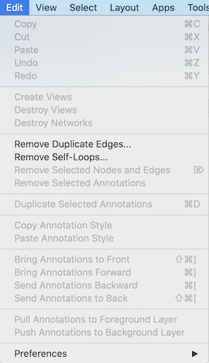
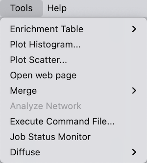

# Quick Tour of Cytoscape

This chapter describes the basic layout and mechanics of using Cytoscape. If you would prefer to learn by doing, consider starting with the [Basic Expression Analysis Tutorial](https://cytoscape.org/cytoscape-tutorials/protocols/basic-data-visualization/#/).

## Starter Panel

When you start Cytoscape, you can access basic functions from the
**Starter Panel**:

The **Starter Panel** is designed to give you quick access to a set of sample session files,
as well as tutorials and Cytoscape news. The sample session files include a broad range of networks
to give a sense of the diversity of interaction types, visualization styles and biological applications (see 
Network Table properties for more information about each sample session network).
The **Starter Panel** will also present your own most recent sessions for quick access.

When you load a session file, the **Starter Panel** will disappear. You can display it at any 
time by choosing **View → Show Starter Panel**.

For
information on user privacy, see the **[Cytoscape Privacy
Policy](Cytoscape_Privacy_Policy.html#cytoscape-privacy-policy)**.

## Basic Features

When a network is loaded, Cytoscape will look similar to the image
below:

Most functionalities are self-explanatory, but we'll go through a
concise explanation for clarity. The main window here has several
components:

-   The **Menu Bar** at the top (see below for more information about
    each menu).

-   The **Tool Bar**, which contains icons for commonly used functions.
    These functions are also available via the menus. Hover the mouse
    pointer over an icon and wait momentarily for a description to
    appear as a tooltip. Right-clicking on the tool bar allows the
    contents to be customized.

-   The **Network Panel** (**Network** panel of the **Control Panel**). 
    At the top of the Network Panel is a Search bar, with direct access 
    to multiple external resources. The network panel also
    contains an optional network overview pane (shown at the
    bottom left).  

-   The main **Network View Window**, which displays the network. At the bottom
    of the network view are a set of network view tools. 

-   The **Table Panel** (bottom right panel), which displays columns of associated data for nodes, edges and network-wide, 
    and enables you to modify the values of column data.

The **Network Panel** and **Table Panel** are dockable tabbed Panels. You can
undock any of these panels by clicking on the **Float Window** control

in the upper-right corner of each panel. This is useful when you want
assign the network panel as much screen space as possible. You will now
have two Cytoscape windows, the main window, and a new window labeled
Table Panel, similar to the one shown below. A popup will be displayed
when you put the mouse pointer on a cell.

To dock the window again, click the **Dock Window** icon
.

Clicking the **Minimize** icon 
will minimize the panel; the panel can be shown again by choosing **View → Show**
and selecting the relevant panel, or by clicking on one of the tabs in the 
minimized panel, for example **Network** or **Node Table**, and then clicking 
the **Dock** icon.

For more information on the panels in Cytoscape, see the **[Panels](Panels.html#what-are-panels)**
section.

### Network Editing

Cytoscape also has an edit functionality that enables you to build and
modify networks interactively within the network canvas. To edit a
network, just right-click on the open space of network window, select
the menu item **Add → Node**, a new node will be added to the canvas. To
add an edge, right click on a node, choose the menu item **Edit → Add
Edge**. Then select the target node, a new edge will be added between
the two nodes. In a similar way annotation objects can be added;
pictures, shapes or textboxes; much like in MS PowerPoint or similar
software. Detailed information on network editing can be found in the
**[Editing Networks](Creating_Networks.html#create_a_new_network_or_edit_one_manually)**
section.

## The Menus

### File

The **File** menu contains most basic file functionality: **File → Open**
for opening a Cytoscape session file; **File → New Network** for creating a new
network, either blank for editing, or from an existing network; **File →
Save** for saving a session file; **File → Import** for importing data
such as networks and tables; and **File → Export** for exporting data. 
**File → Export Network to Image** lets you export the
network in either JPEG, PDF, PNG, PostScript or SVG format.
**File → Export Network to Web Page** lets you export the entire session or
a single network as a Web page using Cytoscape.js.

**File → Open Recent** will list recently opened session files for
quick access. **File → Print...** allows printing.

### Edit

The **Edit** menu contains **Cut**, **Copy** and **Paste** functions, as
well as **Undo** and **Redo** functions which undo and redo edits made
in the **Table Panel**, edits to the network and to layout. The **Undo**/**Redo**
functions work on the last 10 tasks performed.

There are also options for creating and destroying views (graphical
representations of a network) and networks (the raw network data - not
yet visualized), as well as an option for deleting selected nodes and
edges from the current network. All deleted nodes and edges can be
restored to the network via **Edit → Undo**.

Other editing options include; **Remove Duplicated Edges** will
delete edges that are duplicates (having the same source and target nodes), keeping one edge, **Remove
Self-Loops** removes edges that have the same source and target node,
and **Delete Selected Nodes and Edges...** deletes a selected subset of
the network. **Rename Network...** allows you to rename the currently
selected network.

A set of functions for bringing annotations forward, backward etc, and pushing/pulling
them to the foreground vs background layer are also available in the Edit menu.

Editing preferences for properties and apps are found under **Edit →
Preferences → Properties...**. More details on how to edit preferences
can be found
[here](Cytoscape_Preferences.html#cytoscape-preferences).

### View

The **View** menu allows you to display or hide panels, including the **Control Panel**,
**Table Panel**, **Result Panel**, **Tool Panel** and the **Command Panel**. In addition, it
also provides a means for viewing the **Starter Panel**. 
It also provides the control of other view-related functionality.

### Select

The **Select** menu contains different options for selecting nodes and
edges.

### Layout

The **Layout** menu has an array of features for visually organizing the
network. The features in the top portion of the network (**Bundle
Edges**, **Clear Edge Bends**, **Node Layout Tools**) are tools for 
manipulating the network visualization. The
bottom section of the menu lists a variety of layout algorithms which
automatically lay a network out.

### Apps

The **Apps** menu gives you access to the **App Store** (**Apps → App
Store**) for managing (install/update/delete) your apps and may have
options added by apps that have been installed. Depending on which apps
are loaded, the apps that you see may be different than what appear
here. The below picture shows a Cytoscape installation without installed
apps.

**Note**: A list of available Cytoscape apps with descriptions is available online at: [http://apps.cytoscape.org](http://apps.cytoscape.org).

In previous versions of Cytoscape, apps were called plugins and served a
similar function.

### Tools

The **Tools** menu contains advanced features like **[Enrichment Table](EnrichmentTable.html)**, **[cyChart](Finding_and_Filtering_Nodes_and_Edges.html#cychart)**, **[Analyze Network](Network_Analyzer.html#networkanalyzer)**, **[Open web page](CyBrowser.html)**, **[Merge](Merge.html#merge)**, **[Execute Command File...](Command_Tool.html)**, **Job Status Monitor**, **Run Script File...** and **[Diffuse](Finding_and_Filtering_Nodes_and_Edges.html#diffusion)**.

**Cytoscape Web Browser** allows for viewing any html page directly in Cytoscape. The web browser can be opened in a separate window or can be launched in the **Results Panel**. 

### Help

The **Help** menu allows you to launch the online help viewer and browse and search this manual.
It also provides direct access to a **Tour of Cytoscape**, as well as a full listing
of Cytoscape tutorials. Tutorial content opens automatically in the **Cytoscape Web Browser**. 
Video demos are also linked to direclty from the Help menu. 

The **Citations** option displays the main literature citation for
Cytoscape, as well as a list of literature citations for installed apps.
The list will be different depending on the set of apps you have
installed.

The **Help** menu also allows you to connect directly to **Cytoscape Help
Desk** and the **Bug Report** interface.

## Network Management

Cytoscape allows multiple networks to be loaded at a time, either with
or without a view. A network stores all the nodes and edges that are
loaded by the user and a view displays them.

An example where a number of networks have been loaded is shown below:

The network manager (in the **Control Panel**) shows the networks that are
loaded. Clicking on a network here will make that view active in the
main window, if the view exists. Each network has a name and size
(number of nodes and edges), which are shown in the network manager. If
a network is loaded from a file, the network name is the name of the
file.

Some networks are very large (thousands of nodes and edges) and can take
a long time to display. For this reason, a network in Cytoscape may not
contain a view. Networks that have a view are in normal black font and
networks that don't have a view are highlighted in red. You can create
or destroy a view for a network by right-clicking the network name in
the network manager or by choosing the appropriate option in the
**Edit** menu. You can also destroy previously loaded networks this way.

Certain operations in Cytoscape will create new networks. If a new
network is created from an old network, for example by selecting a set
of nodes in one network and copying these nodes to a new network (via
the **File → New Network** option), it will be shown immediately
follows the network that it was derived from.

Network views can also be detached (undocked) from the main Cytoscape window. When detached, a view window can be dragged to another monitor, resized, maximized and minimized by using the normal window controls for your operating system. Notice, however, that closing a view window does not destroy it, but simply reattaches it to the Cytoscape window.

### Arrange Network Windows

When you have detached network view windows, you can arrange them by selecting one of these options under **View → Arrange Detatched Views**:

**Grid**

**Cascade**

**Vertical Stack**

**Side by Side**

## Network View Tools

At the bottom of the Network View Window is a set of network tools:

-   **Show Grid** will arrange all loaded networks as a grid.

-   **Show Network** will show the currently selected network.

-   **Detach View** detaches the network view window from the main Cytoscape window.

-   **Export to File...** gives you options to export the network or image.

-   **Always Show Graphics Detail** forces the rendering of graphics details. It is turned off by default.

-   **Toggle Node Selection** allows you to turn off/on node selection. It is turned on by default.
    
-   **Toggle Edge Selection** allows you to turn off/on edge selection. It is turned on by default.

-   **Toggle Annotation Selection** allows you to turn off/on annotation selection. It is turned off by default.

-   **Toggle Label Selection** allows you to turn off/on node/edge label selection. It is turned off by default.

-   **Hide Navigator** lets you hide the Navigator ("bird's eye view").

The **Navigator** (or bird's eye view) shows an overview of the network. It can be used to navigate around a large network view. The blue rectangle indicates the portion of the network currently displayed in the network view window, and it can be dragged with the mouse to view other portions of the network. Zooming in will cause the rectangle to appear smaller and vice versa. 

