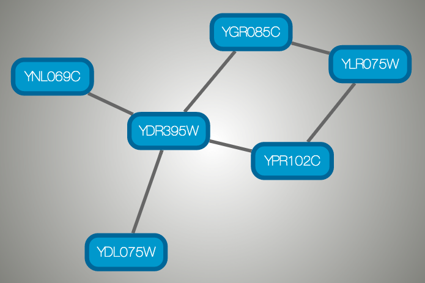
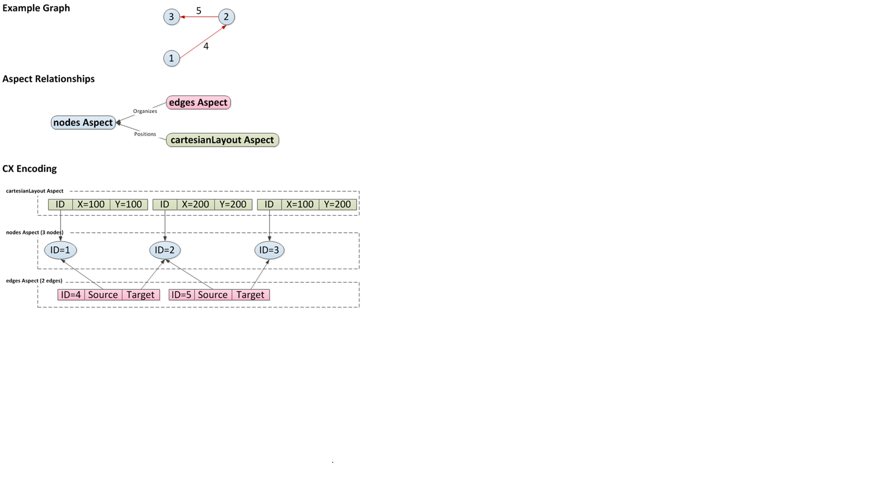

# Supported Network File Formats

Cytoscape can read network/pathway files written in the following
formats:

-   Simple interaction file (SIF or .sif format)

-   Graph Markup Language (GML or .gml format)

-   XGMML (extensible graph markup and modelling language).

-   SBML

-   BioPAX

-   GraphML

-   Delimited text

-   Excel Workbook (.xls, .xlsx)

-   [Cytoscape.js
    JSON](http://cytoscape.github.io/cytoscape.js/#notation/elements-json)
    
-   [Cytoscape CX](https://github.com/CyComponent/CyWiki)    

The SIF format specifies nodes and interactions only, while other
formats store additional information about network layout and allow
network data exchange with a variety of other network programs and data
sources. Typically, SIF files are used to import interactions when
building a network for the first time, since they are easy to create in
a text editor or spreadsheet. Once the interactions have been loaded and
network layout has been performed, the network may be saved to GML or
XGMML format for interaction with other systems. All file types listed
(except Excel) are text files and you can edit and view them in a
regular text editor.

## SIF Format

The simple interaction format is convenient for building a graph from a
list of interactions. It also makes it easy to combine different
interaction sets into a larger network, or add new interactions to an
existing data set. The main disadvantage is that this format does not
include any layout information, forcing Cytoscape to re-compute a new
layout of the network each time it is loaded.

Lines in the SIF file specify a source node, a relationship type (or
edge type), and one or more target nodes:

    nodeA relationship_type nodeB
    nodeC relationship_type nodeA
    nodeD relationship_type nodeE nodeF nodeB
    nodeG
    ...
    nodeY relationship_type nodeZ

A more specific example is:

    node1 typeA node2
    node2 typeB node3 node4 node5
    node0

The first line identifies two nodes, called node1 and node2, and a
single relationship between node1 and node2 of type typeA. The second
line specifies three new nodes, node3, node4, and node5; here "node2"
refers to the same node as in the first line. The second line also
specifies three relationships, all of type typeB and with node2 as the
source, with node3, node4, and node5 as the targets. This second form is
simply shorthand for specifying multiple relationships of the same type
with the same source node. The third line indicates how to specify a
node that has no relationships with other nodes. This form is not needed
for nodes that do have relationships, since the specification of the
relationship implicitly identifies the nodes as well.

Duplicate entries are kept. Multiple edges between the same nodes
can have the same edge types. For example, the following specifies three
edges between the same pair of nodes, two of type xx and one of type yy:

    node1 xx node2
    node1 xx node2
    node1 yy node2

Edges connecting a node to itself (self-edges) are also allowed:

    node1 xx node1

Every node and edge in Cytoscape has a name column. For a network
defined in SIF format, node names should be unique, as identically named
nodes will be treated as identical nodes. The name of each node will be
the name in this file by default (unless another string is mapped to
display on the node using styles). This is discussed in the section on
**[Styles](Styles.md)**.
The name of each edge will be formed from the name of the source and
target nodes plus the interaction type: for example,
`sourceName (edgeType) targetName`.

The tag "edgeType" can be any string. Whole words or concatenated
words may be used to define types of relationships, e.g. geneFusion,
cogInference, pullsDown, activates, degrades, inactivates, inhibits,
phosphorylates, upRegulates, etc.

Some common interaction types used in the Systems Biology community are
as follows:

      pp .................. protein - protein interaction
      pd .................. protein -> DNA
      (e.g. transcription factor binding upstream of a regulating gene.)

Some less common interaction types used are:

      pr .................. protein -> reaction
      rc .................. reaction -> compound
      cr .................. compound -> reaction
      gl .................. genetic lethal relationship
      pm .................. protein-metabolite interaction
      mp .................. metabolite-protein interaction

### Delimiters

Whitespace (space or tab) is used to delimit the names in the simple
interaction file format. However, in some cases spaces are desired in a
node name or edge type. The standard is that, if the file contains any
tab characters, then tabs are used to delimit the fields and spaces are
considered part of the name. If the file contains no tabs, then any
spaces are delimiters that separate names (and names cannot contain
spaces).

If your network unexpectedly contains no edges and node names that look
like edge names, it probably means your file contains a stray tab that's
fooling the parser. On the other hand, if your network has nodes whose
names are half of a full name, then you probably meant to use tabs to
separate node names with spaces.

Networks in simple interactions format are often stored in files with a
`.sif` extension, and Cytoscape recognizes this extension when browsing
a directory for files of this type.

	
## GML Format

In contrast to SIF, GML is a rich graph format language supported by
many other network visualization packages. The GML file format
specification is available at:

[http://graphviewer.nl/misc/gmllanguage/gml-technical-report.pdf](http://www.graphviewer.nl/misc/gmllanguage/gml-technical-report.pdf)

It is generally not necessary to modify the content of a GML file
directly. Once a network is built in SIF format and then laid out, the
layout is preserved by saving to and loading from GML. Properties
specified in a GML file will result in a new style named
`Filename.style` when that GML file is loaded.

## XGMML Format

XGMML is the XML evolution of GML and is based on the GML definition. In
addition to network data, XGMML contains node/edge/network column data. More
information on Wikipedia:

[https://en.wikipedia.org/wiki/XGMML](https://en.wikipedia.org/wiki/XGMML)

XGMML is now preferred to GML because it offers the flexibility
associated with all XML document types. If you're unsure about which to
use, choose XGMML.

There is a java system property "cytoscape.xgmml.repair.bare.ampersands"
that can be set to "true" if you have experience trouble reading older
files.

This should only be used when an XGMML file or session cannot be read
due improperly encoded ampersands, as it slows down the reading process,
but this is still preferable to attempting to fix such files using
manual editing.

## SBML (Systems Biology Markup Language) Format

The Systems Biology Markup Language (SBML) is an XML format to describe
biochemical networks. SBML file format specification is available at:

[http://sbml.org/documents/](http://sbml.org/documents/)

## BioPAX (Biological PAthways eXchange) Format

BioPAX is an OWL (Web Ontology Language) document designed to exchange
biological pathways data. The complete set of documents for this format
is available at:

[http://www.biopax.org/](http://www.biopax.org/)

## GraphML

GraphML is a comprehensive and easy-to-use file format for graphs. It is
based on XML. The complete set of documents for this format is available
at:

[http://graphml.graphdrawing.org/](http://graphml.graphdrawing.org/)

## Delimited Text Table and Excel Workbook

Cytoscape has native support for Microsoft Excel files (.xls, .xlsx) and
delimited text files. The tables in these files can have network data
and edge columns. Users can specify columns containg source nodes,
target nodes, interaction types, and edge columns during file import.
Some of the other network analysis tools, such as igraph
([https://igraph.org/](https://igraph.org/)), has feature to export graph
as simple text files. Cytoscape can read these text files and build
networks from them. For more detail, please read the Import Free-Format
Tables section of the **[Creating
Networks](Creating_Networks.md#creating-networks)**
section.

## Cytoscape.js JSON

From Cytoscape 3.1.0 on, Cytoscape supports
[Cytoscape.js](http://cytoscape.github.io/cytoscape.js/) JSON files. You
can use this feature to export your network visualizations to web
browsers. Cytoscape.js has two ways to represent network data, and
currently both reader and writer support only the array style graph
notation. For example, this network in Cytoscape:

will be exported to this JSON:

    {
      "elements" : {
        "nodes" : [ {
          "data" : {
            "id" : "723",
            "selected" : false,
            "annotation_Taxon" : "Saccharomyces cerevisiae",
            "alias" : [ "RPL31A", "RPL34", "S000002233", "ribosomal protein L31A (L34A) (YL28)" ],
            "shared_name" : "YDL075W",
            "SUID" : 723,
            "degree_layout" : 1,
            "name" : "YDL075W"
          },
          "position" : {
            "x" : 693.0518315633137,
            "y" : -49.47506554921466
          },
          "selected" : false
        }, {
          "data" : {
            "id" : "726",
            "selected" : false,
            "annotation_Taxon" : "Saccharomyces cerevisiae",
            "alias" : [ "RP23", "RPL16B", "S000005013", "ribosomal protein L16B (L21B) (rp23) (YL15)" ],
            "shared_name" : "YNL069C",
            "SUID" : 726,
            "degree_layout" : 1,
            "name" : "YNL069C"
          },
          "position" : {
            "x" : 627.3147710164387,
            "y" : -205.99251969655353
          },
          "selected" : false
        }, {
          "data" : {
            "id" : "658",
            "selected" : false,
            "annotation_Taxon" : "Saccharomyces cerevisiae",
            "alias" : [ "RPL11B", "S000003317", "ribosomal protein L11B (L16B) (rp39B) (YL22)" ],
            "shared_name" : "YGR085C",
            "SUID" : 658,
            "degree_layout" : 2,
            "name" : "YGR085C"
          },
          "position" : {
            "x" : 804.3092778523762,
            "y" : -245.6235926946004
          },
          "selected" : false
        }, {
          "data" : {
            "id" : "660",
            "selected" : false,
            "annotation_Taxon" : "Saccharomyces cerevisiae",
            "alias" : [ "KAP108", "S000002803", "SXM1" ],
            "shared_name" : "YDR395W",
            "SUID" : 660,
            "degree_layout" : 8,
            "name" : "YDR395W"
          },
          "position" : {
            "x" : 730.8733342488606,
            "y" : -157.50702317555744
          },
          "selected" : false
        }, {
          "data" : {
            "id" : "579",
            "selected" : false,
            "annotation_Taxon" : "Saccharomyces cerevisiae",
            "alias" : [ "RPL11A", "S000006306", "ribosomal protein L11A (L16A) (rp39A) (YL22)" ],
            "shared_name" : "YPR102C",
            "SUID" : 579,
            "degree_layout" : 2,
            "name" : "YPR102C"
          },
          "position" : {
            "x" : 841.1395696004231,
            "y" : -130.77909119923908
          },
          "selected" : false
        }, {
          "data" : {
            "id" : "578",
            "selected" : false,
            "annotation_Taxon" : "Saccharomyces cerevisiae",
            "alias" : [ "GRC5", "QSR1", "RPL10", "S000004065", "ribosomal protein L10" ],
            "shared_name" : "YLR075W",
            "SUID" : 578,
            "degree_layout" : 2,
            "name" : "YLR075W"
          },
          "position" : {
            "x" : 910.3755162556965,
            "y" : -217.0562556584676
          },
          "selected" : false
        } ],
        "edges" : [ {
          "data" : {
            "id" : "659",
            "source" : "658",
            "target" : "578",
            "selected" : false,
            "interaction" : "pp",
            "shared_interaction" : "pp",
            "shared_name" : "YGR085C (pp) YLR075W",
            "SUID" : 659,
            "name" : "YGR085C (pp) YLR075W"
          },
          "selected" : false
        }, {
          "data" : {
            "id" : "661",
            "source" : "658",
            "target" : "660",
            "selected" : false,
            "interaction" : "pp",
            "shared_interaction" : "pp",
            "shared_name" : "YGR085C (pp) YDR395W",
            "SUID" : 661,
            "name" : "YGR085C (pp) YDR395W"
          },
          "selected" : false
        }, {
          "data" : {
            "id" : "724",
            "source" : "660",
            "target" : "723",
            "selected" : false,
            "interaction" : "pp",
            "shared_interaction" : "pp",
            "shared_name" : "YDR395W (pp) YDL075W",
            "SUID" : 724,
            "name" : "YDR395W (pp) YDL075W"
          },
          "selected" : false
        }, {
          "data" : {
            "id" : "733",
            "source" : "660",
            "target" : "579",
            "selected" : false,
            "interaction" : "pp",
            "shared_interaction" : "pp",
            "shared_name" : "YDR395W (pp) YPR102C",
            "SUID" : 733,
            "name" : "YDR395W (pp) YPR102C"
          },
          "selected" : false
        }, {
          "data" : {
            "id" : "727",
            "source" : "660",
            "target" : "726",
            "selected" : false,
            "interaction" : "pp",
            "shared_interaction" : "pp",
            "shared_name" : "YDR395W (pp) YNL069C",
            "SUID" : 727,
            "name" : "YDR395W (pp) YNL069C"
          },
          "selected" : false
        }, {
          "data" : {
            "id" : "580",
            "source" : "578",
            "target" : "579",
            "selected" : false,
            "interaction" : "pp",
            "shared_interaction" : "pp",
            "shared_name" : "YLR075W (pp) YPR102C",
            "SUID" : 580,
            "name" : "YLR075W (pp) YPR102C"
          },
          "selected" : false
        } ]
      }
    }

And this is a sample visualization in Cytoscape.js:

### Important Note

Export network and table to Cytoscape.js feature in Cytoscape creates a
JSON file **WITHOUT** style. This means that you need to export the
style in a separate JSON file if you apply style to your network. Please
read the [Style](Styles.md#styles) section for more details.

## Cytoscape CX

CX is a JSON-based transfer format that enables diverse Cytoscape Cyberinfrastructure (CI) services to exchange networks while preserving all network-related information.
It is designed for flexibility, modularity, and extensibility, and as a message payload in common CI REST protocols. It enables applications to standardize on core aspects of networks, coordinate on more specific or unique standards, and to ignore or omit irrelevant aspects. It is not intended as an optimized format for storage or for specific functionality in applications.
 
CX is an Aspect-Oriented Network Interchange Format, where the base information is a list of nodes. Independent data structures (called aspects) organize and elaborate on nodes and each other. The core of CX defines five aspects, though a more comprehensive [CX document](https://github.com/CyComponent/CyWiki) describes many more aspects.

<table cellspacing="0" style="table-layout: fixed; width: 700px">
<colgroup> <col style="width:200px">                              <col style="width:500px"> </colgroup>
<tbody>
<tr> <th>Aspect</th>                                 <th>Purpose</th></tr>
<tr> <th class="spec ulcase">networkAttributes</th>  <td class="">element specify name-value pairs describing the network</td> </tr>
<tr> <th class="specalt ulcase">nodes</th>           <td class="alt">elements specify the identifiers for nodes in a network, optionally specifying a node name</td> </tr>
<tr> <th class="spec ulcase">edges</th>              <td class="">elements specify edges that connect nodes, optionally specifying a interaction</td> </tr>
<tr> <th class="specalt ulcase">nodeAttributes</th>  <td class="alt">elements specify name-value pairs describing nodes</td> </tr>
<tr> <th class="spec ulcase">edgeAttributes</th>     <td class="">elements specify name-value pairs describing edges</td> </tr>
</tbody>
</table>
 

The **nodes** aspect contains only the identifiers of the network's nodes, The **edges** aspect contains identifiers for each edge along with the identifiers of the nodes the edge connects. The **networkAttributes** aspect contains name-value pairs describing the network. The **nodeAttributes** and "edgeAttributes" aspects contain name-value pairs attached to specifically identified nodes and edges.

Critically, applications are free to add and maintain their own aspects without coordinating or negotiating with disinterested applications.

As an illustration using the picture below, a three node network can be described as a list of nodes (**nodes** aspect) and edges that link them (**edges** aspect). If the network has been laid out, a separate aspect (**cartesianLayout** aspect) can describe the position of each node. More concretely, a CX encoding would have three nodes in the **nodes** aspect, each with unique IDs. The **edges** aspect references each node by ID, with each edge having its own ID. Finally, the **cartesianLayout** aspect ties coordinates to nodes by ID. In fact, a network may have many aspects, describing node and edge attributes, subnetworks, visual properties, groups and so on.

The actual JSON encoding for a CX stream is described in the [CX document](https://github.com/CyComponent/CyWiki). It would appear something like this: 

    {
      "nodes": [{"@id": 1}, {"@id": 2}, {"@id": 3}],
      "edges": [{"s": 1, "@id": 4, "t": 2}, 
                {"s": 2, "@id": 5, "t": 3}],
      "cartesianLayout": [{"x": 100, "node": 1, "y": 100}, 
                          {"x": 200, "node": 2, "y": 200},
                          {"x": 100, "node": 3, "y": 200}]
    }
